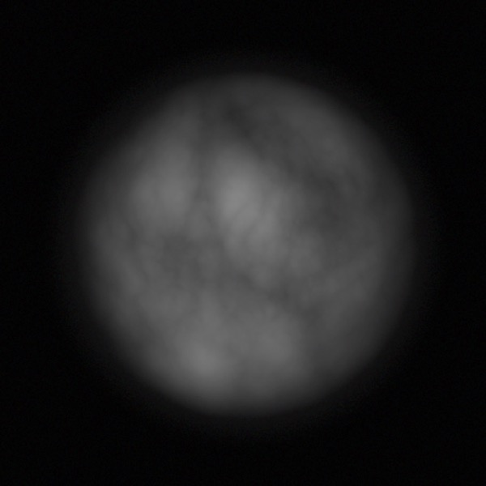
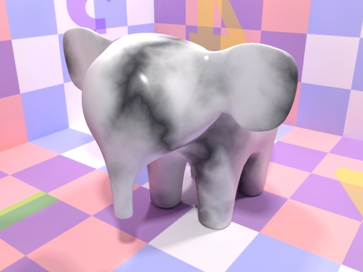

## Faking It

### Volumetrics

It’s possible to fake some kinds of volumetrics using the material system. It’s possible to do reasonable smoke and clouds using carefully designed materials.

Here’s the smoke material (which produces the column of smoke in the preceding render). The basic idea is that it gets more opaque as it gets more front-on, but this opacity is partially modulated by procedural turbulence.

*The faux volumetric flame, cloud, and smoke materials (top to bottom) used in this scene applied to a sphere.*

The basic concept I use for faking volumetrics to produce puffs of smoke and cloud is to use the I•N output of the State node to control transparency or emission, and apply the materials to rounded objects.

### Sub-Surface Scattering

> *All non-metallic materials are translucent to some degree. This means that light scatters inside the material before being either absorbed or leaving the material at a different location. This phenomenon is called subsurface scattering.* **Henrik Wann Jensen**

Sub-surface scattering (SSS) refers to one of a set of related techniques for approximating the light that diffuses through slightly translucent substances such as marble, milk, mud, vegetation, and skin. (Mostly transparent substances, such as airborne dust and mist are handled via volumetrics.)

Cheetah 3D does not currently support SSS — making this perhaps the only chapter of the book devoted to a *missing* feature — but I’ve made a number of varyingly successful attempts to simulate it using node-based shaders.

*Here is a series of attempts to “fake” SSS by using the I•N output of the State node to drive subtle emission around the edges of a model.*

*This approach was then toned down and combined with lightening the diffuse channel towards the edges to improve the simple procedural marble material.*

*Here’s the final shader showing how the gradient node is set up.*

#### A completely different approach using blurred transparency

And now for something completely different.

Here is the best way of faking SSS that I’ve come up with. It’s considerably slower to render than the previous approach, but it can produce excellent results. Basically you make the object quite transparent (25-50% transparent), add a huge amount of transparency blur (0.5 or so), and reduce the transparency samples (because they don’t make much of a difference and it speeds up rendering).

The best thing about this method is it should work fine for hard edges, which the “edge glow” method definitely won’t. It works particularly well if you put a solid object inside the “faux SSS” object that controls maximum light penetration.

*Here’s the marble elephant rendered using the blurred transparency method.*

*Here’s the shader. Rather than simply make it have a fixed transparency, I multiply the diffuse channel input by 0.5 and use that (this stops the dark parts of the marble from being transparent).*

*Here are three cubes — the last has a rounded cube inside it — rendered with standard marble, edge glowing faux SSS marble, and the blurred transparency option (which doesn’t look quite right.)*

*Here’s a much more successful application of this technique. The candle wax is about 50% transparent and very blurred. There’s an opaque object inside the candle preventing light from going too far. The only light source is an area light over the candle flame.*

