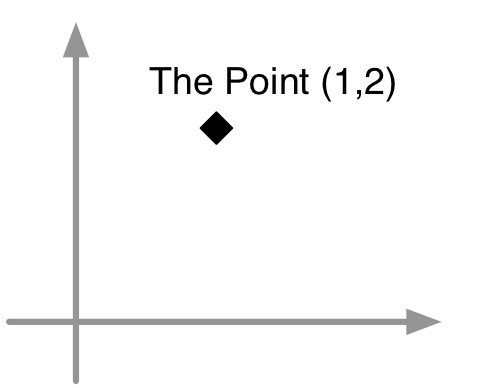
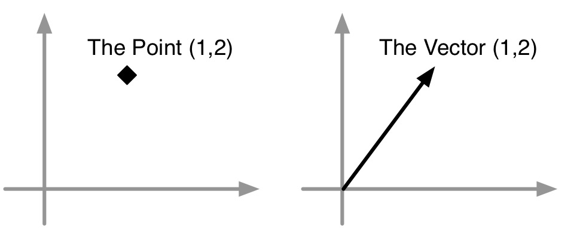
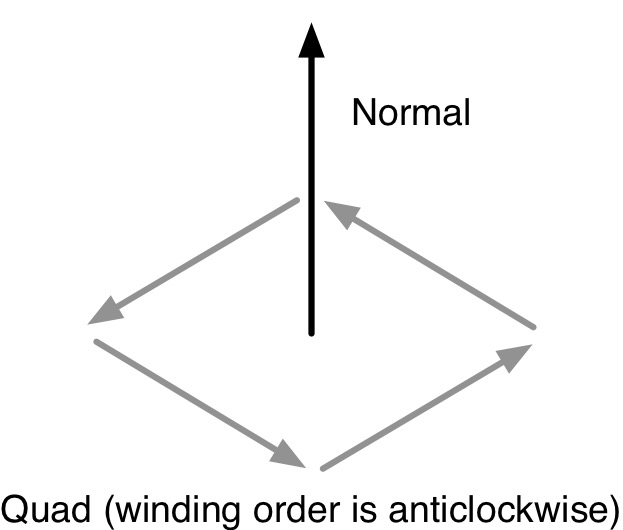
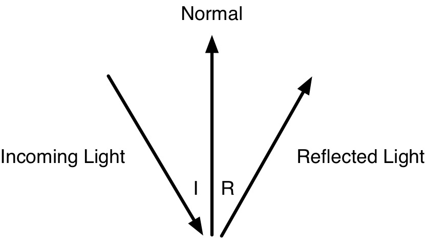
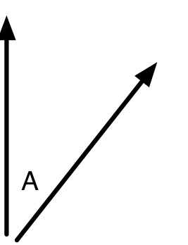
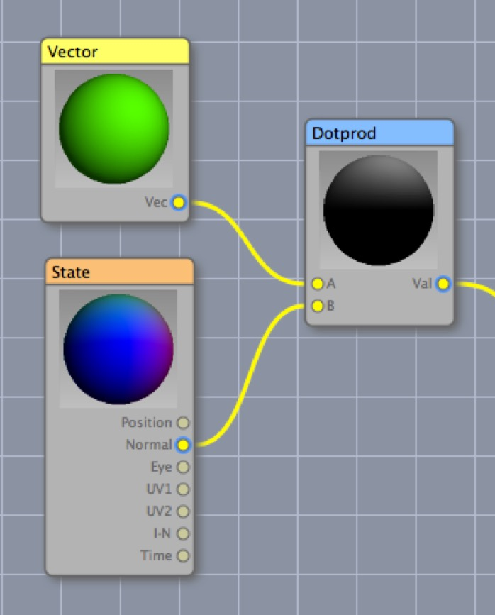
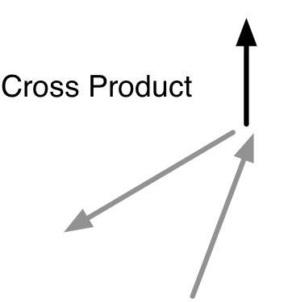
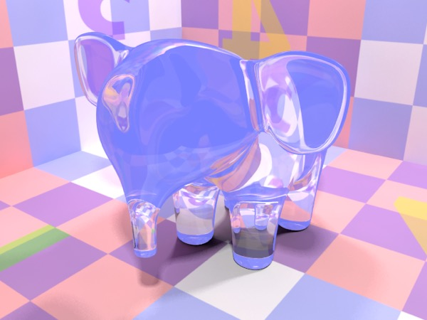

## The Math of Material Nodes

**OMG! You didn’t tell me there’d be math!**

I don’t know how old you are, but I can remember back when I was studying trigonometry and I wondered “what the heck use will this ever be in real life?” Well, one very good answer is anything to do with graphics or design.

The goal of this section isn’t to teach you complex vector math, but simply to give you a feel for how these things work — the idea is to give you an intuitive grasp of what the different concepts mean and do, rather than teach you how to calculate the normal of a plane. You don’t need to do that rubbish — Cheetah 3D does it for you. Millions and millions of times.

### Points

A point is a position in 3D space represented by three floating point values for x, y, and z. 

Usually points will be represented in their local coordinate system (e.g. if you’re looking at an object points — such as the child object’s position — will be described in terms of the parent object’s coordinate system (and not the global coordinate system, unless the object has no parent).

The points of a mesh are treated as children of that object (i.e. they are described as children of the object).

### Planes

A plane is a flat surface.

Any three points will lie in a plane (and thus can form a triangle). In general, any larger number of points cannot be relied on to be *coplanar* (i.e. they may not lie in a plane). For this reason, 3D programs tend to reduce any polygon with more than three sides to triangles (which will always lie in a plane).

### Planarity, Coplanarity

Objects are said to be coplanar if they lie within a plane. Figuring out if a given point lies (to some approximation) in a plane is very useful for doing things like merging and splitting adjacent polygons. It's less likely to be useful for materials than for _scripts_.

If you have a point **p** on a plane and the normal of the plane **n**, you can tell that another point **q** lies on the plane by looking at the vector **q-p** and projecting it onto **n** (i.e. the dot product **(q-p).n**). The magnitude of this product is how far the point q is from the plane.

### Vector

A vector is a direction and a magnitude. Vectors, like points, are described by three values (x, y, and z), but instead of thinking of those values as describing a position, you should think of them as describing a velocity (or perhaps as arrow formed by drawing a line from 0,0,0 to the point described by x,y,z).

Usually in 3D we’re interested in unit vectors — i.e. vectors whose magnitude (length) is exactly 1. In general, when I describe 3D math I will simplify it by assuming we’re talking about unit vectors.

### Normal

A normal vector is a unit vector pointing straight out from — i.e. perpendicular to — a plane. In 3D programs, polygons are generally considered “one-sided” with the normal pointing in the direction the polygon “faces”. 

Viewed from the “front” a polygon has an “anticlockwise” winding order, i.e. it is defined as a series of points running anticlockwise. Normal vectors are extremely useful for calculating the behavior of light.

E.g. you may recall that with reflected light, the “angle of incidence is equal to the angle of reflection”. In terms of vectors, the angle of incidence is the angle between the vector representing the direction of the incoming light and the normal of the reflecting surface, while the angle of reflection is the angle between the reflected light and the same normal.

### Dot Product

The dot product of two vectors is the product of their magnitudes (lengths) and the cosine of the angle between them. 

We’re mostly interested in unit vectors, so the product of the magnitudes will be 1. It follows that the dot product of two unit vectors is the cosine of the angle between them.

In intuitive terms dot product is a measure of how similar two unit vectors are in direction where 1.0 means “exactly the same direction”, 0.0 means “perpendicular”, and -1.0 means “exactly the opposite direction”.

*Visualizing dot product. The unit vector pointing straight up is (0,1,0) which, considered as a color is green (red = 0, green = 1, blue = 0). The normal vectors of our sphere vary continuously over its surface — the parts pointing straight at us are close to (0,0,1) and look blue while those pointing right look red (1,0,0) and those pointing up look green. The dot product of these values gives you values close to 1 at the top of the sphere, and this goes to 0 (black) at the equator and -1 (still black) in the lower hemisphere.*

### Cross Product

*Here the two vectors being cross multiplied aren’t very perpendicular so the sine of the angle between them will be considerably smaller than 1, thus the magnitude of the cross product is small.*

The cross product of two vectors is a **vector** perpendicular to *both* of them whose magnitude is the product of their magnitudes multiplied by the sine of the angle between them.

Note that for vectors that point in exactly the same or exactly opposite directions cross product is zero (which is handy, since this is also the point at which uniquely determining a vector perpendicular to the two input vectors is impossible).

Again, we’re mostly interested in unit vectors, so product of their magnitudes will be 1. It follows that the *magnitude* of the cross product of two unit vectors will be the sine of the angle between them.

The cross product itself is a vector perpendicular to the input vectors, which may be useful itself.

**Putting it all together**

Here are some examples of how these concepts work in practical terms.

**Diffuse Illumination**

You don’t need to calculate diffuse illumination yourself but it’s interesting to know how it works. The diffuse color of a surface whose diffuse color is D, illuminated by a light of intensity L, is equal to the product of the colors D and L and the **dot product** of the surface normal and the unit vector pointing to the light.

**Fresnel Effects**

*Simple glass material with fresnel checked off and on, respectively. (The non-fresnel version is much more reflective in general, but less reflective at the edges — the blue you see is a reflection of the background color.)*

If you look at a pane of glass from an oblique angle then it behaves much like a mirror — not much light passes through it, but it reflects quite well. On the other hand if you look at a pane of glass straight on, light passes through it very well while relatively little is reflected.

This is called the Fresnel effect or Fresnel reflectance.

You can simulate this in Cheetah 3D by feeding I•R from a State node into a Material shader’s transparency input. I•R is the **dot product** of the viewing angle (the direction from the point being rendered to the camera) and the surface normal at that point. Since the dot product effectively measures how similar these vectors are, it will be one if you’re looking at the surface straight on, and close to zero if you’re viewing it obliquely.

Similarly, you can feed (1 – this dot product) into the reflection input of the shader to make the surface more reflective when viewed at an oblique angle and non-reflective when viewed straight on. This is the same as the magnitude of I×R (the cross product of I and R), but its easier to use I•R (since the State node has a dedicated output channel for this value).

