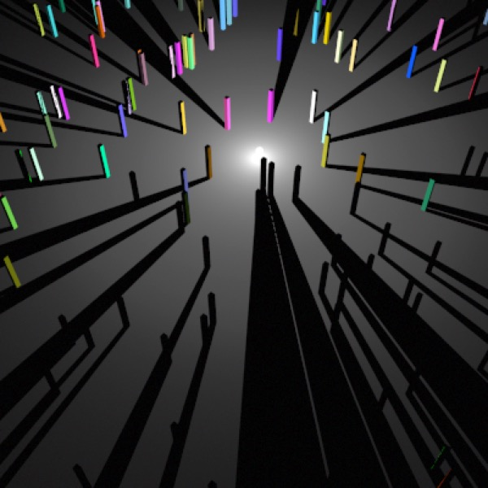
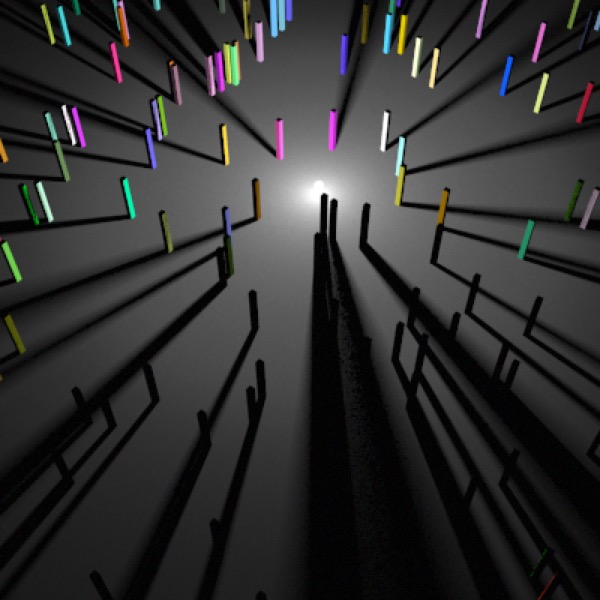
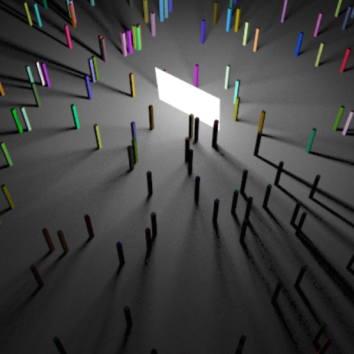
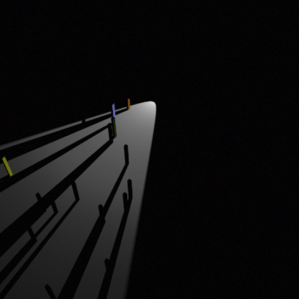
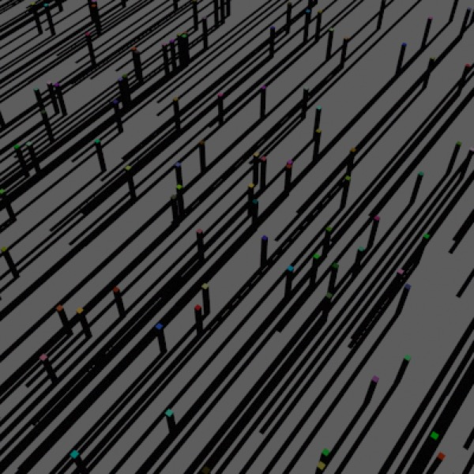
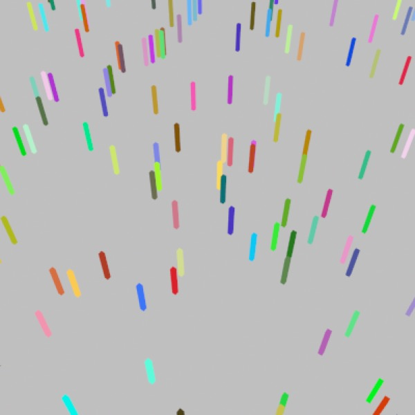

## How Lights Work

### Falcon vs. Cheetah

### Lights in Falcon

### Lights in Cheetah

Because Cheetah 3D is a ray tracer and ray tracing works backwards from the observer to the light source, lights do not work exactly the way you might expect.

To begin with, lights don’t “shine”. They’re simply used to calculate how brightly lit surfaces are. Without a surface to render, lights don’t do anything. If you point a camera at a light you get nothing (some lights have a “geometry” property which, if checked, adds an emissive surface that doesn’t cast shadows).

*Point Light.*

*Point Light with 5 samples.*

*Area Light with 5 samples (geometry is switched on)*

*Spot Light.*

*Directional Light.*

*Ambient Light.*

Next, all lights in Cheetah 3D are either effectively point sources or distant lights. A spot light is a point source whose brightness varies based on direction. An area light is simply a stochastically sampled collection of point lights lying on a rectangle. And so forth. This is important because lighting calculations all require the rendering engine to calculate the direction from some point in space to a light source.

How much light the light source casts on an object is determined by:

- the light source’s color and intensity,

- the normal of the surface being illuminated relative to the direction from the point being rendered to the light source, 

- what obstacles, if any, lie on the path between the point being rendered and the light (and what those obstacles are made of), 

- for attenuating lights — the distance from the point being rendered to the light source, 

- and — for spot lights — the direction from the light source to the point being lit relative to the light source’s facing.