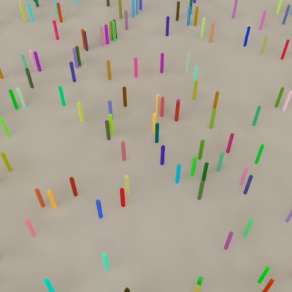

## Other Lighting Options

*Sky Light (8:00am).*

*Sky Light (noon).*

*Sky Light (5:30pm).*

*HDRI (Entrance Hall Pano) with Radiosity (default settings).*

*Glowing Torus with Radiosity (Rmin 0.001, Samples 5000, Detail Detection on) and Camera Light set to off (if auto, it will turn on and ruin image).*

*Camera Light. (Just say “No!”)*

In addition to the basic light object, Cheetah 3D provides several other methods of lighting a scene.

- The **camera light** (essentially a point light with no attenuation located where the camera is; by default, it is only active if a scene has no other lights in it).

- The **Sky Light** (a basic sky simulation which provides a passable simulacrum of the light produced by the sun and sky.

- **Image-based lighting** (if you add an HDRI tag and a Radiosity tag to the active camera, and load a suitable image into the HDRI tag, the image will light your scene).

- **Emissive Objects** can light a scene in combination with the Radiosity tag (these work particularly well in combination with the radiosity tag and judiciously chosen settings). To make an object “emissive” you need to create a suitable material — generally using the Material shader. The light emitted is the diffuse color multiplied by the emissive color.

**Note** that if the diffuse color is black, no matter what the emissive color is, no light will be emitted. I consider this to be a bug, but apparently it’s a feature. Note that to create a strongly emissive material you need to use a Color constant node (or some other vector of arbitrary size) to drive the Material Shader’s emissive channel — which allows you to dial up the intensity of the emission.

