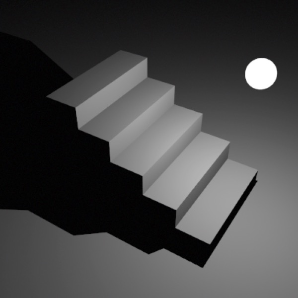
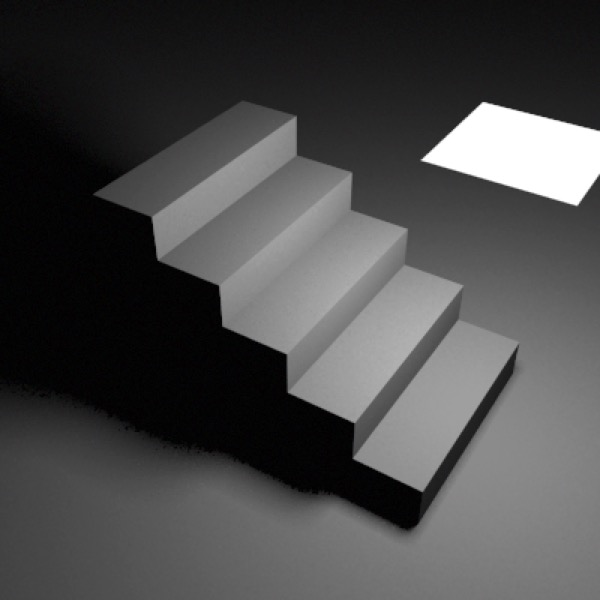

## Shadows

Shadows are rendered as a side effect of the ray-tracing algorithm. If shadows are enabled for a given light then it will not illuminate a point where the path between that point and the light is obstructed by another object.

The Raytrace+Transparency shadow setting causes transparent objects to partially block light, but since it does not simulate the refraction of light the resulting shadows often look unconvincing.

### Soft Shadows

*Point Light with 1 sample.*

*Point Light with 5 samples.*

*Area light (5 samples)*

Cheetah 3D renders soft shadows when shadow-casting lights are area or point lights with multiple samples. Image-based lighting and emissive object lighting produce very soft shadows.

