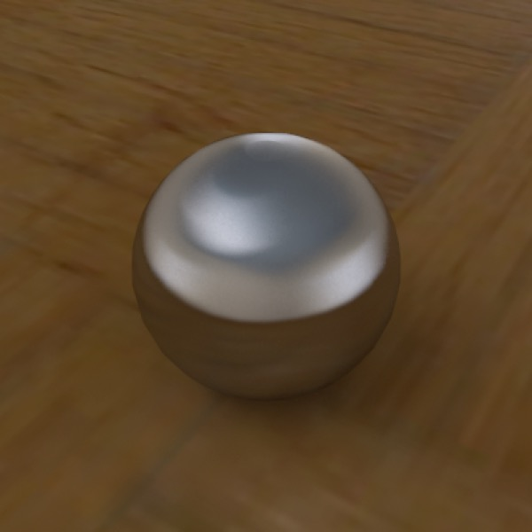

## Advanced Lighting

Most of the techniques discussed here involve alternatives to using standard lights (or the Sky Light).

### Global Illumination

Also referred to as HDRI and Image-Based Lighting.

*Brushed steel sphere on parquet plane, with HDRI and Radiosity tags used for lighting. Fast, attractive renders with almost no effort.*

Using a light probe, light box, or panorama to light a scene (you also need the Radiosity tag) often produces excellent results with relatively little effort, and also short render times.

### Lighting with Emissive Objects

You can light scenes entirely using emissive objects and Radiosity. The important thing is to make sure the camera light is off (if set to auto — the default — it will turn on if there are no lights in a scene). The second problem is preventing blotches, which generally involves setting Rmin to be low enough and Samples high enough.

