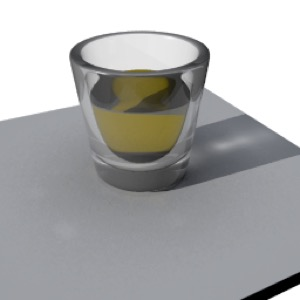

## Caustics

*Caustics simulate the reflection and refraction of light. Note that the light creating the caustics is set to have solid (“Raytrace”) shadows. Caustics shouldn’t be used in concert with “Raytrace+Transparency” for a given light — use one or the other.*

Caustics refer to reflected and refracted light, something which traditional ray-tracing simply doesn’t capture. (Consider how you can reflect light onto a wall using a mirror: this simply doesn’t work in the standard ray-tracing model.)

*Without caustics, the glass either casts a solid shadow or a completely undistorted shadow (depending on whether the lights are set to “raytrace” or “raytrace+transparency”). Neither looks realistic.*

The way caustics work (at least in Cheetah 3D) is that you create a “photon” light (a spotlight) and add a Caustics tag to the camera you’ll be rendering with.

### Settings

Once you’re using a Caustics tag, the Caustics settings of lights in the scene become very important.

In general, when rendering caustics, a light should either emit NO caustic photons (and you might want to set its shadow type to “None” or “Raytrace+Transparency”) or a lot of them.

Caustics are expensive in terms of CPU time, and it’s very difficult to do them well for everything in a scene. Generally you simply want to produce good caustics for something that’s going to be the center of attention. 

The simplest and most efficient case is to use one spotlight to emit caustic photons and zero out the photons from every other light. You might even want to use a “pure photon light” to simulate caustics from a specific light source for a particular effect.

#### Under the Hood

When you render caustics, Cheetah 3D then does some pre-processing: it fires the number of photons you specify out of the light and into the scene, and figures out where they go (using stochastic methods: e.g. if a photon hits glass it has some chance of being reflected, and some chance of being transmitted). Then, based on where the photon ends up, it adds to the lighting of that spot in the image (and, to make up for using a small number of photons, some blurring is applied to the effect.

#### Fine-Tuning Caustics

The following table shows the impact of changing the number of photons emitted by a photon light and the number of samples in the Caustics tag. In each case blur is set to 10 pixels and strength is set to 5.0 in order to exaggerate the effects. 

I would recommend starting around strength 1.0 and blur 20 pixels for a better looking result in practice, but reducing the blur and increasing the strength makes it easier to fine-tune your settings.

I should add that for this (simple) scene, the settings had almost no impact on rendering time until I went up to 5M photons, i.e. it was almost as fast to render with 500K photons and 1000 samples as with 5k and 10!

*5000 Photons: 10, 100, 1000 Samples*

*50,000 Photons: 10, 100, 1000 Samples*

*500,000 Photons: 10, 100, 1000 Samples*

*5,000,000 Photons: 10, 100, 1000 Samples*

One of the things this set of test renders demonstrates is that the more photons you get to work with, the better. Since the glass doesn’t reflect much light, the reflected light is dominated by a few random spots, while the transmitted light (where most of the photons are going) gets much better as you add photons.

To really handle the reflected light well, you might be better off rendering the scene twice, once with a non-reflective glass, and once with a mirror-reflecting glass, and then carefully composite the two images.

*Here’s the same test scene, rendered with 5M photons, 1000 samples, and the render tag settings set to a more reasonable strength (1.0) and blur (20.0). Because glass isn’t very reflective, there’s essentially nothing we can do to really get the reflected light right. (If you look closely, it’s very splotchy.)*

*Here I used only 500K photons, but rendered twice, the second time with a mirrored glass, then using a garbage matte in Photoshop I combined the two images. Note the very nice and subtle reflected light from the glass (it should probably be toned down a bit (since the glass can’t reflect and transmit 100% of the light falling on it) but it looks pretty nice.*

**Note**: the term “garbage matte” refers to a quick, crude, often hand-drawn matte used to separate parts of an image. In this case I simply needed to separate the region of the image containing light *reflected* from the silvered glass from the rest of the image.

