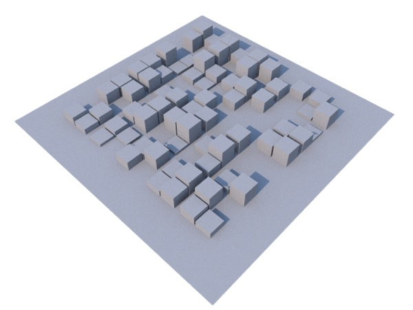
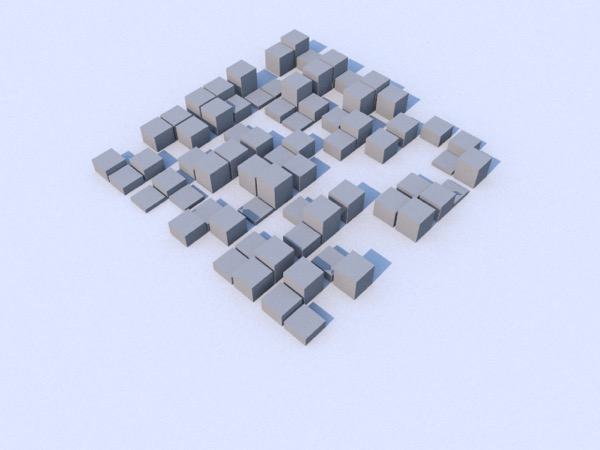
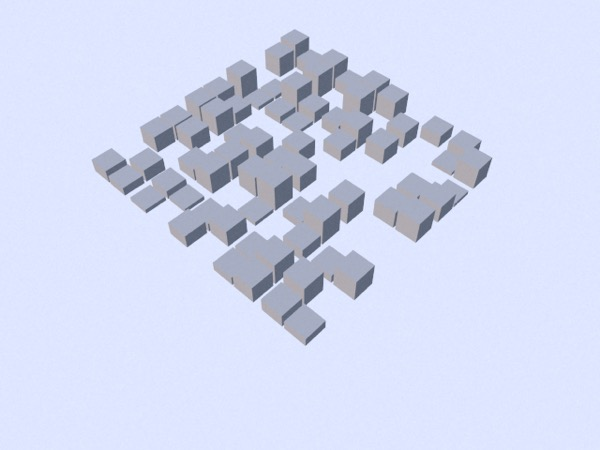
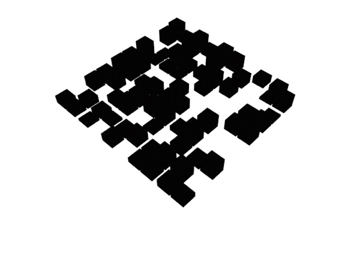
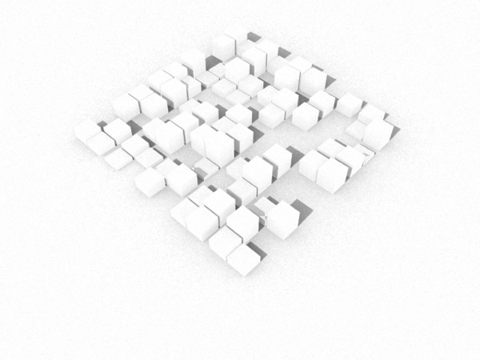
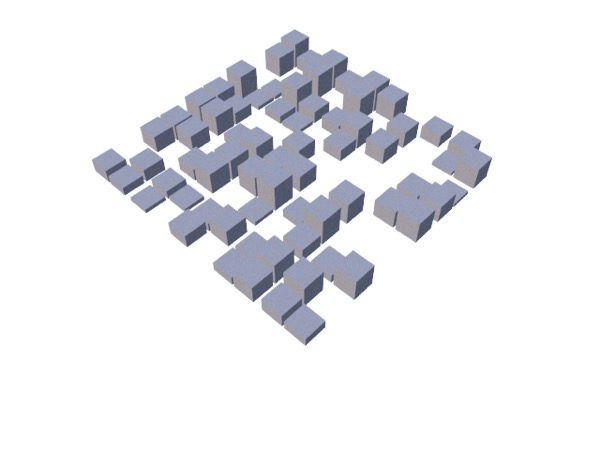
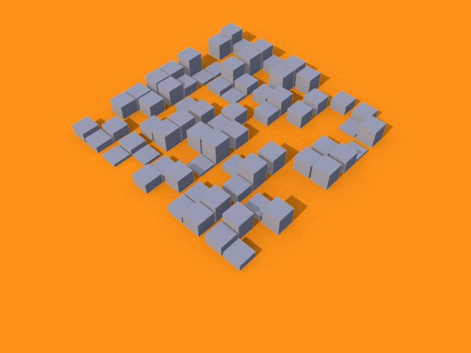

## Foolproof Shadow Catchers

**Helpful Hint**: if you really want to grab an object’s shadow there’s a more foolproof option. Render it three times, once with no backdrop, once with a matte white plane to catch the shadow, and once with a matte white plane with shadows turned off. In Photoshop (or similar) use **difference** to get the shadow from the latter two renders, and drop this below the first render. This method will capture shadows perfectly but is obviously more labor-intensive than using a shadow catcher material.

*A simple scene with a plane under it. When I replace assign a shadowmat to the plane to turn it into a shadow catcher, two problems immediately become evident. First, the shadows aren’t cleanly captured but worse, because the geometry didn’t neatly end at the “ground plane” the shadow mat shows stuff that was hidden.*

Above, I’ve made three renders. **Top**: white ground plane with shadows. **Middle**: white ground plane without shadows. **Bottom**: stuff I want opaque solid black, other stuff solid white.

***Top**: using the difference between the first two renders, you can create a perfect shadow layer. **Middle**: using the third render, you can create a perfect mask for the content. **Bottom**: and with these two, you can composite your object and its shadows *

