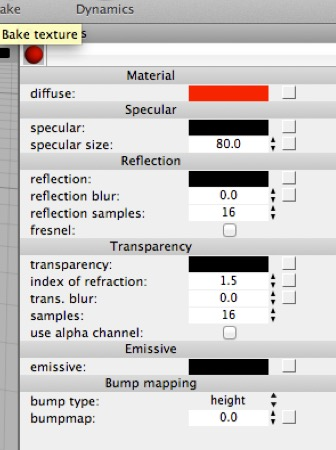

## Simple Materials Without Nodes

### Material Shader Properties

*When you create a new material and select it, its Properties panel will look something like this (**top**). On the **bottom** is a simple test model in a simple environment, both with the default material assigned.*

Before Cheetah 3D got its node-based material system materials were simply objects with properties like everything else. You click on a material and then edit its properties. This interface is still supported, but it doesn’t let you access most of the power of the new material system and it’s easy to get lost if you create more complex materials.

Even so, it’s very useful for quickly creating simple materials such as a flat color shader, a shiny “plastic” material, a simple metal material, or a simple glass or water material, and even simple texture-based materials. Indeed, without even looking at the node display, the Properties panel allows you to make much more sophisticated materials than were possible before.

(You *might* wonder why you’d need anything else at this point.)

To create various simple materials, here’s a quick guide to how to adjust these settings.

#### Flat Colors

*A flat red material. You don’t need to do anything with nodes to make this material. Simply create a new material and set its diffuse color to red and its specular color to black. If you’re wondering why this object looks so eery in the test render, it’s because real world objects are never this intensely red. Generally, to make things look more realistic you need to make their colors a bit “murky” (darker and less saturated).*

- Set diffuse to the color you want the material to be

- Set specular to black

#### Shiny Plastic

- Set diffuse to the color of the plastic

- Set specular to a light grey

- Set the specular size to a smaller value (say 20)

- (If you know what you’re doing, set specular to black, set reflection to a darkish grey, and set reflection blur to somewhere between 0.1 and 0.6 depending on how hard the plastic is supposed to be — 0.4 is a nice starting point.)

#### Hard Rubber

- Set diffuse to very dark grey.

- Set specular to dark grey.

- Set specular size to a very small value (say 10)

- (If you know what you’re doing, set specular to black, set reflection to dark grey, set reflection blur to somewhere between 0.6 and 1.0.)

#### Metal

- Set diffuse to black

- Set specular to the color of the metal (if you want fake reflections of light) or black (if not)

- If you didn’t set specular to black, set specular size to a high value (80 or 90).

- Set reflection to the color of the metal

- If you want the metal to render nicely, you’ll need to place it in an elaborate scene (so it can reflect stuff) or attach an HDRI tag to the camera and load a suitable image into it).

Note that this is *not* the best way to make a simple metal material, but the best way involves using the node system to select a different shader (the Metal shader) or modifying one of the Metal shaders that comes bundled with Cheetah 3D.

#### Brushed Metal

- As for metal, but set reflection blur to something greater than zero (0.2 is a good starting point) and set specular size to a lower value (e.g. 30).

Again, a better way of doing brushed metal is to use the Metal Shader (it also allows you to do anisotropic reflection, i.e. directional blur).

#### Glass

- Set transparent to a very light grey (but not white)

- Set reflection to a moderate grey (maybe a little darker than medium)

- Check the fresnel box

- If necessary, set refractive index to 1.5

#### Water

- Set transparent to a very light blue (very low saturation, very high brightness)

- Set reflection to a dark grey.

- Check the fresnel box.

- Set refractive index to 1.33.

#### Procedural Marble

- Click on the box to the right of the diffuse color. (This is an alternate route to the node system.) A menu will appear — select **Textures \> Marble**.

- Change the Marble texture’s colors to what you’d like for your marble (feel free to experiment with the other settings). **When you’re done, click the small left-pointing arrow at the top-right of the Properties panel to get back to the Material shader’s properties.**

- Set the specular color to a middling grey (if you want fake reflections of lights, black otherwise).

- Set the reflection to a dark grey.

- Depending on how polished you want the marble to be, leave reflection blur at 0 (for very polished) or increase it beyond zero for less-polished looking marble.

#### Procedural Concrete (“Cement” for Americans)

- Click on the box to the right of the diffuse color. A menu will appear — select **Textures \> Fractal**.

- Set the Fractal texture’s two colors to a light shade of grey, and a darker shade of grey. You might even like to tint one of the two colors with a little warm yellow. **Click the small left arrow at the top-right to get back to the Material shader.**

- Set specular to black.

- Click on the box to the right of the bumpmap. Select Textures \> Voronoi.

- Set the Voronoi texture’s type to F1, its top color to black and its bottom color to a dark grey. Under samples, set the three scale values to something high (e.g. 40.0). Again, click the left arrow to get back to the material shader.

The Fractal texture causes variation in the color of the material, while the Voronoi shader creates the texture. The higher the scale setting in the Fractal texture, the finer the grain will be.

#### Procedural Wood

- Click on the box to the right of the diffuse color. A menu will appear — select **Textures \> Wood**.

- You might want to change the Wood texture’s colors to (say) dark brown and pale brown. When you’re done, click the small left-pointing arrow at the top-right of the Properties panel to get back to the Material shader’s properties.

- For undressed wood, set the specular to black. For polished wood set specular to dark grey (if you want fake reflections of lights, black otherwise).

- For polished wood, set the reflection to a dark grey.

- Depending on how polished you want the wood to be, leave reflection blur at 0 (for very polished) or increase it beyond zero for less-polished looking marble.

#### Simple, Image-Based Materials

*This material was created using a simple test pattern. It’s a total mess on the elephant because it isn’t properly UV-mapped. All of the other materials so far (including the procedural wood and marble) don’t use UV-maps, and thus don’t rely on the underlying mesh having proper UV-maps.*

- Click on the box to the right of the diffuse color. A menu will appear — select **Textures \> Image** (it’s the first item in the menu).

- In the Image texture’s properties click the Load button to load an image to be used by the material. When you’re done, click the small left-pointing arrow at the top-right of the Properties panel to get back to the Material shader’s properties.

- If the image you just loaded has an alpha channel (i.e. it is transparent in places) you should check **use alpha channel**.

- If you checked use alpha channel, you probably want to set the refractive index to 1.0.

- Based on what you’ve learned creating the other materials, you may want to adjust specular, reflection and so on.

### The Material Shader

**The most versatile Shader in Cheetah 3D is the Material Shader**. All of the simple materials we’ve discussed in the previous section have been created with it. Most of the other shaders are simplified versions of the Material Shader that are specialized for handling one kind of material.

*The material shader node is your friend.*

The first thing you might notice about a shader is that it has *no output channels* (its output goes to the renderer — as far as your node system is concerned, the shader is the end of the line). The node system is simply there to give information to the shader to help it do its job.

As you may recall, I have described a shader as a software gizmo that answers the question “what color is this specific point on this specific triangle” given a bunch of data about the scene that triangle resides in, and the direction we’re looking from.

To answer this question, the shader needs a bunch of additional information, some of which is represented by the input nodes (the labeled sockets on the left of the shader node). If nothing comes into one of these channels, then the shader uses its own internal (constant) values for that channel.

*Diffuse set to bright red (**top**) and a greenish-grey (**bottom**).*

- **Diffuse** is what you’d normally think of as the color of the object.

*On the **top** is the default material (which has specular set to white). On the **bottom**, specular has been set to black.*

- **Specular** controls the color of specular highlights (which are simulated reflections of light sources).

*Specular size set to 80.0 (**top** — the default value) and 20 (**bottom**). Yes, the greater the specular size the smaller and duller the highlight.*

- **Specular Size** (number) is the smoothness of the object, but only for purposes of using specular. Higher specular size produces smaller, sharper specular highlights.

*At **top**, reflection set to light grey. At **bottom**, reflection set to dark red.*

- **Reflection** is the reflectiveness of the object, a better (but more CPU-intensive) method for handling reflections.

*Reflection blur 0.0 (**top** — default value) and 0.2 (**bottom**).*

- **Reflection Blur** is the roughness of the object (the higher it is, the blurrier reflections will be)

- **Transparency** is what it sounds like.

*Glass material with index of refraction set to 1.0 (**top**), 1.1 (**middle**), and 1.5 (**bottom** — the default)*

- **Index of Refraction** (number) is the degree to which light passing through the material is deflected. 1.0 is the value for a vacuum or air (unless you’re rendering planets, in which case it should be slightly higher), while 1.5 is typical for glass.

*Glass material with transparency blur set to 0.0 (**top** — the default) and 0.2 (**bottom**).*

- **Trans. Blur** is the degree to which light passing through the material is blurred (think of frosted glass).

***Top**: emissive is set to bright red; **bottom**: the diffuse color is set to bright red as well.*

- **Emissive** (color with intensity) is the color of light with which the object “glows”. Emissive accepts color values beyond (1,1,1), allowing objects to glow very brightly (this impacts how bright the objects appear in reflections and how much illumination they provide when using radiosity).

*Default material with diffuse set to medium grey and Voronoi texture node’s color output applied to bumpmap.*

- **Bumpmap** (monochrome) is the distance the surface of the object is considered to be pushed out from its actual position in 3D space for purposes of determining its shading.

Except where stated otherwise, these channels are expected to be RGB color values. Diffuse can be an RGBA color (i.e. include opacity) and the shader has a toggle option for using the A value as its Transparency input.

