## Image-based Materials

If you’re working on real-time applications (e.g. games) then chances are you’re going to be using a lot of image-based materials. An image based material is a material that uses bitmap image textures to drive shader properties. Typical examples include:

- Using an image texture to drive the diffuse channel. This is very common for mobile games and other highly memory/gpu/power constrained cases.

- Using one image texture to drive the diffuse channel, and same or other (greyscale) image maps to drive the specular, bump, and/or transparency channels. In game engines, lighting channels are also important. Cheetah 3D isn’t good at previewing lightmaps, but it is good at creating them.

- A common case of the above is to use a single image map to drive diffuse, bump, and sometimes specular. (Typical surfaces are “dark and rough in the indented areas” so this is often a nice shortcut.) This is more common for non-realtime applications. (And it’s an interesting flip of a common procedural pattern which is to use one procedural texture to drive bump, diffuse, etc. but feed it through different filters — usually gradients or mixers — to “colorize” the texture in different ways for different channels.)

- Using an image texture to drive the emission or transparency channel (or some very specialized channel that Cheetah 3D doesn’t have). This is typical for **particles** in games.

In general, Cheetah 3D provides good support for image-based materials (and it previews materials which use images to drive the diffuse channel), but it almost certainly won’t look exactly like what you’ll get in your game engine. (Some high end 3D packages provide very good support for previewing game engine shaders.)

But, Cheetah 3D does have very good round-trip support for **Unity**, so you can save your Cheetah 3D scene (along with any necessary images) straight into your Unity assets folder and see the model live in Unity. You can customize the shader inside Unity and then make edits in Cheetah 3D without affecting your shaders.

In any event, one very important thing all image based materials have in common is that they rely heavily on UV mapping.

### Quick Introduction to UV Mapping

One of the problems with explaining a lot of 3D concepts is that you need to understand A to understand B, but you need to understand B to understand A. Materials and UV Maps are inter-related in just this way. So before we go any further let’s take a quick look at the wonderful world of UV mapping.

A UV map is a method of deciding how a texture gets mapped (or “wrapped”) onto a surface. UVs are 2D coordinates (U and V are essentially x,y coordinates in texture space) that are assigned to vertices on a mesh, interpolated across polygons to obtain values at a specific point, and then that point is looked up in the texture space.

#### UV vs. Spatial Mapping

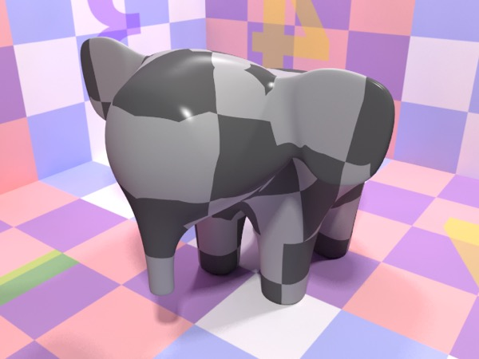

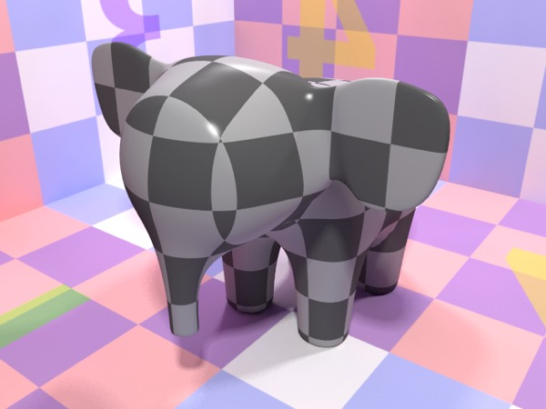

_**Top**: procedural checkerboard using UV-mapping. **Bottom**: procedural checkerboard using 3D (spatial) mapping (the default setting for procedural textures)._

Image-based materials are driven by UV-coordinates, but procedural materials are driven by 3D spatial coordinates by default (some offer the option of using UV coordinates). The fact that procedural materials work without needing UVs is often an advantage, but not always. Fabric, for example, tends to follow the flow of the surface and not act like a solid procedural material.

#### Default UV Maps

All Cheetah 3D’s primitives (except for the polyhedra) have a default UV mapping which produces reasonable results. Objects created using the lathe, sweep, and extrude creators also get default UV maps.

Here are examples of the default UV-mappings for all the primitives and examples of the sweep, extrude, and lathe creators.

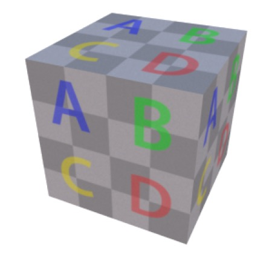

*Box*

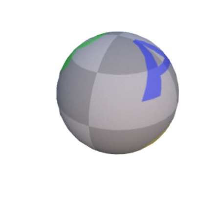

*Ball*

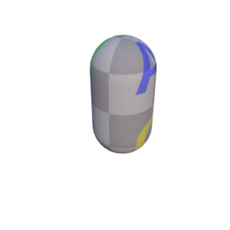

*Capsule*

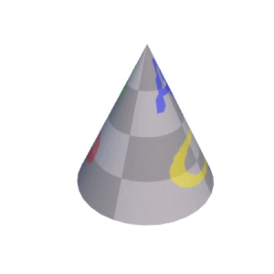

*Cone*

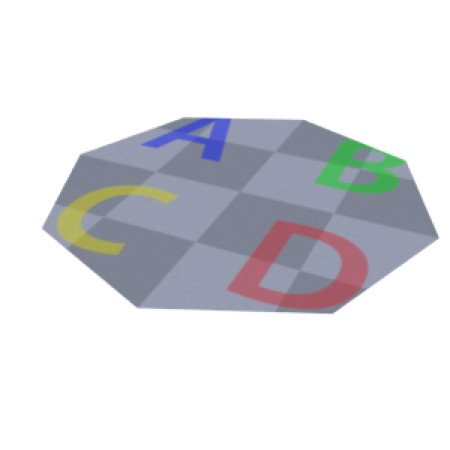

*Disk*

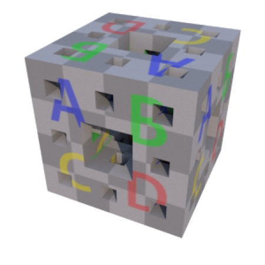

*Fractal*

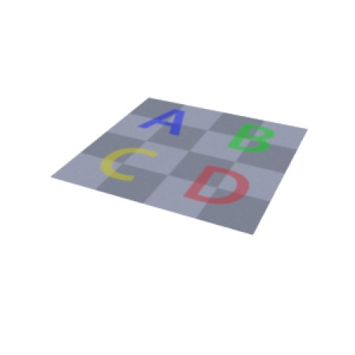

*Plane*

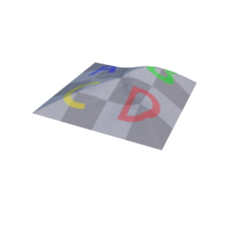

*Relief*

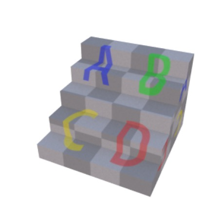

*Stair*

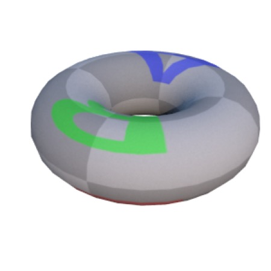

*Torus*

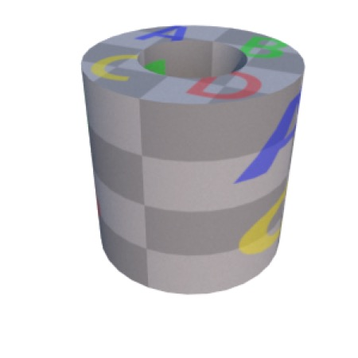

*Tube*

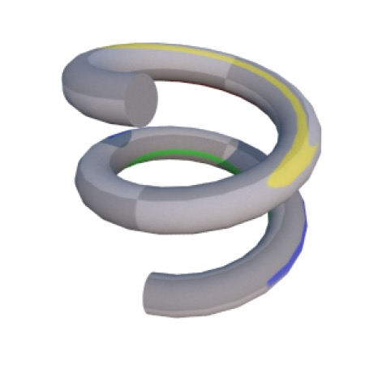

*Sweep*

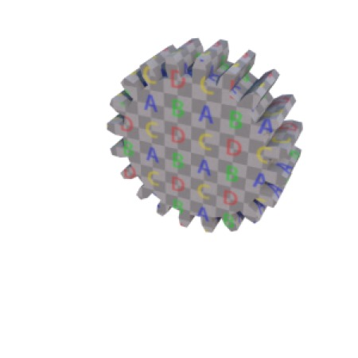

*Extrude*

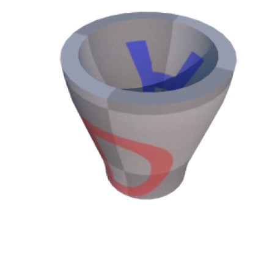

*Lathe*

#### Quick and Dirty Bumpmaps

Often the easiest way to generate a bump map for a material is simply to use the same image you’re using as your diffuse map. Even if it’s not exactly accurate to treat “everything dark” as a crack or dent, it often works well as a first approximation.

