## Transparent Materials

In simplistic terms, a transparent material is any material whose transparent color is something other than black in some places. Note: as soon as a material’s transparent color becomes non-black, rendering it becomes significantly slower

### Refraction

Refractive Indices of various materials (source: http://en.wikipedia.org/wiki/List\_of\_refractive\_indices):

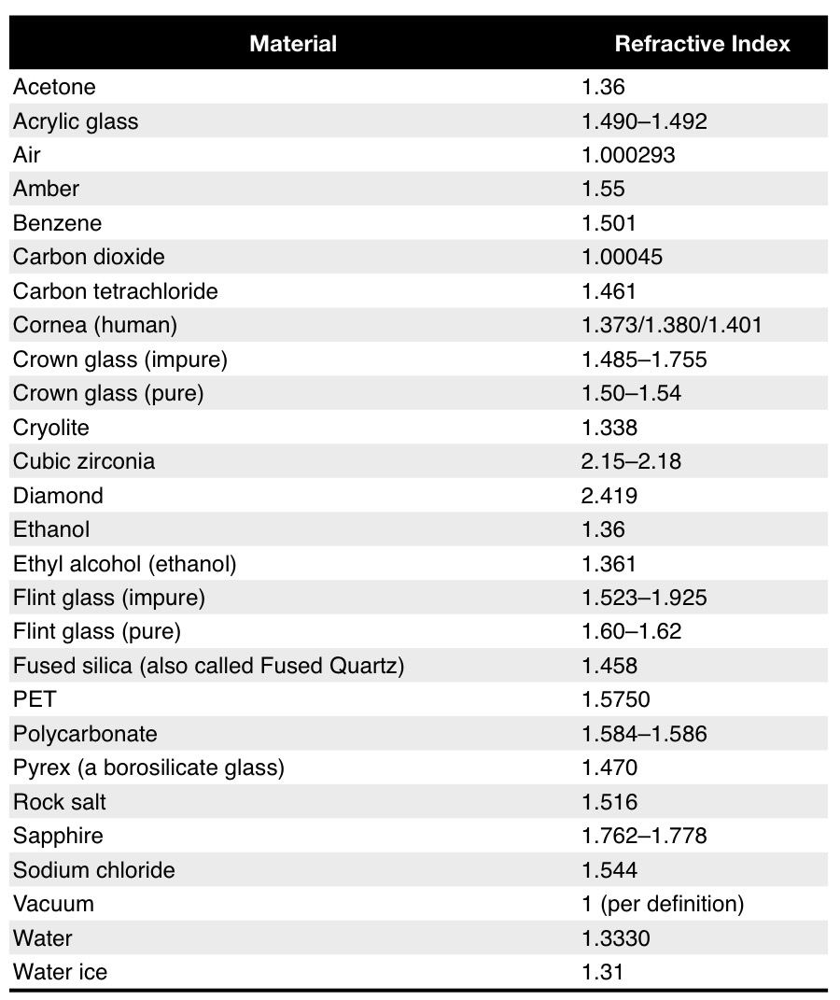

### Fresnel Effect

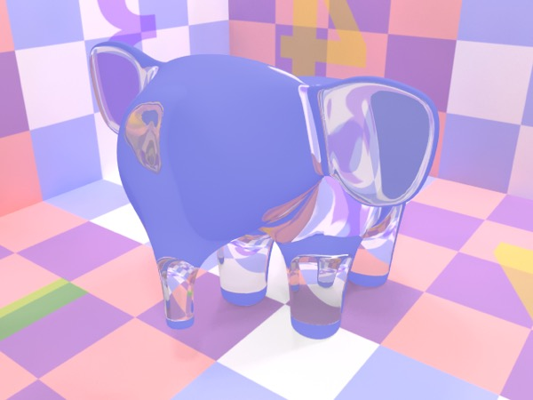

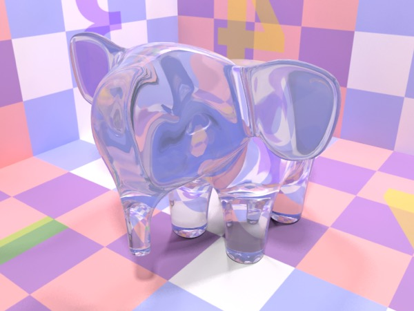

_**Top**: “glass” with transparency set to light grey and reflection set to black. **Bottom**: as left, but with the fresnel box checked._

The Fresnel effect simulates the behavior of real-world materials by adjusting the transmission and reflection characteristics of a material based on the viewing angle. In general, the simplest way to produce a realistic transparent material is to check the fresnel box and set its rfractive index correctly.

### The Dielectric Shader

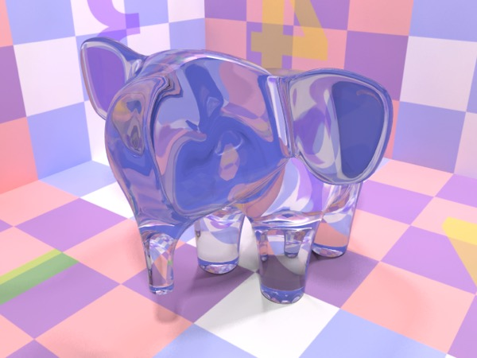

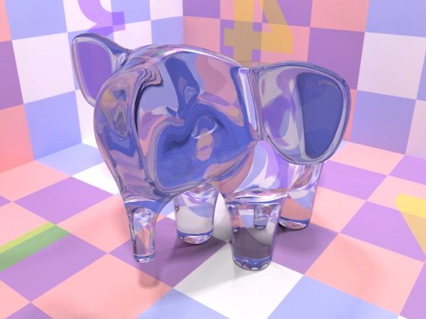

_**Top**: material shader “glass” (diffuse . **Bottom**: dielectric “glass”. Same transparency and refractive index. Very similar, but not quite identical._

The Dielectric Shader is designed to make creating realistic transparent materials easy. Anything you can do in the Dielectric Shader you can do in the Material Shader (with extra work and more control), but the Dielectric Shader is simpler to work with, and produces good results.

Unlike the Metal shader, the dielectric shader doesn’t offer you any capabilities that the Material shader lacks, although its output is not exactly the same as a Material shader with the “obvious” equivalent inputs.

#### Soap Bubbles

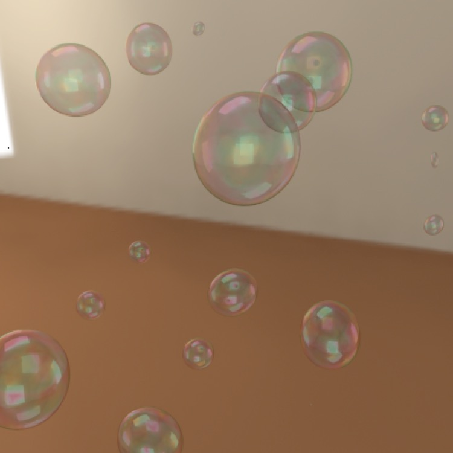

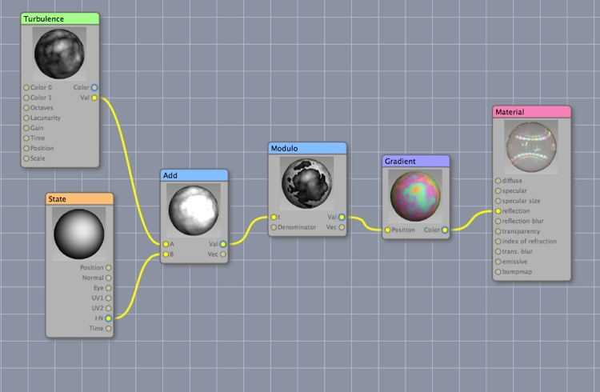

The problem with the dielectric shader is that it doesn’t let you vary the transparency or reflection colors. Here I’ve created a soap-bubbly color effect by adding the I•N channel of the State node and a Turbulence procedural texture, then used a Modulo node to wrap the values around (so 1.1 becomes 0.1) and fed this into a gradient of pastel colors that starts and ends with the same color and used this as the reflection color. The other settings are simply tweaks to get the right reflectiveness.

The bubbles themselves are icosahedrons with a shell modifier (to give them a thickness of 0.02) and 4 levels of Stam-Loop subdivision. (Stam-Loop is optimized for triangulated meshes, and an icosahedron is a triangulated mesh.)

#### Liquid in a Glass

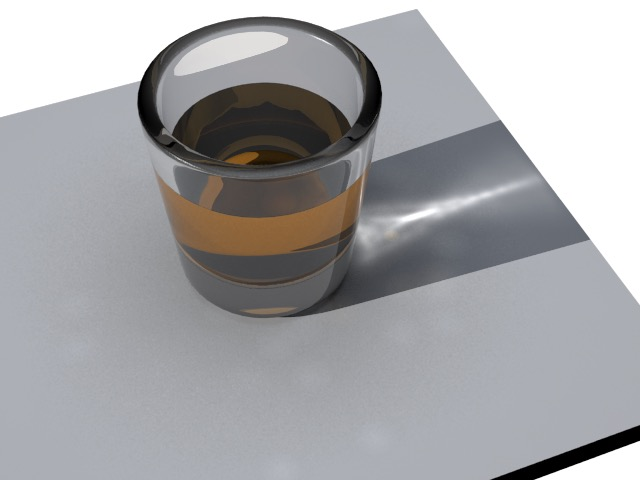

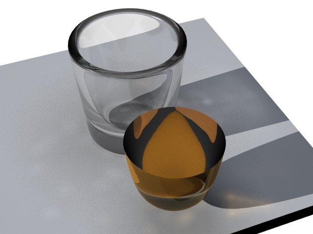

_**Above**: a render of a shot glass. **Below**: the glass and the liquid inside it rendered apart to show how the scene was assembled. The liquid is slightly larger than the interior of the glass to avoid rendering errors. (Note that C3D’s caustics are not correctly picking up the color of the liquid.)_

To render liquid in a glass the best option turns out to be to model the liquid as an object that is slightly larger than the glass containing it. It’s as simple as that. 

**Note**: in earlier editions of this book I incorrectly stated that the liquid should be slightly _smaller_ than the container. It turns out that the most realistic-looking results are obtained by making the liquid slightly larger than the container.

You’ll generally want to increase the **Max Ray Depth** in the **Render Preferences** for that scene.

#### Bubbles in Water

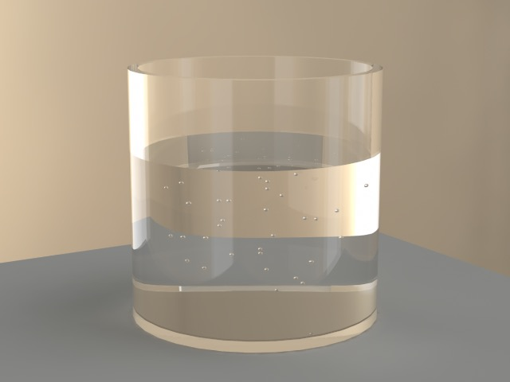

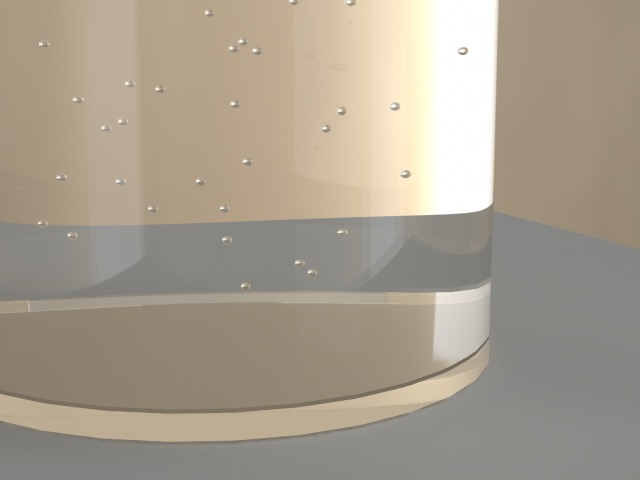

To render bubbles in water you might think you could make the bubbles out of an “air” material that had a refractive index of 1.0, but Cheetah 3D’s renderer doesn’t do what you’d expect and the bubbles essentially disappear. The bubbles need to be holes in the geometry of the water. To accomplish this I made the bubbles out of spheres with all their polygons flipped (so the sphere “faces” inward), made a particle system of the bubbles, and then converted the particle system to a mesh (using Tool -\> Particle -\> Polygon). I then imported the resulting mesh into the water mesh.

