## Understanding Nodes

### Node Types

**Shader**: the heart of a material. Literally the software gizmo that decides what color to make a pixel (or subpixel) based on the information available (lights, texture mappings, local and global coordinates, orientation of the surface, etc. etc.).

A material can only have one shader.

**Constant**: a convenience object for holding a fixed value you want to pipe to other places. This can save the trouble of having to edit multiple objects to achieve a specific effect (e.g. if you change the scale of one thing you may need to change the scale of another to match it -- use a constant value and pipe it to both). It’s also a good way of making critical controlling values for a material easier to find.

**Filter**: a mathematical function that has an obvious visual description (vs. those which don't, which are referred to as "Math"). 

Filters are a bit like Photoshop filters with a significant practical difference — a lot of Photoshop filters involve calculating the value of a filtered pixel from the values of an arbitrary collection of _neighboring_ source pixels (e.g. “gaussian blur” is calculated by replacing a given pixel with a weighted average of the original pixel and nearby pixels). Filter nodes cannot act on anything other than the value of the current point (both for performance and because the input is considered to be resolution-independent). This makes area-based filter effects — like blurring and sharpening — very difficult to do.

**Math**: a mathematical function that takes one or more inputs, performs math on them, and produces an output (e.g. addition, average, dot product, and so forth).

**Other**: this is where you find the "state" and “instance” nodes which gives you access to information about the thing being rendered and the scene it resides in for use as input into other shaders. 

You might use the state node to use positional information about an object to affect its properties. Similarly, you can use instance node properties to drive particles (e.g. they might change color as they get older).

**Textures**: a software gizmo that generates texture maps somehow or other. The most popular one is the image texture which outputs an infinite plane (by default with the image tiled on it, but this can be switched off in either axis). The other filters are a combination of simple repeating functions (e.g. bricks) and various fractal noise algorithms.

### Connecting Nodes

It’s perfectly possible to create some useful materials without using anything other than a shader node, but more complex materials will involve connecting nodes to one another.

Each node has possible **inputs** and **outputs**. Inputs are on the left of a node, outputs on the right. **You connect an output of one node to an input of another by dragging a line between the two.**

* You cannot connect a node to itself.

* Even though inputs and outputs can have different types, Cheetah 3D can always figure out how to convert one type of output into the appropriate type of input — _but it may not produce the result you expect_.

#### Visualizing an Output Channel

You can see any output channel of any node displayed visually by clicking on it.** This shows you how that output channel varies across the surface of a sphere if that output channel were to determine its color.

Perhaps the most intuitive node you can visualize is an Image node.

_Here’s the same image node, but with the color vs. value outputs selected. The value output shows grayscale output (note that it isn’t just the red channel)._

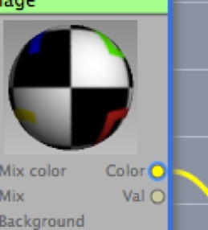

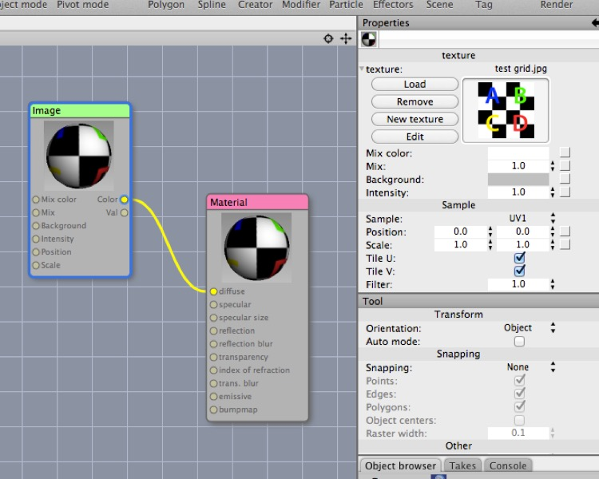

_Here’s a test material comprising a test grid image that feeds its color output into the Material shader node’s diffuse input. Currently you’re seeing the image itself being visualized as mapped onto the test sphere, and it produces a fairly straightforward result._

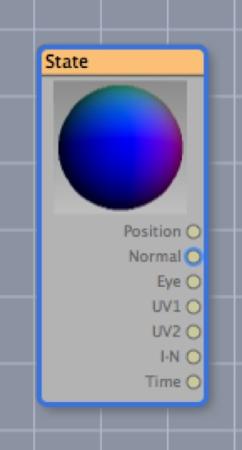

Here is a **State** node (it’s not hooked up to anything else) with its **Normal** output channel visualized. If you can understand what you’re looking at here, you’re well on your way to grasping 3D vector math and the material system, so I’ll try to explain it.

First of all, think of a Normal as a little arrow of length 1.0 pointing straight out from every point on the surface of an object. So, for a sphere, it’s like imagining the entire surface of the sphere covered in hairs sticking straight out.

Now, this sphere we’re looking at is living in a 3D space, and we’re looking at the front of the sphere. You may recall from our initial discussion of 3D math that when you look at the “front” of a scene you’re looking **down the z axis at it**. So the little arrows in the middle of the sphere are pointing straight at us up the z axis. Expressed as an x,y,z vector, the center of the sphere is 0,0,1. 

But we’re visualizing this point 0,0,1 as a **color**, so it’s blue (r = 0, g = 0, b = 1). Neighboring arrows will be nearly pointing at us, so they’ll be ~0, ~0, ~1, so the central area of the sphere is blue.

Now let’s consider the top of the sphere. The arrow here will be pointing straight up, which is up the y axis. So it will be 0,1,0. Treated as a color, that’s green.

If that all made sense, now you understand what you’re looking at. And this is how you can turn something as seemingly dry as “normal vectors” into something beautiful!

**Exercise**. Now, if you click on the Position output channel of the State node it looks exactly the same as the Normal channel. What’s going on here? I’ll give you a hint — consider these two materials:

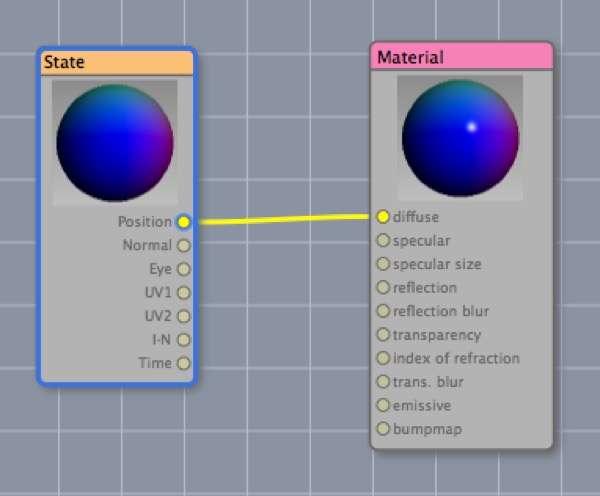

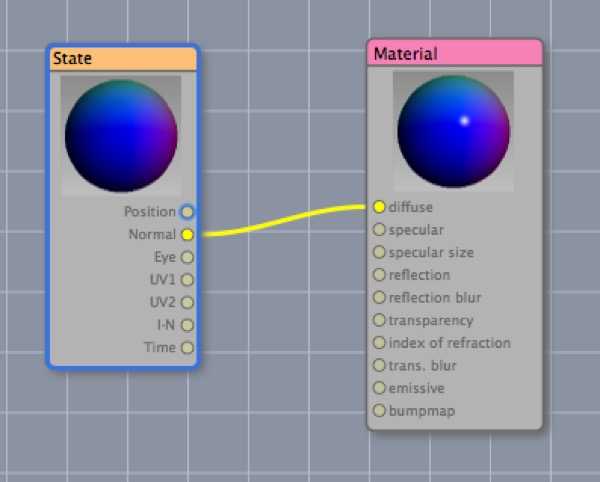

These might seem identical here, but they will look very different when applied to a unit cube:

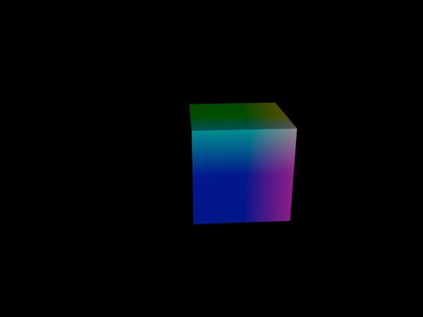

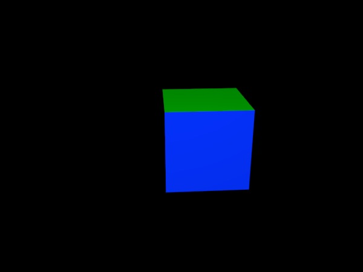

The reason for the difference is that a normal is a little arrow pointing out from the surface, whereas position is, well, position. As you move across the face of a cube the normal stays constant (so the faces of the cube colored with normals are flat colors) whereas your position is changing (so the position colored faces are gradients).

The surface of a unit sphere coincidentally happens to have normals whose values exactly equal the positions on its surface. (If you consider the arrow pointing out from a point on the unit sphere, it’s identical in length and direction to the arrow from the center of the sphere to that point, which is the position.)

### Channel Types

Each node channel has a **type**. There are three types: color, vector, and number. You can connect an output of one type to an input of a different type and the necessary conversion will take place automatically. (See **Converting Between Types**, below.)

Properties can have many names, but there are only three fundamental types of property (in other words, the kind of information that goes down one of the curvy lines from one node to another is always going to be one of three things).

**Color**: a color is a vector (red, green, blue, alpha) with each value ranging from 0 to 1. Colors also have an _intensity_ (this essentially supports dynamic range beyond “white”) so that a color with intensity greater than 1 will be brighter than bright. (This is particularly useful when creating objects for radiosity and/or reflections.)

Mathematically speaking, a color is a vector with an alpha channel (the intensity handles colors with a magnitude of more than one).

Note that support for the alpha component of a color is inconsistent. Some nodes will take a color input but ignore the alpha component. The key case where the alpha component is supported is the Material shader node.

**Number**: a number is a scalar floating point value. If used as a color, 0.0 or less becomes black and 1.0 becomes white. Numbers larger than 1.0 become _more intense_ white (see color, above).

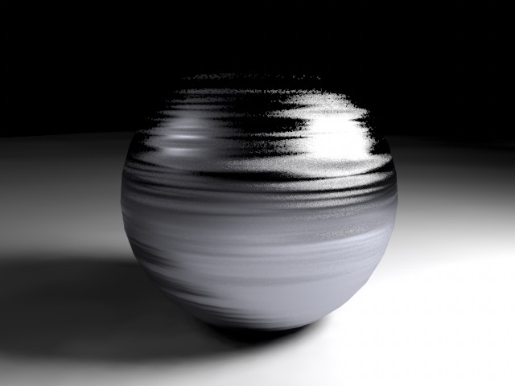

_The brushed metal sphere is illuminated by two small squares, one “lit” with the number 1.0, and the other by the number 10.0._

**Vector**: a vector is simply a triple value (x,y,z) where each value is a floating point number.

Vectors can represent positions in 3D space, directions, directions with magnitude (think "velocity"), and even colors and orientations (x, y, z rotation). In C3D they're usually used to represent positions or directions, but occasionally it's useful to think of colors as being vectors too.

### Converting Between Types

In general, conversion tends to work best when all values are in the range [0,1] (that’s math notation for a number greater than or equal to zero, and less than or equal to one). In general, color values below zero are treated as zero, while those above 1 may be interpreted as clipped to 1 or intensely bright (depending on context).

E.g. if you feed the constant 10.0 into the diffuse channel of the material shader it acts just like white. But if you feed it into the emissive channel (and you attach a radiosity tag to your camera) the difference from 1.0 will be enormous.

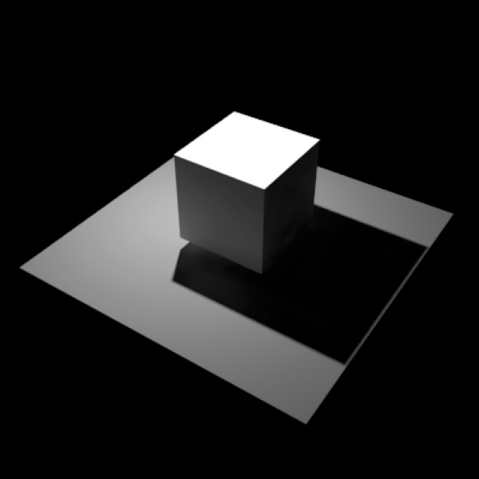

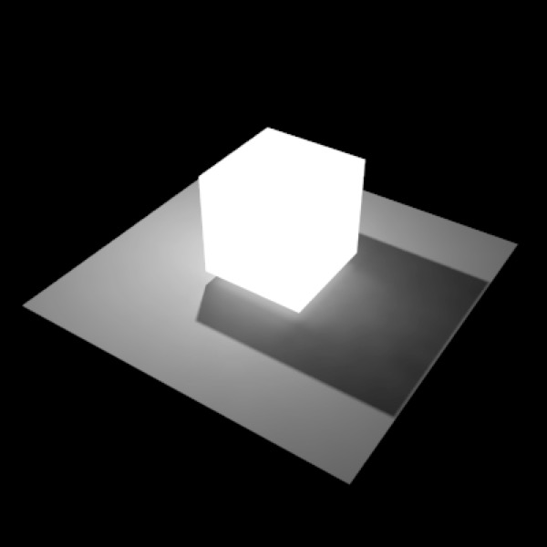

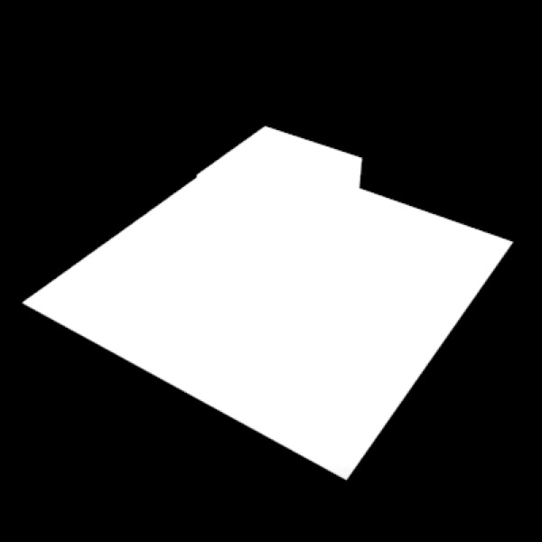

_**Top**: a cube with constant 1.0 or 10.0 fed into material’s diffuse channel looks the same. **Middle and bottom** are the same cube with 1.0 and 10.0 (respectively) fed into the material’s emission channel._

When you send information of one type to a property of another type it will automatically be converted into the correct type. The way this works is usually pretty straightforward:

**Color to Vector**: alpha channel gets dropped.

There is a wrinkle though:

_The alpha channel of a color is an “invisible fourth channel” that only seems to work with the diffuse input of a material shader when **Use Alpha Channel** is checked._

**Vector to Color**: x, y, z become r, g, b; alpha channel is assumed to be 100% (completely opaque).

**Vector or Color to Number**: the first value (x or r) is used.

There’s a special case to consider, which is **monochrome colors**, such as the Val channel of an Image texture node. When Cheetah 3D converts a color to a greyscale color, it appears to do so “as expected” (which, I believe, is to average r, g, and b) rather than simply using the r value.

_This shows the value output of an image material compared with the value output of a multiplication node that’s multiplying the color input by (1,1,1)._

**Number to Vector**: the number gets copied to all three values (so 0.5 becomes 0.5, 0.5, 0.5).

**Number to Color**: the number gets converted into a greyscale value (so the value goes to all three channels, but alpha is made 100% (completely opaque).

