## Building Procedural Materials

We’re going to build some materials from scratch in an effort to understand how all this stuff fits together. We’ll start simple and then build up to some pretty complex concepts.

One of the simplest ways to quickly create nice materials in a hurry is judicious use of different procedural textures. One of the huge advantages of procedural textures is that they can produce seamless surface detail without UV mapping, but this comes at a price. A lot of procedural textures don’t look very convincing, and can have a kind of “plastic” or “alien” quality.

The key to creating procedural materials is to get a feel for how the different “noise” functions work. The first thing you should do is play with them — add them to a material, and play with the **scale** values in particular.

### Advanced Techniques

The following techniques are very powerful ways of using the node system. If you can master them, there’s pretty much nothing you won’t be able to figure out how to do.

#### Using a texture as a selector

Let’s suppose you want a material that looks like a combination of two materials — dirt and grass, rust and steel, cobbles and mortar. If you can find a texture that looks like the distribution of the two pseudo materials (image textures are just fine too) then you’re on your way.

Let’s take the example of irregular cobblestones.

If you look at the various procedural textures, voronoi has some very promising looking options.

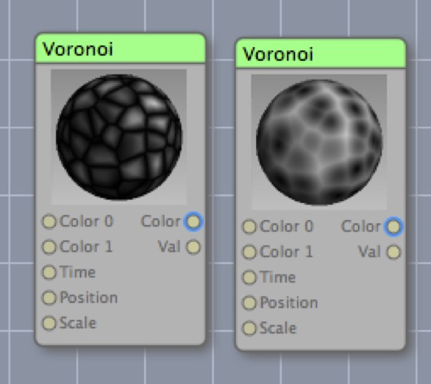

*Two Voronoi texture nodes side-by-side. The one on the left has everything set to default values. It kind of looks like greyish cobbles with black mortar already. On the right is a Voronoi with type set to F1, which looks nice for creating some kind of blobby organic cellular thing.*

The first thing we want is to make the division between cobble and mortar sharper, and the best way to do this is to use a gradient node.

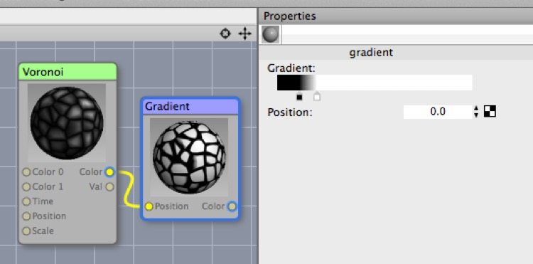

I’ve tweaked the gradient node so that the cobbles tend to be solid white and the mortar tends to be solid black. Now I can use this as a “selector” to pick between two different inputs.

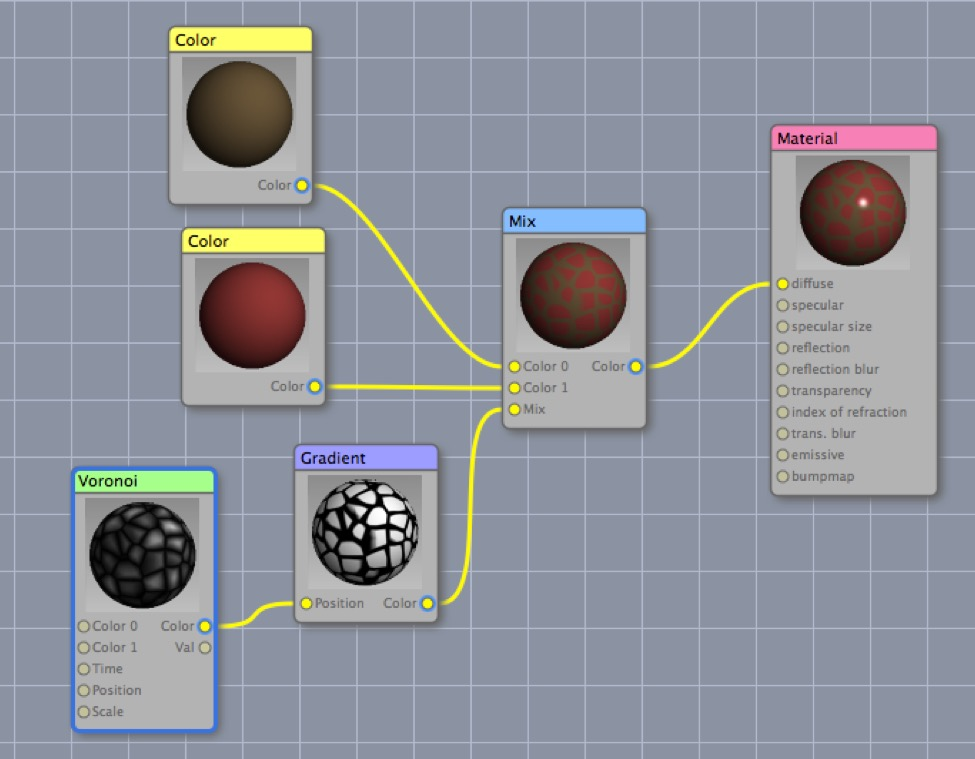

*The Mix node uses a value between 0 and 1 to select between two inputs. In this case we’re using flat colors and passing the result to the diffuse channel of our shader.*

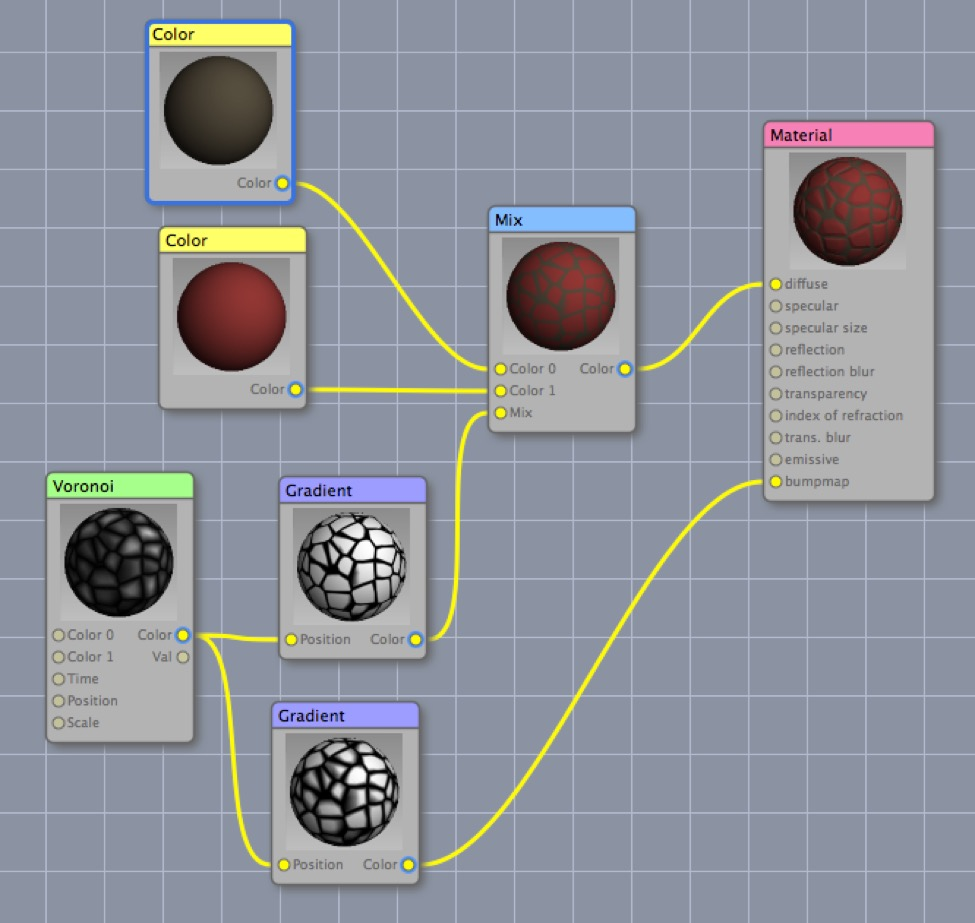

*Now I use a slightly different gradient node to produce a nice bump map.*

We can refine this material endlessly. The mix node could be selecting between two different textures instead of simple colors. Similarly the gradient node generating the bump map could itself drive a mix node selecting between two bump maps (one for the mortar and one for the stone)

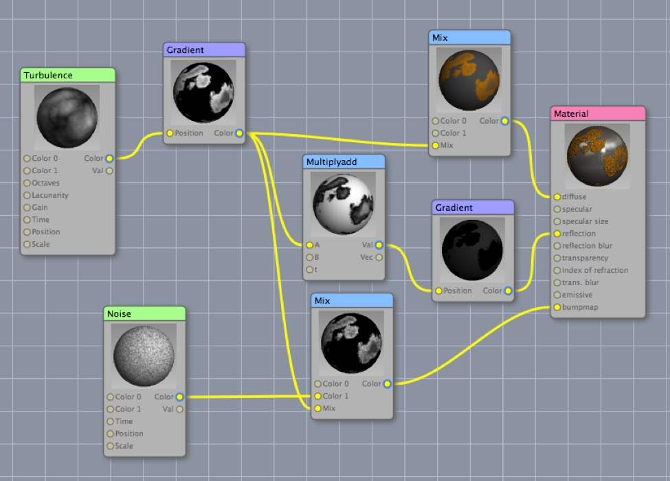

*The “Rusted Steel” material (which I believe comes bundled with Cheetah 3D) is a good example of this technique. *

*The turbulence material is used to select between the clean metal and the rusted metal (black means the metal is clean, anything else indicates a certain level of rust. *

*Noise is mixed by this value to produce bumps on the rusted areas, while color is mixed by it to give the rusted parts the correct color. *

*Finally, a MultiplyAdd node is used to invert the value to make the clean parts shiny (reflective in this case rather than specular).*

#### Orientation-based materials

There are two very common kinds of orientations that we often want to use to drive materials: spatial orientation, and orientation relative to the viewing angle.

Spatial orientation is great for doing things like terrain shaders (e.g. snow and dust tends to gather on flat, horizontal surfaces, similarly cliffs don’t tend to be thickly vegetated).

An orientation is represented by a normal. You can measure how similar a surface’s orientation is to a given normal by calculating its dot product with the surface’s normal.

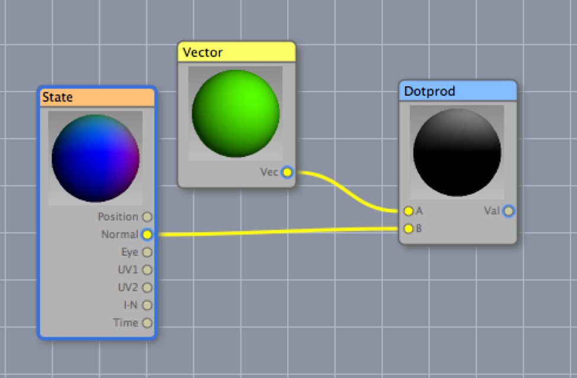

*Here we visualize the dot product of the surface normal (on the default sphere) and a normal pointing straight up (0,1,0) — which corresponds to green (hence the vector constant is displayed as a green ball). *

*You can see on the “normal ball” that the normals look green at the top of the sphere (where the vectors start getting close to (0,1,0) and blue on the “front” on the sphere where the vectors start getting close to (0,0,1). *

*But the real news is the dot product, which looks kind of like a bit of snow on a black ball. Neat huh?*

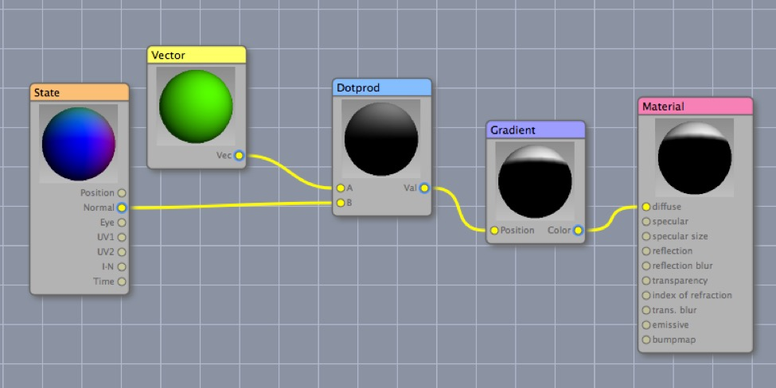

*So now we refine our dot product using a gradient to sharpen the cutoff from snow to no snow. A quick test render shows we need to change the cutoff a bit, but the real problem is that our shader puts “snow” in the valleys as well as on the peaks.*

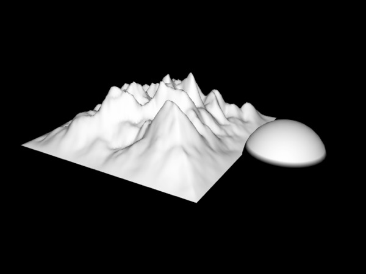

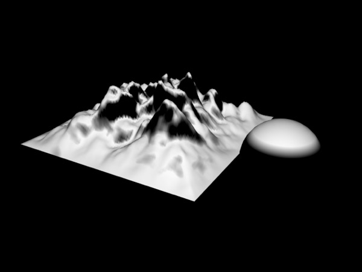

*Changing the gradient can determine how horizontal a surface needs to be to be covered in snow, and how sharp the cut-off is.*

*A more sophisticated version of this material might — if being used for terrain — take absolute altitude into account (e.g. the driving value for snow vs. no snow might be a combination of the dotproduct we just calculated and altitude (the y coordinate of position).*

**Viewing angle** often drives optical properties such as reflection and transmission — the “fresnel” property of the material shader gives you an all-or-nothing implementation of the behavior of many real-world materials, but you might want a more subtle effect, or you might be producing a composite material (e.g. stained glass window) where some parts of the material have fresnel behavior and some don’t.

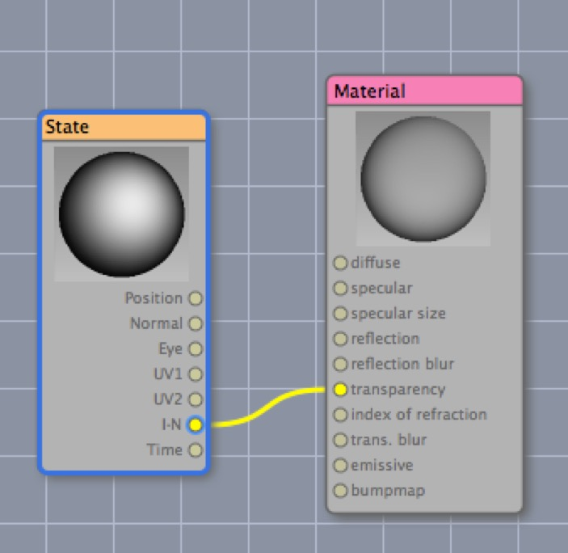

The state node gives you an interesting output channel called I•N — the dot product of the viewing angle (I) and the normal of the surface you’re rendering (N). In short, a value that will be 1 (or white) for a surface pointing straight at the camera, 0 (or black) for a surface pointing off to the side, and –1 (or even blacker) for a surface pointing directly away from the camera.

If I feed I•N straight into the transparency input of my shader node, I get a pretty weird kind of material. (I’ve also set its refractive index to 1.0.)

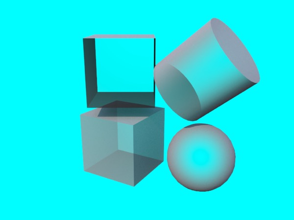

*Here’s a rendering of some test objects with this weird material.*

This may seem peculiar, but it’s actually exactly what the fresnel checkbox does to transparency. The difference is that it does a similar (but opposite) thing to reflection.

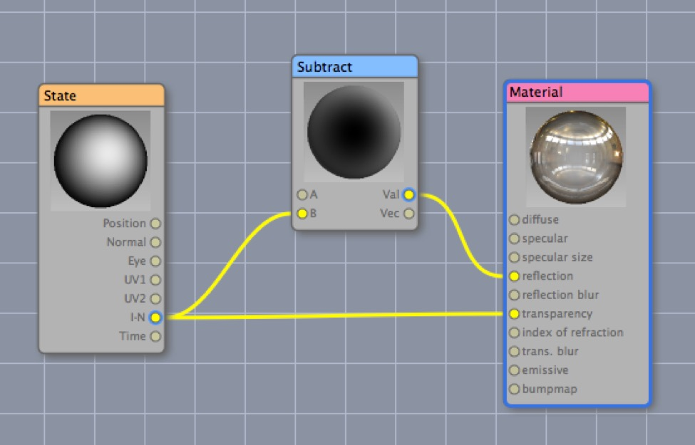

*Here I’ve simply flipped I•N (by subtracting it from 1) and used that as the reflection channel, and the result is exactly like checking the “fresnel” box. It would look like glass if I hadn’t set the refractive index to 1.0.*

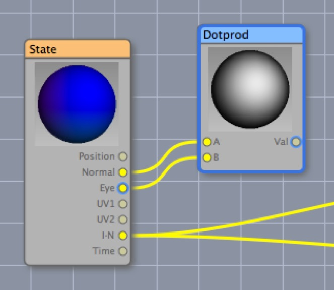

*It’s worth noting that I•N is exactly the same as taking the dot product of the Eye and Normal output channels. If you want to drive a material based on the viewing angle itself, then you can simply use the Eye vector.*

Now for a really interesting experiment, we’ll use the Eye vector to drive a shader that can produce a procedural background environment. (Ever wanted to be able to completely customize the reflected background the Skylight produces?)

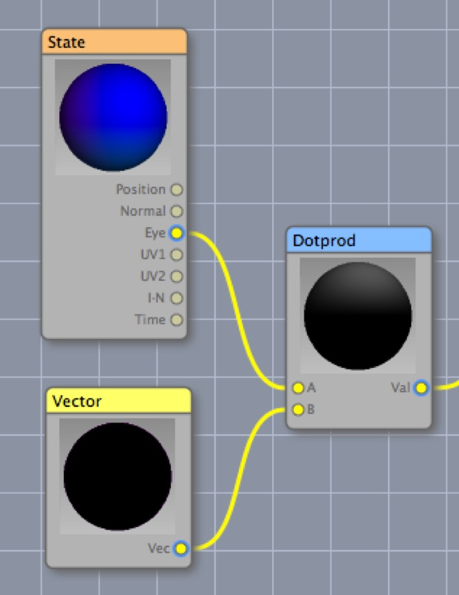

*We start by taking the Eye vector from the State node and dot multiplying it with the down vector (0,-1,0). (The eye vector points from the point being rendered to the camera, so you can see the bottom of the sphere gets slightly green because the direction from the bottom of the sphere to the camera is slightly upward.)*

*This dot product will be 1 for things directly above the camera and –1 for things below the camera and 0 for things level with the camera (i.e. the horizon). Note that these calculations are made in global space so rotating the camera will not change them.*

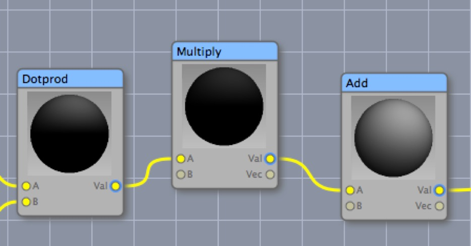

*To select from a gradient we want a value in [0,1] not [-1,1] so we multiply by 0.5 and then add 0.5. (Sorry, math.)*

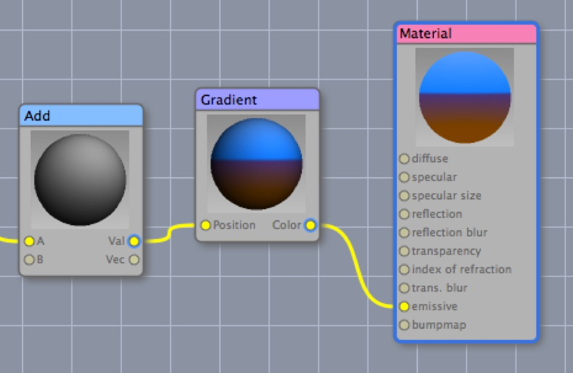

*This value then selects from a gradient which lets us control the color of the sky, the horizon, and the ground beneath our feet and the severity of the cutoffs between them. This then feeds into emission (diffuse and specular are set to black).*

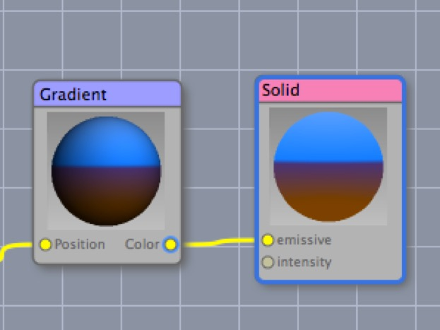

*Even simpler, I could use a Solid Shader node.*

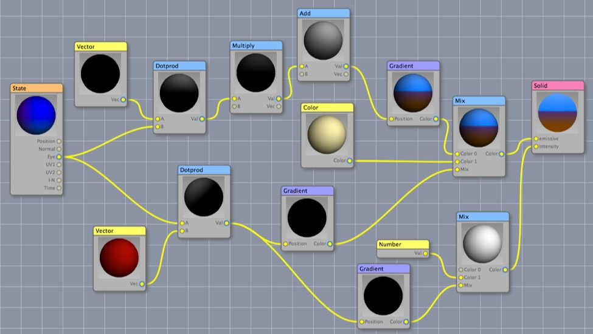

*Now this is getting complicated.*

*I’ve made the material even more complicated in order to put a “sun” into the sky. I’ve used a second vector to represent the direction to the sun, then I dot product the Eye vector with that to get a “sunwardness” value which I tweak with two different gradients, one to select between background color and sun color, and one to select between background intensity and sun intensity (I want the sun to be super bright).*

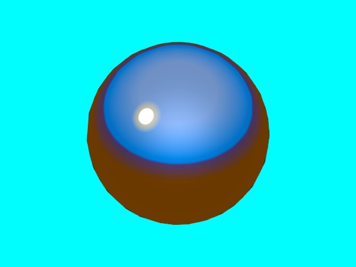

*And here’s a steel ball rendered with the new procedural background. (The sphere has a render tag on it that prevents it from casting shadows or being visible in primary rays. If I wanted it to be rendered as the background, I’d switch visible in primary rays back on.)*

#### Using a texture to offset spatial-mapping

So let’s suppose we’re creating a simple-minded terrain shader based on altitude. High bits are white (covered in snow) and low bits are covered in grass with the bits in between being brown.

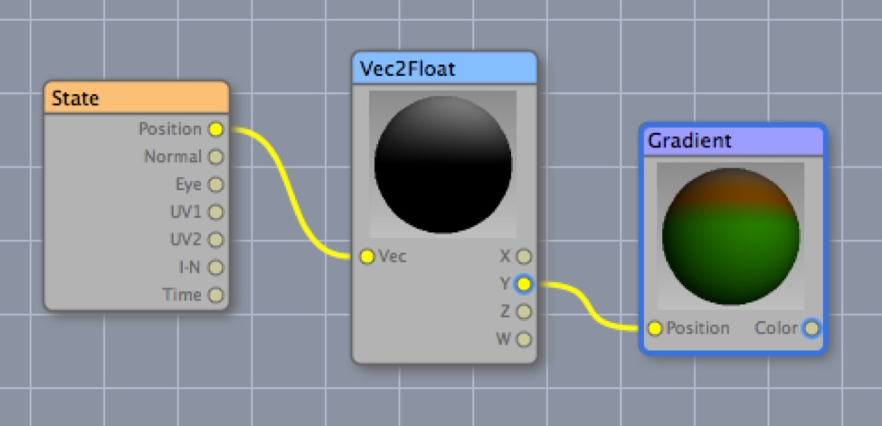

*We pull the position and pull out the y coordinate. (This is position in local coordinate space, so we want our object’s geometry to sit between y=0 and y=1 or the y value will to “blow out”.) I feed this into a gradient (you don’t see any white because the sphere only gets up to y=0.5.*

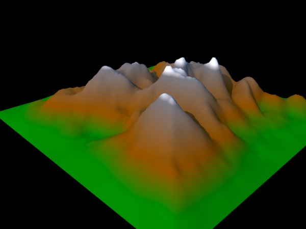

*Here’s our simple test terrain (carefully scaled so the top of the highest mountains lie at y=1 in its local coordinate space) with this material applied. It doesn’t look too bad for such a simple material… until you see it side-on.*

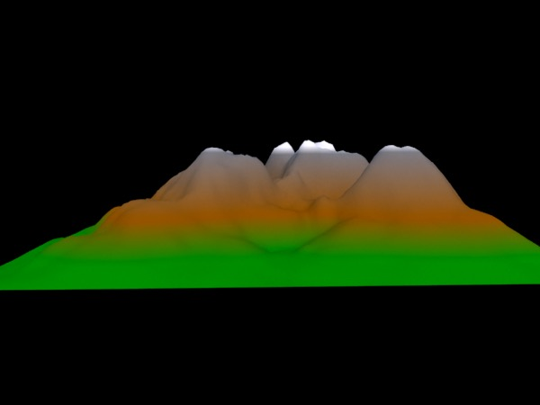

*Not quite side-on and it already looks way too regular. So what we want to do is make the way the terrain changes with altitude a little random, so we’re going to offset the y coordinate we’re using with a little noise.*

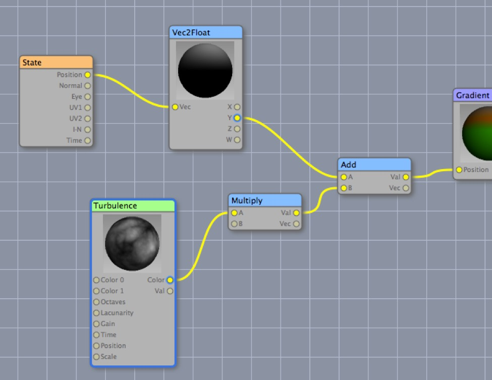

*So I simply add a turbulence texture node, multiply its output by 0.1, and then add that to the y value before filtering it through the gradient. Here’s the result.*

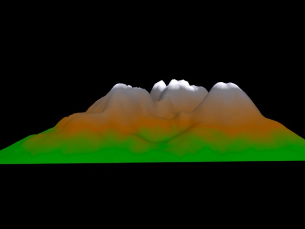

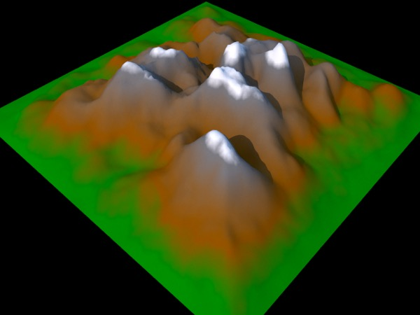

*As you can see we now have nice fractal jiggles in the transitions between the different terrain colors.*

#### Terrain Shaders

Terrain shaders can be built by mashing up the techniques described above. The simple spatially-mapped shader described above can be beefed up by using mix selectors to vary things like the bump maps and shininess of the different terrain strata (you could make the green look like vegetation, the brown look like rock, and the white like snow and ice). 

Similarly you can use dot products to detect horizontalness and then combine that with position to do things like make snow appear at lower altitudes on more horizontal surfaces, and vegetation to shy away from sheer surfaces.

