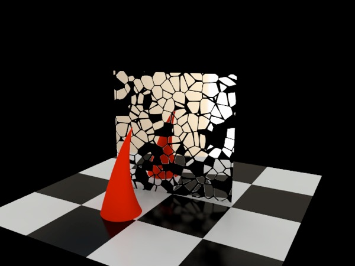
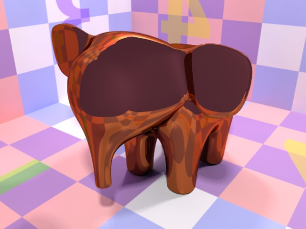
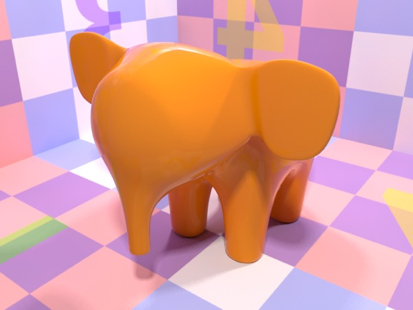
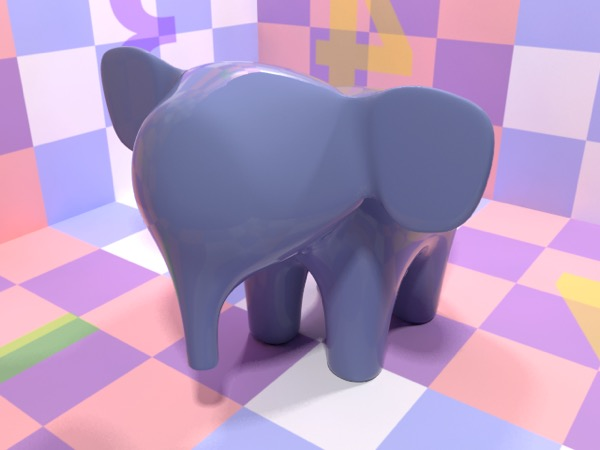

## Reflective Materials

*Reflection Map Example: Cracked Mirror.*

### The Metal Shader

*Metal shader with copperish reflection color. Top: roughness 0.0. Bottom: roughness 0.1, anisotropy: 0.9.*

The Metal shader offers one key feature that the Material Shader does not, and that is anisotropic reflection, which essentially means that it lets you *bias* the way reflections are blurred (to produce the effect of brushed metal). Aside from that, anything the Metal shader can do, the Material shader can do with more work (and control).

### The Car Paint Shader

*The Car Paint shader produces a nice “coated gloss paint” look with very little effort.*

The Car Paint shader simulates the behavior of car paint, which is something you can’t do with the Material Shader (at least, not easily). Car Paint is characterized by having a thin transparent coating and metallic properties.

