## UV Mapping

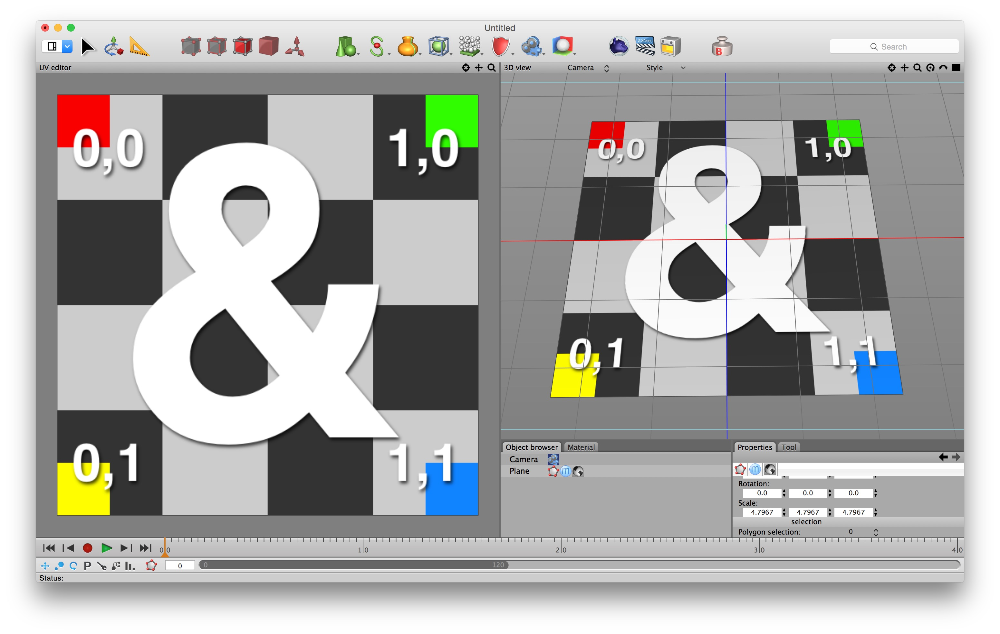

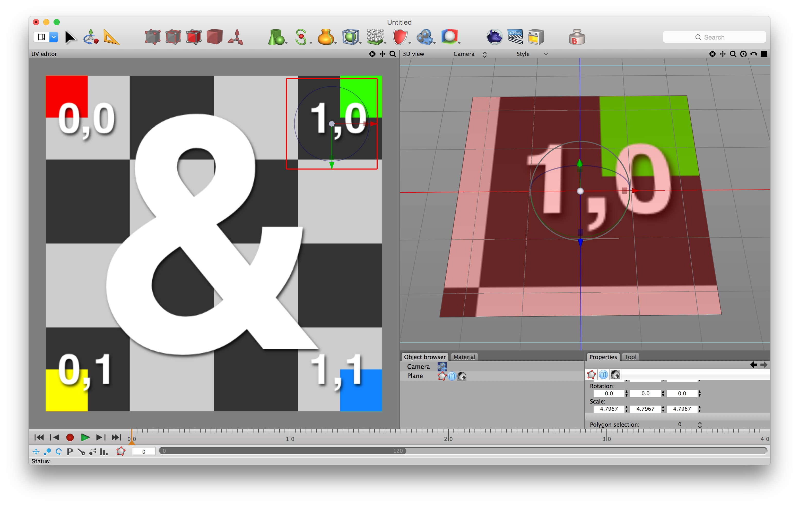

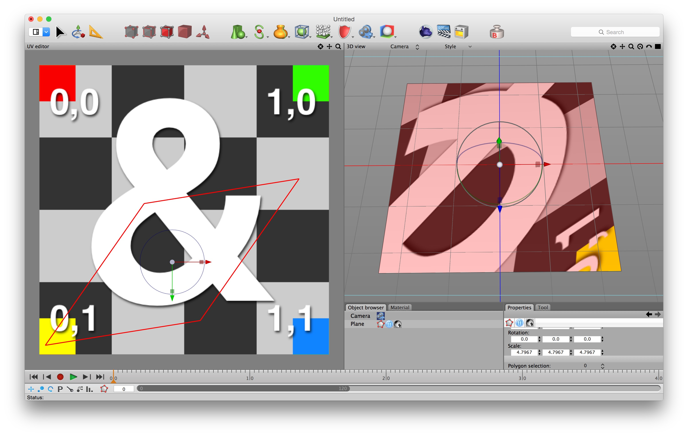

*UV mapping simply involves giving the vertices of polygons in a mesh coordinates in UV (i.e. texture) space. This affects the way the image is “mapped” onto the polygons. In the three examples above (all show Cheetah 3D’s UV Editing layout) I’ve clicked the “Edit” button of the image in question (so it shows up in the UV Editor) and you can see a simple quad (four sided polygon) displayed in UV space and the 3D view. At the **top** you see the default mapping of a texture to a plane. **Middle**, I’ve simply scaled the UV representation of the polygon down and moved it so that a feature is centered. In the **bottom** image, the rotated quad is “squashed” because the image isn’t square, and so it’s being rotated in non-uniformly scaled space.*

The basic idea of UV-mapping is to place 2D images onto 3D surfaces. The 2D images are treated as having their own coordinate space (where u and v replace the traditional x and y) and then every polygon in a 3D mesh is assumed to have a representation in uv space as well as 3D space.

To this end, a mesh has uv points (or vertices) with uv coordinates in addition to its 3D points, and each polygon is represented as an ordered set of UV points.

If you consider the default plane, it’s a quad with four 3D vertices: -0.5,0,-0.5, -0.5,0,0.5, 0.5,0,-0.5, and 0.5,0,0.5. The quad is defined in terms of those coordinates, but also in terms of four UV coordinates: 0,0, 0,1, 1,0, and 1,1.

UV-mapping consists of editing the UV-representation of a mesh (in 2D) just as you edit the 3D representation of the mesh to alter its 3D geometry.

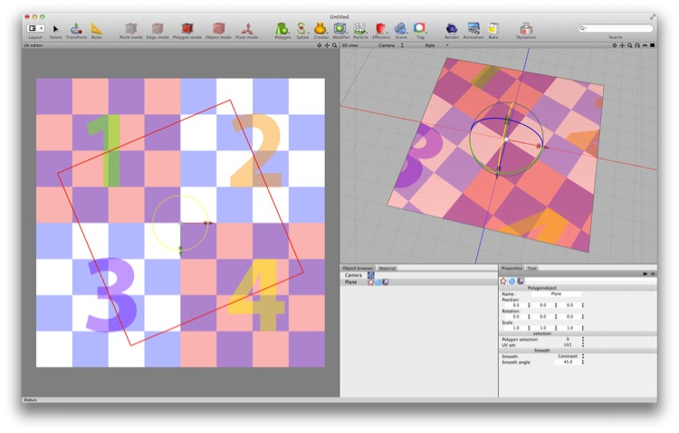

*Cheetah 3D’s UV Editing view is designed to allow you to directly edit the UV layout of a mesh and see the results interactively — as you move things around in the UV editor, the displayed model changes live.*

Cheetah 3D provides a UV editing view which shows a mesh’s UV representation and lets you edit it using the standard transformation tools (restricted to 2D). By default, Cheetah 3D provides a **UV Editing** layout (available from the Layout menu in the toolbar) which provides a large pane for the UV Editor and a smaller 3D view so you can see the results of your handiwork. If you select an Image texture node you can click Edit to see it under your mesh in the UV Editor (which is very helpful). 

Cheetah 3D also provides some rudimentary texture painting tools which work in both the UV Editor and in the 3D view.

Setting up the UV map of an object — especially a complex object — simply by pushing points and polygons around in the UV Editor tends to be tedious and error-prone — usually there are better options. 

Cheetah 3D has two tools to help you with UV mapping, and they’re the **UV Mapper** (**Tools \> UV \> UV Mapper**) and **Unwrap UV** (**Tools \> UV \> Unwrap UV**).

Not all materials use or rely on UV coordinates. Most materials vary one or more of their attributes as you move across an object’s surface or through space. In general such materials fall into two categories: **procedural** materials, which are often driven by **spatial coordinates**, and **image-based** materials, which are almost always driven by **UV coordinates**.

### UV Coordinates

In any mesh, each polygon is constructed both out of points in 3D space (which show where that polygon is) and points in UV space (which determine how UV-mapped materials will vary across it).

Primitive objects have default UV mappings. E.g. a cube has a UV map such that each square face will be mapped to a square in UV space formed by (0,0), (1,0), (1,1), and (0,1).

If you consider a polygon with UV coordinates for each vertex then you can draw that polygon in UV space (and it may look very different in UV space than it does in 3D space). Image textures are assumed to occupy a square in UV space formed by (0,0), (1,0), (1,1), (0,1), so if you look at the polygon drawn in UV space superimposed on the image, that’s how UV mapping works.

You can see exactly how this works by selecting **UV Editing** from Cheetah 3D’s Layout menu (in the toolbar). Click on any object to see how its polygons appear in UV space.

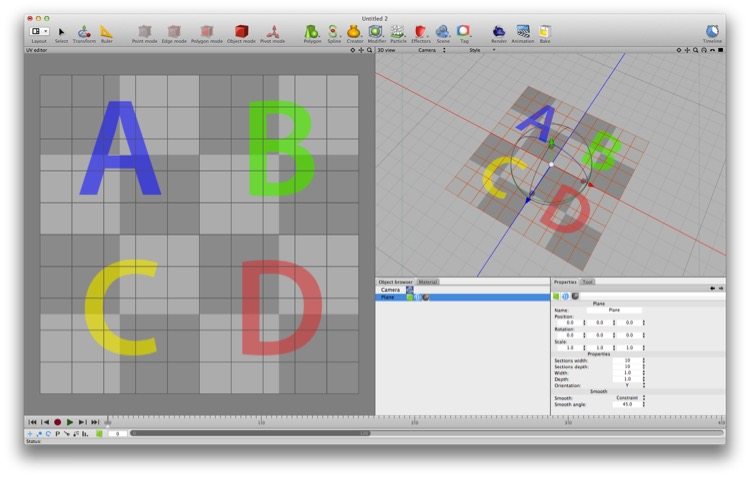

*Here’s a plane (with 10x10 sections) with my test material assigned to it in UV Editing layout. I’ve clicked Edit on the Image node so you can see the image in the UV editor pane. Here, the UV mapping of the plane exactly corresponds to the entire plane.*

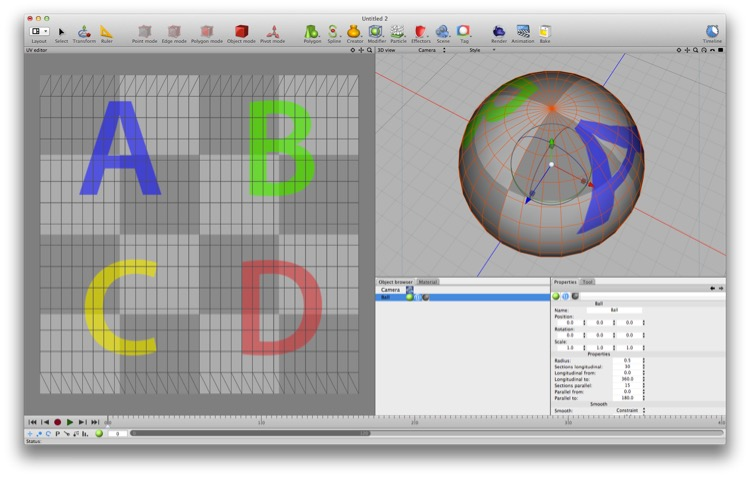

*Here I’ve done the exact same thing but with a sphere. Note how the triangles near the poles are mapped into UV space such that parts of the image aren’t covered. This can be a big problem with UV-mapped polar spheres.*

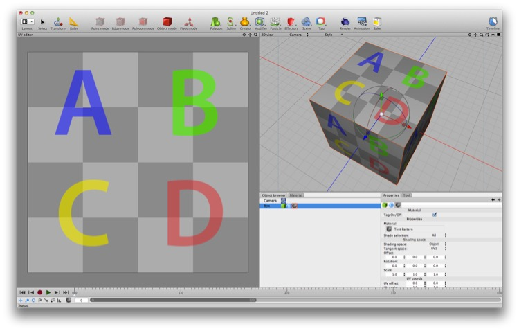

*Here’s how a cube is mapped by default. Each square face covers the texture in UV space, so each face of the cube has its own copy of the texture mapped to it.*

Primitives have fixed UV maps. You can change how they’re interpreted (in essence you can scale and rotate them) but you can’t change them arbitrarily. Editable meshes can have their UV maps changed to anything you like.

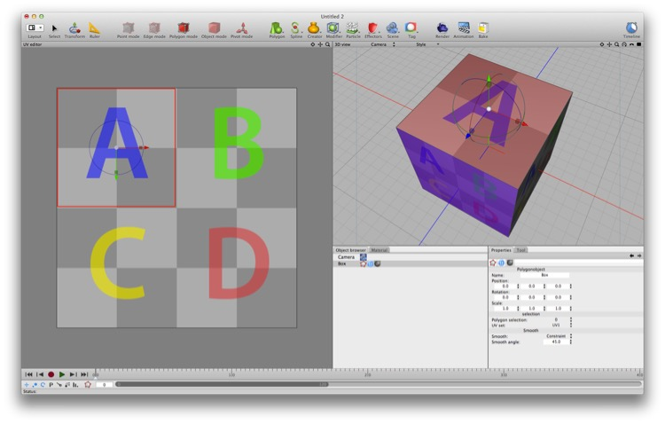

*Here I made the cube editable, then selected the top polygon and then — in the UV editor — scaled it down and moved it roughly over the top-left quarter of the image in UV space. As you can see, the top face now has the A on it.*

As an added wrinkle, by default UV coordinates “wrap around”. In other words, a UV coordinate need not be inside the square — it might be (57.3, -102.6) — but it wraps around to its fractional value — 57.3 wraps around to 0.3, and -102.6 wraps around to 0.4. (The “Tile U” and “Tile V” properties of an Image node — both checked on by default — determine whether the U and V coordinates, respectively, wrap around.)

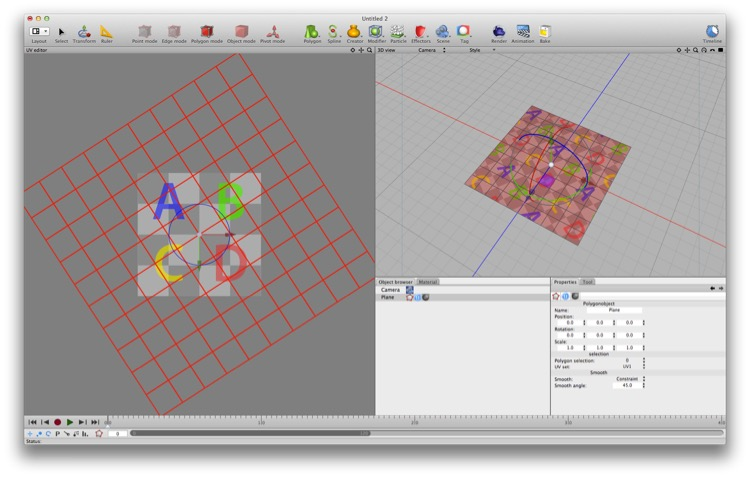

*Here I’ve made the plane editable by double-clicking on it and then selected all its polygons and — in the UV editor — scaled and rotated everything. As you can see, the image is now tiled and rotated across the plane.*

### Coordinate Spaces

Because every point on a polygon’s surface has a spatial coordinate, it’s possible to map materials onto it simply by using those spatial coordinates. Because the coordinates are 3D coordinates, trying to use those coordinates as UV coordinates tends to produce poor results, but it works very well for multidimensional chaotic functions, which is what most of the procedural texture maps are.

**Aside**: a chaotic function is one that produces highly unpredictable results from seemingly simple input values.

### UV Mapper Tool

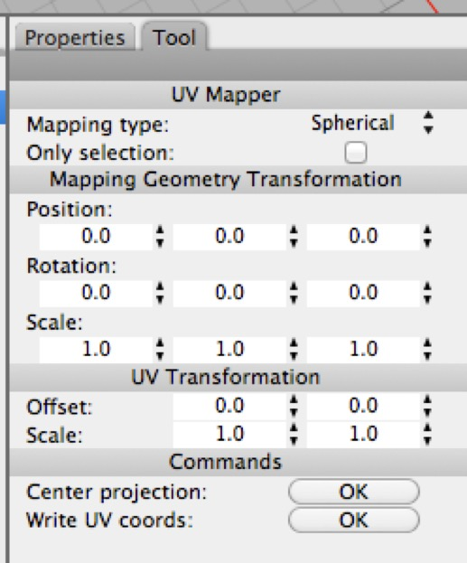

The UV Mapper tool applies a simple UV projection onto your mesh. This can work beautifully for simple cases. The UV Mapper offers five mapping options: cubic, spherical, flat, cylindrical, and frontal.

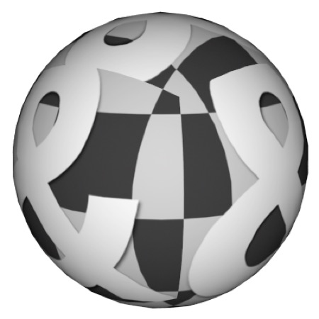

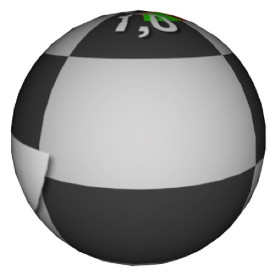

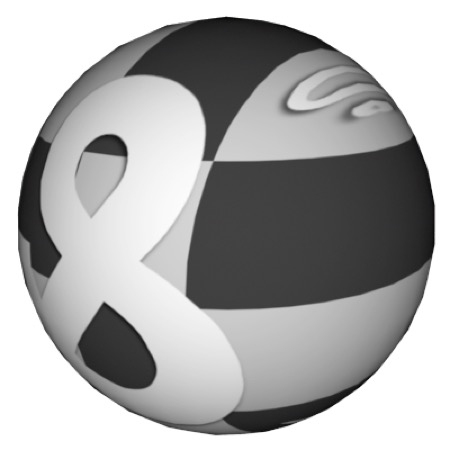

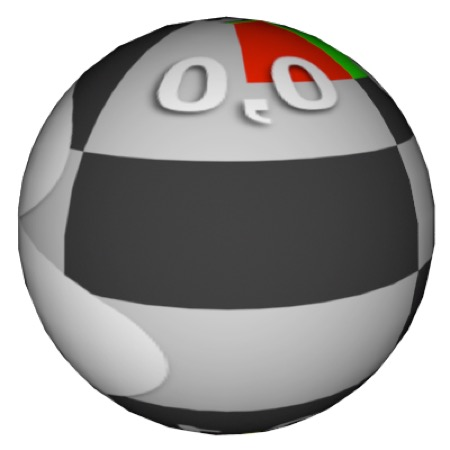

*UV Mapper applied to a sphere using cubic, spherical, planar, and cylindrical mapping type (respectively).*

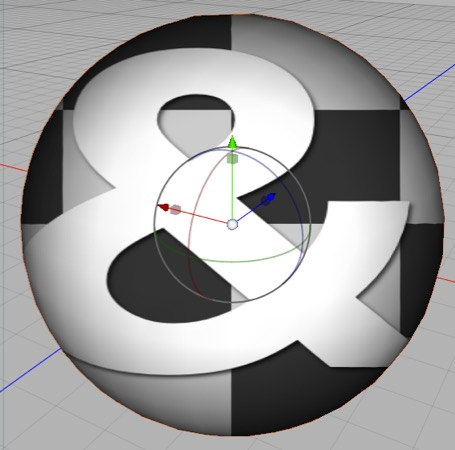

*The frontal mapping projects the material straight onto the object (imagine a projector whose beam stays a constant size).*

### Unwrap UV Tool

The Unwrap UV tool is the most powerful tool for UV mapping complex objects, such as almost any character. It can also be very useful for dealing with quite simple objects.

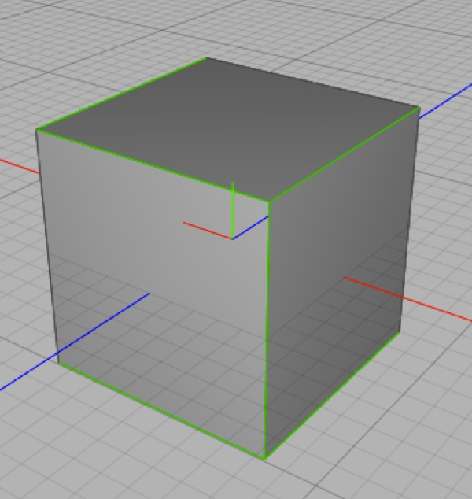

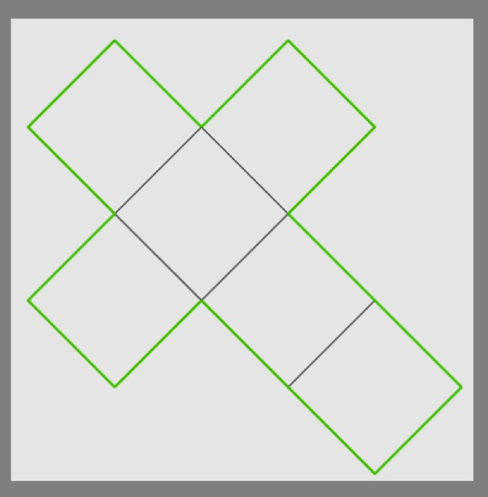

*Placing seams in the “obvious places” on a cube mesh (left) and using Unwrap UV leads to the UV mapping on the right (actually the mapping was a little bit off, but very easily fixed by selecting all the polygons and moving and rescaling them slightly.*

The key to effectively using the Unwrap UV tool is placing seams on your mesh, and the simplest way of thinking about seam placement is to assume you wanted to sew the object out of cloth, and place seams where you’d need to have seams in the fabric.

#### Manual Seams

As stated above, the best way to think about texture seams is to place them as though you were sewing the mesh out of pieces of fabric. So, what better example to discuss than a shirt?

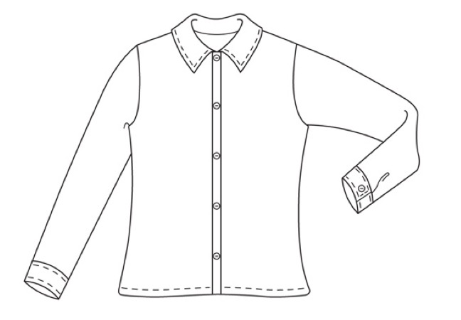

*Here’s a drawing of a shirt. It’s fairly obvious where the major seams are. (This image is from a free pattern found on the Etsy Blog — etsy.com.)*

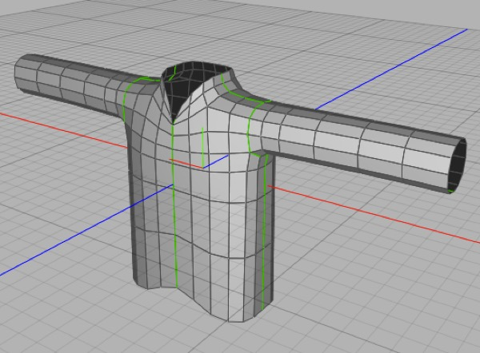

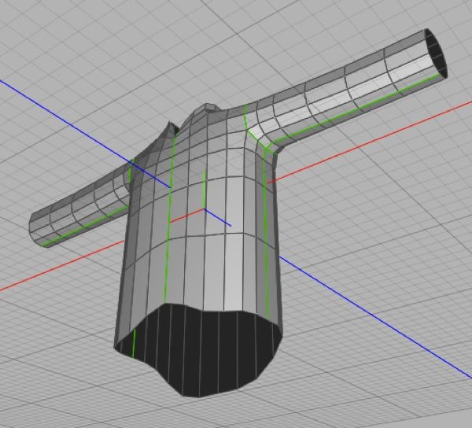

*Here’s a simple shirt mesh. I’ve placed seams in it exactly where the major seams would go in a fabric shirt (by default, Cheetah 3D shows seams in green in edge mode).*

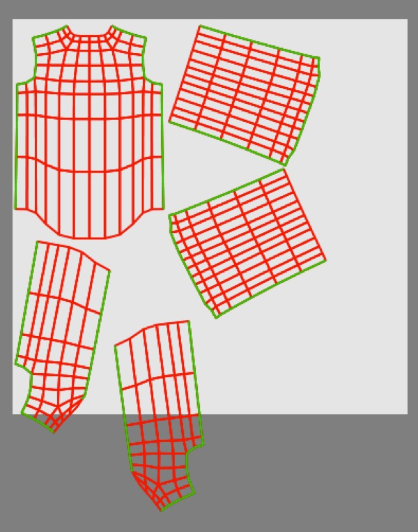

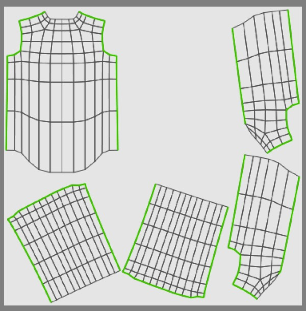

*Simply selecting Unwrap UV results in the UV mapping on the left. Using Group select it’s easy enough to rearrange the pieces to fit inside the UV square.*

As of v6.2, Cheetah 3D offers two different unwrapping options — ABF and LSCM. LSCM was the old algorithm, ABF is new and generally reduces stretching and overlap compared with LSCM. It's easy enough to try both and use whichever works better. In general, for organic forms, like the shirt, ABF works better.

This is how the shirt turns out using ABF. The results don't look much different from LSCM but it turns out to cause significantly less distortion around the collarbones. A little bit of tidying up produces this map:

By moving the groups around while looking at the viewport, it's possible to line up the seams remarkably well with very little effort.

#### Automatic Seams

Automatic Seams does exactly what you’d expect it to do — it automatically places seams on a model, and it does a pretty good job.

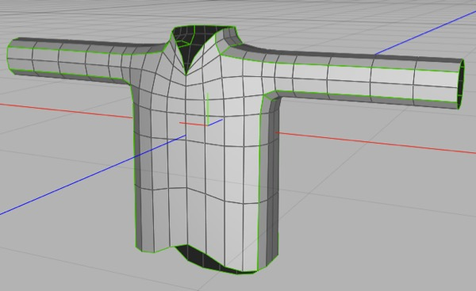

Automatic seams wraps seams around contiguous sets of polygons facing more-or-less in the same direction. In the above example I’ve applied Automatic Seams to the same shirt model as before.

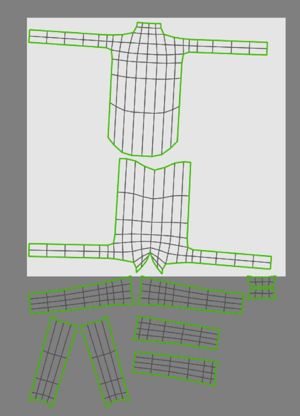

##### Why not just use automatic seams?

Automatic seams are great for hairy models where manually adding seams would be horribly time-consuming, but they have a lot of drawbacks.

Using automatic seams will lead to seams being in arbitrary places, and almost always lead to more seams than necessary. E.g. on the shirt we’ve ended up with four seams running along each sleeve and no seam down the middle of the front of the shirt. The problem here is that seams tend to be where you’ll see problems (discontinuities, minor artifacts) in the UV-mapping, so you generally want (a) as few seams as possible, and (b) seams to be where they’re less likely to be seen (which is why shirts have one seam on their sleeves, and it’s on the inner/under side of the sleeve where it won’t usually be seen.

Our automatic seam unwrapping means we’ll have way more seams on the sleeve than we did when we placed the seams manually, they’re more visible, and there’s no seam down the front where we’d actually expect a seam (and a discontinuity in the pattern on a shirt).

### Texture Painting

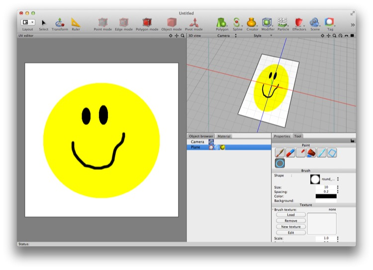

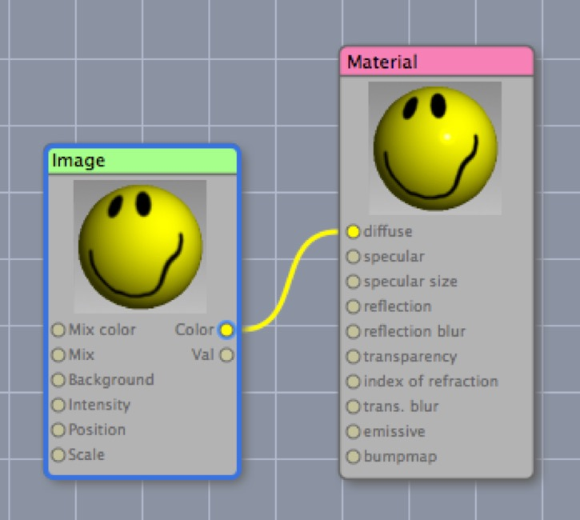

_**Top**: Cheetah 3D in the UV Editing layout with a simple material (**bottom**) assigned to a plane, the image texture node from that material is being edited, and the **Tools \> UV \> Paint tool** is active. This incredible texture map was created entirely using the Paint tool._

Cheetah 3D offers some basic texture painting functionality. If you use an Image texture node to create a new texture (by clicking the New Texture button) or edit an existing texture (by clicking the edit button) the image will appear in the UV Editor. 

If this image texture is driving the diffuse channel of a Material shader you can assign the texture to objects in your scene and paint the texture either in the UV editor or directly in the 3D view.

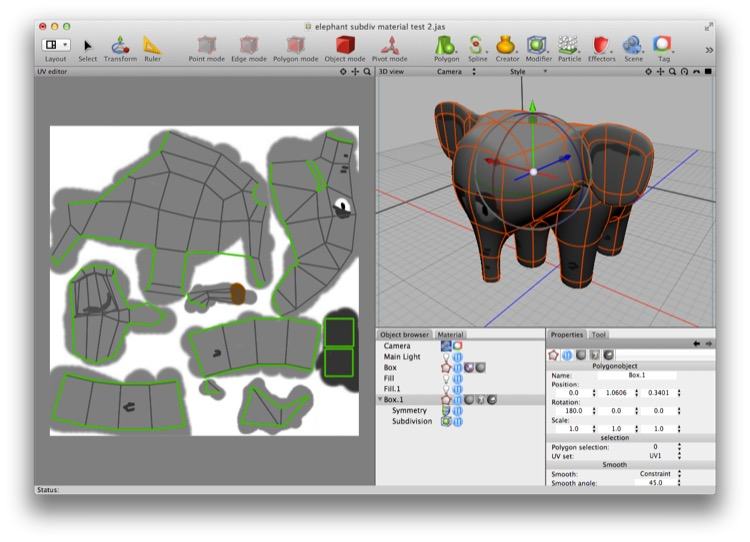

*Here the elephant mesh has bee unwrapped using manually placed seams, and color has been roughly applied using the Paint tool. This can serve as a useful template in a dedicated image editor such as Photoshop, Acorn, Pixelmator, Photoline, or The GIMP.*

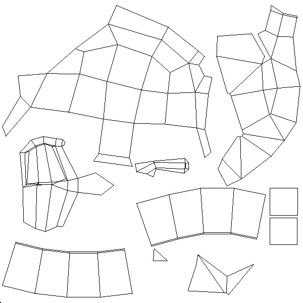

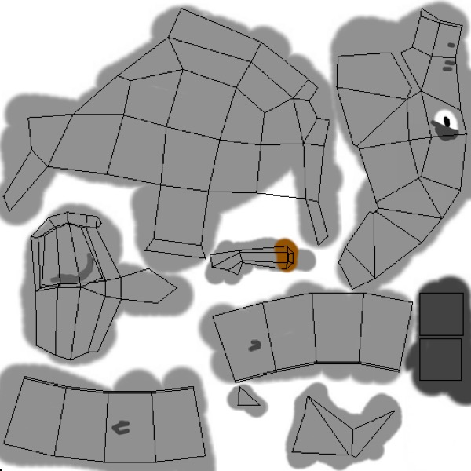

***Top**: Cheetah 3D can also export a UV layout as a PDF (using **Tools \> UV \> Save UV’s to PDF**). You can then convert the PDF to a bitmap image, e.g. a PNG or TIFF, using Preview or some other app, and bring it back into Cheetah 3D and use the editor to mark it up with some indicative colors, or — **bottom** — add it as a guide layer in a dedicated image editor.*

Although the Paint tool allows you to load bitmaps for use as brushes, in general it’s really best used for simple touch ups (e.g. cleaning up minor errors in bakes) and marking color swatches on a UV line render.

