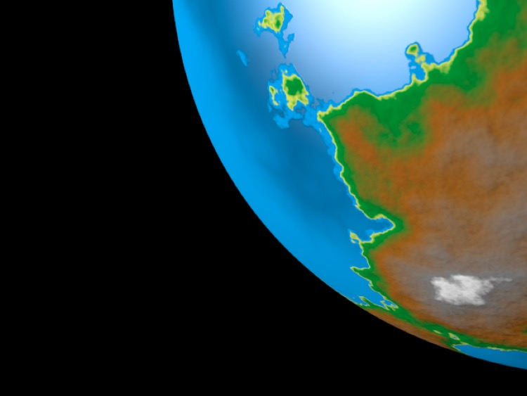

## How Materials Work

Now that you’ve learned your way around the material system, it’s probably not a bad idea to understand how the material system actually works.

**A material is a system for deciding what color a given point on a given object is.**

Materials do this by taking information about a ray that has been projected onto a surface, along with information about the scene (mostly lighting information), and feeding it into a shader. It may also recursively generate new rays which need to be resolved the same way (and on and on, subject to the limits you set in the Renderer Settings).

Cheetah 3D’s renderer renders images by sending virtual rays from a view point, through a view port (i.e. the pixel or subpixel being rendered), and into a scene until it hits something (in fact, a triangle). That triangle has a material, and the material has to tell the renderer what color the exact point on the triangle that the ray struck is.

The simplest material in Cheetah 3D simply consists of a single node — a Solid shader node. When the renderer asks what color something which has this material is, its answer is always the same.

The default material (the material things that haven’t been given a material have) is a bit more complex. Unless you’ve changed Cheetah 3D’s preferences it will be light grey, and have specular highlights. This means that to answer the “what color is this point” question it needs to know how much light, in total, is falling on it, and then multiply that by its light grey color, but the default material must also figure out how much light is being reflected from each light in the scene right at the viewpoint, multiply this by its specular color (which is white by default) and add this to the previous result. That’s its answer to “what color is this point”.

**Note**: in the previous paragraph, “right at” depends on the “hardness” of the material. Cheetah 3D calls this “specular size” which — confusingly — creates *smaller* highlights the *larger* its value. Hardness (or better yet smoothness or shininess) would make more sense. *Harder* surfaces produce *sharper* reflections. Specular highlights are essentially faux reflections of lights. In the real world, specular highlights do not exist!

### Complex Materials

The most complex materials in Cheetah 3D are built around the **Material** shader node. In order to answer the same question the material shader needs to know all kinds of things — how much light is shining on that point, and from what direction, and it may need to fire off one or more new rays (recursively) and get more answers from other materials before it can answer.

If you’re interested in this topic, you may find the section on How Raytracing Works interesting.

#### Aside: Color Arithmetic

**Multiplication** — Cheetah 3D treats colors as RGB vectors. If a light of color A bounces off a surface of color B then the resulting color will be the product of those two colors (in some sense). In this case the product is produced by multiplying the components separately, so a red light bouncing off a blue surface will produce black.

**Aside**: to be more precise, Cheetah 3D treats colors as RGB vectors with an additional A (alpha, or transparency) component. (They’re not RGBA vectors because the RGB components can be greater than 1, whereas the A value cannot.) Also note that alpha channels can be interpreted in two different ways, a measure of transparency (1.0 means completely transparent) or opacity (1.0 means completely opaque). Concsistent with Mac OS X, Cheetah 3D treats 1.0 as totally opaque.

It’s worth knowing that this is a crude approximation of nature which, nonetheless, works quite well. In fact the behavior of light is much more complicated. E.g. you can mix red, green, and blue light to produce something we perceive as “white” light, but it’s very different from actual sun light which is a mess of different wavelengths of light (all the colors of a rainbow, in fact) and the way light is reflected from surfaces is highly variable. E.g. a “pure red” light bouncing off an “orange” object in a 3D program will produce red, but in nature it might produce black or brown, depending on how the object actually reflects light.

**Addition and Subtraction** — In case you’re wondering, it also makes sense to add colors (indeed, the color of a point on a triangle is created by *adding* the diffuse, transparent, reflective, and specular components) and calculate weighted averages (blending). Alpha compositing is performed by adding the alpha value multiplied by one color and (1 – the alpha value) multiplied by a second — if you consider “1” to be white, and the alpha value to be a shade of gray, this is all color arithmetic.

Indeed, all the kinds of things Photoshop does to images are, at their heart, essentially color arithmetic along these lines.

### Specular vs. Reflected Highlights

You’ve probably seen ray-traced images with mirrored balls all over the place (at least if you’re old enough to have seen stuff rendered in the late 80s) but reflection is more than just a cheesy rendering gimmick. It turns out that the light that reaches your eye from a scene can be thought of as either being “emitted”, “diffuse” or “reflected” (where “diffuse” essentially means “randomly reflected”).

Early 3D rendering algorithms handle diffuse and reflected light using two different algorithms (named after their inventors — Henri **Gouraud** and Bui Tuong **Phong**). Cheetah 3D refers to “Phong” as “Specular”, but it’s the same thing.

When ray-tracing came to the fore, it was seen as too expensive (in terms of computational requirements) to use for trivial stuff like reflecting light sources, and “building out” light sources suitable for reflection was another issue, so the raytracing algorithm and specular highlighting continued to be used side-by-side, but it’s important to understand that specular highlighting is simply a cheat for producing fake reflections of light sources.

In general, the best way to produce nice looking “shiny stuff” is to make the shiny stuff reflective, and make the reflections blurry for stuff like hard rubber and plastic, but it involves taking more care to set up your scene. Specular highlights are “cheap” both in terms of rendering time and effort.

*Here’s a brushed metal ball illuminated by a point light source with geometry toggled off (the default setting). We can see the ball is being lit, but we can’t see the light.*

*The same metal ball illuminated by a point light with geometry toggled on. Now you can see the light source reflected on the ball.*

So, if you want to produce very realistic looking renders you should set the specular color of your materials to black (in essence, turn off specular highlights), and “build out” light sources. Or you can simply check the “Geometry” option for lights in Cheetah 3D to have them appear in reflections, but this is often not satisfactory (most light sources don’t look like white disks or rectangles). 

On the other hand you can simply use specular settings to produce reasonably decent looking “reflected lights” on objects, and not worry about it too much. But there’s a problem here — some shaders don’t support specular! In this particular example we’ve been using the Metal shader which supports anisotropic blurred reflections (in other words “reflections blurred more in one direction than another” which is what brushed metal looks like) and the Metal shader doesn’t support specular. So if you want nice looking brushed metal, you need to build out light sources or use image-based (HDRI) lighting.

#### Planet Shaders

If you’re trying to render nice planets as seen from space (e.g. for a science fiction space scene) then it’s exactly like creating a terrain shader that’s driven by a texture instead of the y component of position (in essence the texture represents altitude).

*Here I replace the state node’s y position with a filtered fractal. The gradient lets me pick the way the texture gets interpreted as altitude while the scale settings of the Fractal node let me determine the detail level of the planet (I set the UVW scales to 3.0).*

*Here’s the resulting planet. For extra points I’ll feed the same filtered “altitude” as a bump map.*

One of the problems with the gradient filter is that it’s a pain to edit it precisely. So here’s a trick for replacing the gradient filter with an arbitrarily large image node which you can edit in a dedicated image editor (such as Photoshop).

I take a screen grab of my gradient node’s settings and open it in a good image editor (in this case Acorn).

*Then I crop to just the gradient part of the image. Now I can create a similar gradient at arbitrary precision using my image editor of choice.*

*Rather than try to create a gradient, I directly modify the gradient using blurs and scales to tweak it.*

*Now I’ve loaded the gradient image into an image node, and I’m creating a UV coordinate by taking the “altitude” value and converting it into a vector (so that altitude becomes X (which is to say U) and picks a color from left-to-right from my image).*

*Note that there’s a slight caveat to this trick. The position input isn’t used as the UV coordinate, but as a UV offset (I don’t know why), so I rescale the UVs to 0.001 so that they have virtually no effect (I actually type in 0, but C3D changes it to 0.001). In essence, I’m telling Cheetah 3D to take the UV coordinate, multiply it by 1/1000 (effectively zero it out) and then offset it by my fake UV coordinate.*

*Here’s the new shader using an image as a gradient instead of an actual gradient. The image is 1000px wide so it can be very easily fine-tuned.*

*The fact that the gradient image has finite resolution doesn’t hurt it, because interpolation smooths out any transitions between pixels, and everything else is procedural so the material holds up even under huge magnifications.*

*Finally for extra realism I’ve added a slightly larger sphere with procedural clouds. Here I’ve multiplied two differently scaled procedural textures to create patches of cloud.*

*The lower Fractal node (with low scale values) drives overall cloudiness and is multiplied by the upper Turbulence node (with high scale values) which produces the individual clouds. I then pass the result through two different gradients (actually the same gradient with black and white swapped) to drive transparency and bump.*

### Material Assignment Tags

*When you assign a material to an object, Cheetah 3D represents this by adding a tag to the object.*

Material assignment tags control how a material is applied to an object. The tag has two sets of properties: the properties listed under Shading Space affect 3D spatially mapped textures while those under UV coords affect UV-mapped textures.

*Procedural, 3D spatially-mapped checkerboard. **Top**: default material tag settings. **Upper-middle**: offset by 0.1,0.1,0.1. **Lower-middle**: rotation by 45°,0,0. **Bottom**: scale by 0.25,0.25,0.25.*

_**Top**: UV scale set to 2,2,2; **Middle**: UV offset set to 0.25,0.25; **Bottom**: UV rotation set to 45°_

