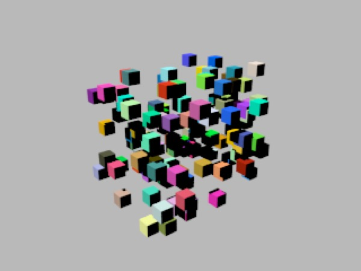
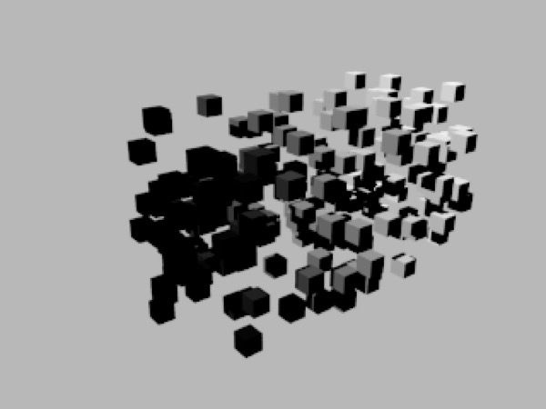

## Node Descriptions

### Shader Nodes

**Car Paint**: a shader designed to emulate the qualities of car paint (which is multilayered paint with a thin transparent coating which has interesting properties).

**Dielectric**: naturally transparent things like glass and water.

**Material**: the most useful shader type -- very similar to C3D's old "material material". Properly configured a "material" shader can do _almost_ anything any of the other nodes can do. (When in doubt — use a material shader.) That said, this is also the most complicated shader (and it can slow down rendering compared with more specialized shaders).

**Membrane**: very similar to C3D's old membrane material. In essence produces transparent film-like materials that get more opaque when viewed at an oblique angle.

**Metal**: you can create most metals quite nicely using the material shader, but the metal shader gives you access to anisotropic reflection. (I'm not quite sure why this wasn't just built into the material shader.) The principal quality of metals is that they are reflective.

**Shadow**: shadow catcher material. The idea of a shadow catcher material is that it captures shadows that fall onto it, but is transparent if there’s no shadow. (Imagine you’re trying to render an object for inclusion in a composition, and you want its shadow, but you want to drop it on top of an arbitrary background.) It works by using a threshold value (which determines how dark it has to be to qualify as being “in shadow”).

**Solid**: solid color, as per old renderer. Now with intensity, allowing objects to function as light sources -- kind of.

The solid shader is very handy for rendering masks for compositing (e.g. if you want to be able to select or mask a specific object in Photoshop you can assign it a solid black material and hide everything else in the scene and hit render and now you have a perfect mask).

**Toon**: the new toon shader. In essence the toon shader posterizes the light value. This may not be exactly what you want, and similar results can be achieved with other shaders using the gradient filter.

**Velvet**: again, as per the old C3D velvet material.

### Texture Nodes

Texture nodes take a virtual 2D (or 3D!) image, sample it using UV mapping or coordinates, and give you a color to play with. The simplest and most familiar case is the image texture which (typically) uses UV coordinates to sample a 2D bitmap image.

All the other textures are procedural and generate a virtual image of infinite resolution and size. Several of them are fractal noise generators of one sort or another.

The simplest way to understand texture nodes is to play with them. Create one and plug it into the diffuse channel of the material shader to see what it "looks" like. (Ideally Martin will provide more convenient previews in a future version of C3D.)

Probably the single most important texture node — certainly for real-time applications such as games — is the **Image** node.

**Brick**: (3D) produces a simple brick pattern.

**Cellnoise**: (3D) produces a random grid of differently colored cubes. Useful for producing "steel plate" type textures for example.

**Checkerboard**: (3D) produces a fixed pattern of alternating cubes.

**Directional**: (3D) converts vector direction information into color using interpolation. Useful for creating materials which change depending on the orientation of faces (e.g. mountains which have vegetation on relatively horizontal areas, and rocks on relatively vertical areas).

**Dots**: (3D) produces a fixed grid of spheres.

**Fractal**: (3D) fractal cloud generator.

**Marble**: (3D) fractal marble generator (like fractal but with a much steeper tone curve).

**Noise**: (3D) fractal noise generator.

**Reptile**: (3D) produces a somewhat regular grid of blobs. Very useful for creating more-or-less uniformly lumpy surfaces. Actually doesn't look much like reptile scales close up. I believe it's using a variation on the Voronoi algorithm.

**Turbulence**: (3D) more fractal noise.

**Voronoi**: (3D) produces a somewhat regular grid of polygons. Very useful for creating not-quite-uniformly tiled surfaces, such as cobbled roads or scales.

**Wireframe**: (2D) renders the wireframe of the underlying model as a texture -- very nice for rendering smoothed wireframes.

**Wood**: (3D) renders turbulent noise tuned to look a bit like the rings in a tree.

**Constant Nodes**

There are three data types that are sent by connections between nodes. The three kinds of constant node reflect the three data types (which are discussed in more detail under **Property Types**.

**Color**: a color!

**Number**: a number!

**Vector**: a vector!

Note that colors and vectors are somewhat interchangeable, and that vectors can be used as numbers (the first value is used, the others are discarded) in a pinch and vice versa (a number n gets treated as the vector (n,n,n)).

### Filter Nodes

**Composite** nodes allow you to blend two input colors using a blend value (which itself may be an input). Usually composite nodes aren't needed since the same thing can be achieved directly in other nodes.

**Gradient** nodes allow you to map an input value (think of it as a black-to-white spectrum) to an output gradient. E.g. if you want black to come out as blue, and middle grey to come out as red, and white to come out as green, then you'd make the gradient blue to red to green. Each color transition in a gradient can be immediate or blended, the former allowing you to achieve (among other things) toon-render effects.

**hsv2rgb** and **rgb2hsv** lets you convert colors between the two color spaces. Note that C3D's colors are RGB natively, so you will need to convert them to HSV if you want to perform operations on them in the HSV color space.

### The State Node

The state node serves as a source for information about the surface being rendered and the scene itself. Perhaps the most immediately useful property from the state node is time. If you're animating a scene you can use the time value to vary materials over time. E.g. you can use it to continuously vary an offset of a noise channel which in turn feeds into a bump map to make "waves" appear on the surface of an object.

The **normal** and **eye** vectors allow you to vary the appearance of a material based on the direction the surface is facing or the angle of view. (I think **i.n** is the incident angle, which is a dot-product of the two.) This lets you implement _fresnel_-type effects (e.g. most transparent surfaces are less transparent and more reflective when viewed from an angle, some change color subtly, and so forth).

**position**, **uv1**, and **uv2** are obvious. Note that normally a material uses the object's uv settings to decide its uv input values -- but you can explicitly access them from the state object and force certain values to be mapped to global position or a specific uv coordinate (taking that control out of the user's hands -- or achieving special effects, such as basing the bump map on global position, the diffuse map on uv1, and the light map on uv2).

### The Instance Node

The instance node allows you to design materials that vary based on the property of the instance being rendered. This is essential for producing complex particle effects since each particle will have the same material assigned to it, so one of the few ways to make one particle look different from another is to use an instance node.

The instance node’s properties include:

**Position**: the location of a particle — in the emitter’s frame of reference. (It’s not clear how this will work once instances are supported for things other than particles.)

**Direction**: I would assume this represents the direction the particle is moving in, but I can’t get it to do anything.

*The random property of an instance can be treated as a random color*

**Rand**: a random value uniquely generated for each instance (this lets you create, say, a “confetti” material that would make each particle randomly colored). I *believe* that Rand is actually a random vector with each value picked randomly from the interval [0,1] (recall that’s math shorthand for “a number between 0 and 1, inclusive”).

**UVW**: an instance’s UV settings may be animated, and this lets you access the current state of the instance’s UV (at the point being rendered).

*Age changes from 0 to 1 over a particle’s lifespan. Here I’ve created a simple material that sends age to the diffuse channel of the Material shader. Older particles are rendered as lighter shades of gray.*

**Age**: this number ranges from 0 (the particle was just born) to 1 (the particle is about to die).

**Color**: I’m not sure what this property is supposed to do. Random seems to do what you’d expect Color to do, and I can’t get it to do much of anything.

### Math Nodes

OK this is the one you've been waiting for, right? Note that most math functions will operate on both scalars and vectors (and colors, which are treated as vectors). It even works for some strange things (e.g. division) which aren't well-defined for vectors.

**abs** returns the "absolute value" (i.e. positive size), so abs(-2) = 2.

**add** adds two values.

**cosine** and **sine** and **tangent** are your usual trigonometric functions (they assume **radians** as inputs — note that C3D’s user interface works in **degrees**). To get an intuitive grasp of trigonometry for 3D, the cosine of an angle is a measure of how parallel the lines forming that angle are to each other: 1 means exactly parallel (the angle is 0), -1 means exactly opposite (the angle is π radians -- 180°), and 0 means perpendicular. Sine is the other way around -- perpendicular = -1 or 1, and parallel or opposite = 0.

#### Note on converting between degrees and radians

If you want to quickly convert radians to degrees, multiply by 180/π (57.296 is more than close enough). Similarly, to convert degrees to radians, multiply by π/180 (0.017459).

**dotprod** is a scalar value telling you how parallel two vectors are. For unit vectors, the dot product is the same as the cosine of the angle they form; for non-unit vectors multiply the cosine by the product of the vectors' magnitudes. crossproduct is the dual of dotprod, returning a vector perpendicular to the plane containing the two vectors whose magnitude is the sine of the angle they form multiplied by the product of their magnitudes.

**divide** divides one value by another.

**float2vec** and **vec2float** let you pull vectors apart and put them back together again.

**mix** blends two colors using a third value. Actually it should be in the Filter menu. (Because it operates on colors, it also mixes alpha values.)

**modulo** turns an open-ended value t into a repeating value by "wrapping" it into the interval [0 .. denominator\\]

**multiply** multiplies two values.

**multiplyadd** multiplies two values and then adds a third value.

**norm** returns the *magnitude* of a vector (this is a correction). To unitize a vector scale it by the inverse of its norm.

**power** raises a number to a power (the exponent). E.g. to cube the input, set the exponent to 3.0.

**pulse** takes an input value and maps everything below the lower threshold or above the upper threshold to 0 (black), and maps the rest to 1 (white). Smooth makes the transition smooth rather than sudden.

**pulsetrain** is like pulse but it performs the mapping 1/period times across the [0,1] interval. Um, that's not very user-friendly. It's like pulse but it scales the input by 1/period and then wraps it back to [0,1] and it only has a lower threshold value. Play with it – it's trippy.

**squareroot** calculates square roots. Same as using **power** and setting the exponent to 0.5.

**step** is like pulsetrain but upside down and with only one threshold value.

**subtract** subtracts one thing from another.

