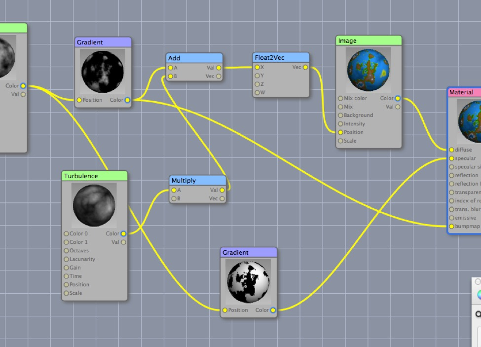

# Materials

### Creating Materials

Creating materials in Cheetah 3D is fun and easy to do. 

But… creating materials that do *exactly* what you want can be *very* difficult.

We’ll start by showing how to create a bunch of simple, typical materials from scratch. Going beyond the basics requires a combination of experimentation, imagination, and an intuitive grasp of 3D math and how rendering works.

