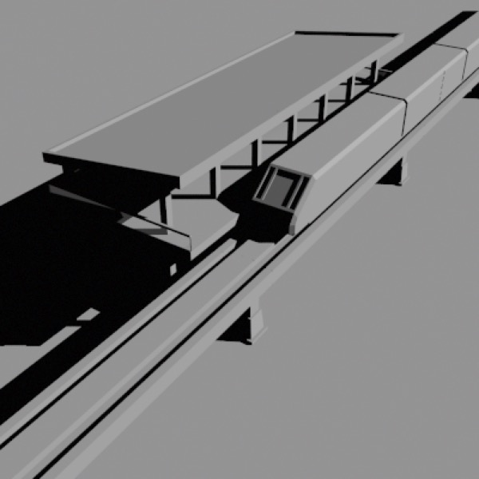
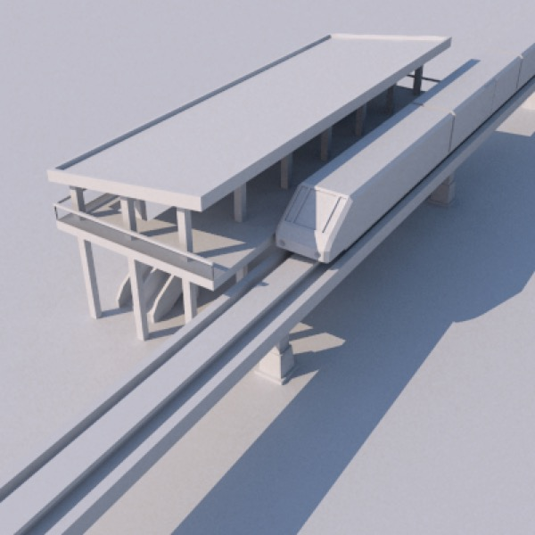
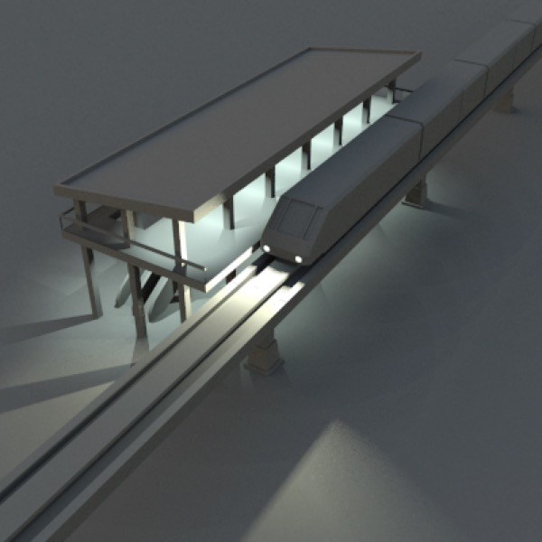

# Lighting

*Lighting has a huge impact on the quality and mood of a rendered image. **Top**: scene rendered with a single directional light. **Middle**: the same scene rendered with a Sky Light. **Bottom**: the Sky Light has been set to just before sunset, a number of lights have been added to simulate the station’s electric lighting (which has a subtle green cast) and the train’s headlights (which have a subtle yellow cast).*

