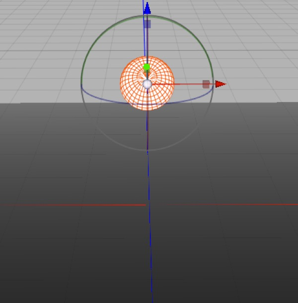
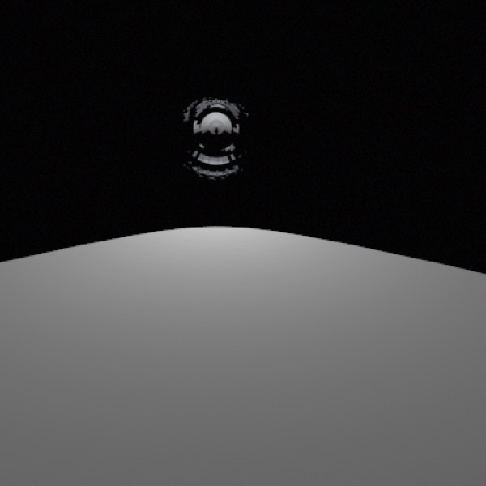
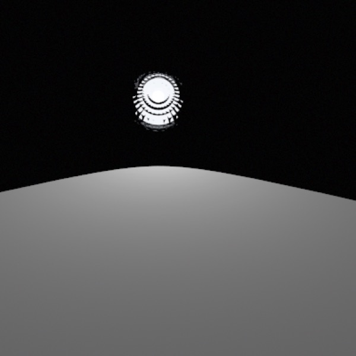
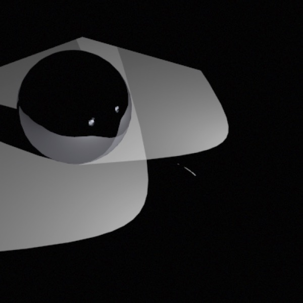
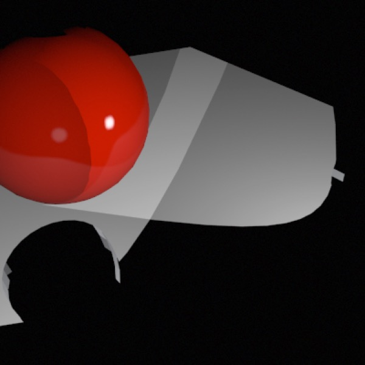

## Rendering Reflected Lights

**By default, Cheetah 3D’s lights are invisible objects**. If you point a camera at them, you get nothing. Crucially: they don’t appear in reflections. (If you consider what a flashlight or a car’s headlight looks like in photographs or when you look at it, what you’re seeing is *reflections of a glowing object*.)

***Top**: simple build of a car headlight — hemispherical silvered reflector with a point light inside it — smoothing mode set to flat. **Middle**: rendered with geometry off. Note that the reflector is showing reflections of the illuminated surface. **Bottom**: rendered with geometry on. (I’ve reduced the point light’s radius to 0.01.*

Some lights have a “geometry” option, this includes the sky light, area light, and point light. The other lights simply have no geometry option. This doesn’t matter so much since the “geometry” option doesn’t do a great job anyway — aside from the sky light’s geometry, the geometry of lights simply looks like an emissive rectangle or circle, and it’s not as bright as it should be (so it doesn’t look as bright in reflections as it should relative to reflections of objects that don’t shine).

*With the lights built out with reflectors and geometry switched on the lights now look much better in reflections, but they’re still really not bright enough. *

*Here I’ve replaced the highly reflective steel with a slightly reflective “plastic” material. The headlight on the left has its geometry switched on, while the headlight on the right has its geometry switched off and replaced with a sphere of the same diameter with a highly emissive material (white with intensity 5.0 fed into emissive) and a render tag that prevents it from casting shadows. As you can see, the headlight on the left produces an anemic reflection, while the headlight on the right looks great.*

