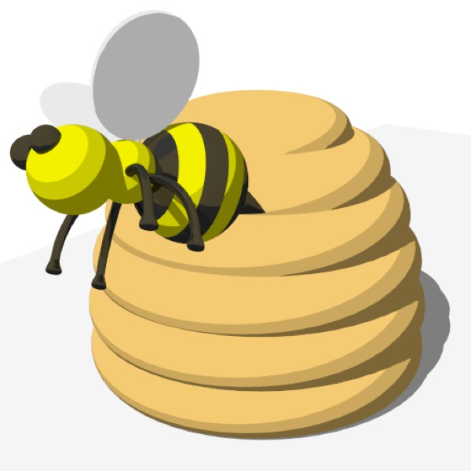

## Cartoon Looks

Almost any cg image is either striving for realism or some kind of “cartoony” or hand-drawn look, but exactly what constitutes a cartoony look is very much in the eye of the beholder.

**Simple Caricatured Models**

*This icon design (for an app called “Hive”) was rendered using all kinds of “realistic” tools, but the simplicity of the models means it looks cartoony.*

Probably the simplest way to achieve a cartoony look is through the way you create models.

**Cartoony Materials**

*Here’s the same scene rendered with simplified lighting (a single distant light) and most of the materials modified to use the **Toon shader** in different ways. The Toon shader “posterizes” lighting, which (combined with simplified lighting) results in hard-edged shading.*

**Lush Unrealism: Painterly Rendering**

*A still from Disney’s Tangled, one of the most technically impressive 3D animated movies to date. A much more impressive and difficult approach to producing a cartoony look is to use hand-painted textures and caricatured modeling styles. (This image is copyright Disney.)*

