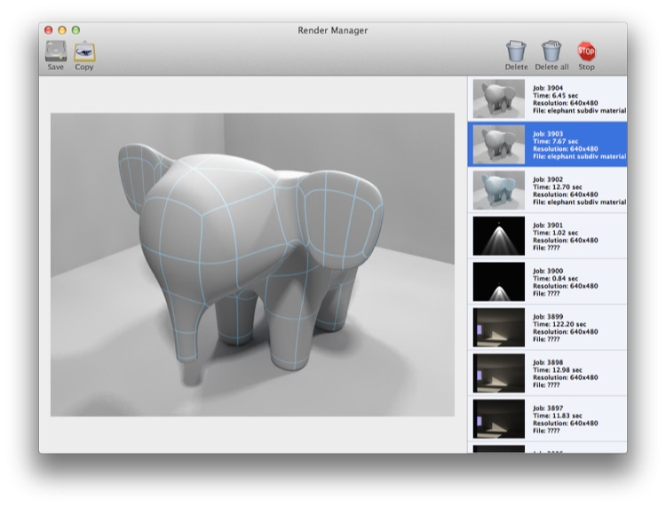
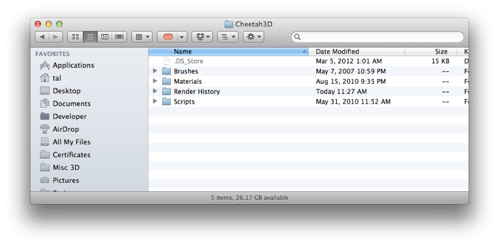

## Render Manager

Cheetah 3D’s Render Manager (it comes to the front whenever you initiate a render, but you can access it at any time from **Render \> Show Render Manager**) allows you to manage Cheetah 3D’s Render Cache, including currently active renders and all past renders (unless you delete them).

Every time you render an image or animation, Cheetah 3D stores it along with a little bit of metadata in its Render Cache. You do not need to save it! Still images are stored as PNG (portable network graphics) files by default, and animations are stored as sequences of PNGs by default.

**Where are all those rendered images stored?**

If you want to get at the Render Cache yourself, simply go to Finder and select **Go \> Go to Folder…** and enter this path: **~/Library/Application Support/Cheetah3D/**

As of Mac OS X 10.7 (Lion) the Library is “invisible” under normal circumstances. (If you’re a power user you can get around this, but normally you won’t see it.) Even so, when you go to this path, Finder will cheerfully show you the Cheetah3D directory in Application Support which is where you’ll find the Render Cache and other useful things such as the Scripts folder.

*This is what the Cheetah3D folder in Application Support looks like. I’ve tweaked my system settings so that invisible files (such as .DS\_Store) are visible — you probably won’t see those.*

