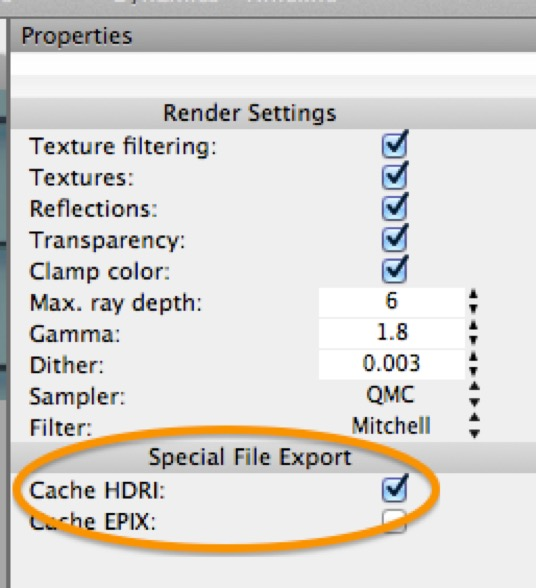
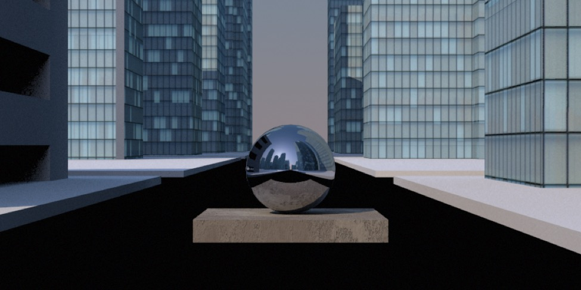
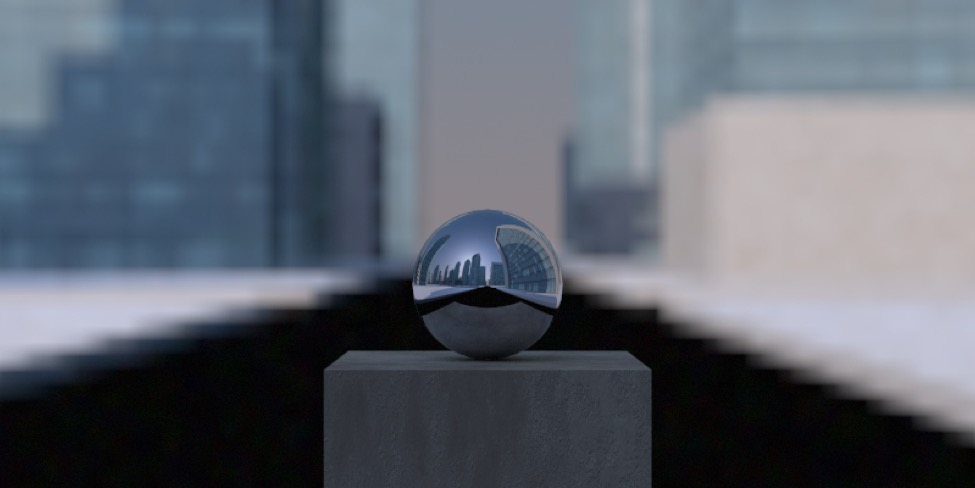

## Creating your own HDRIs for Image-Based Lighting

If you want to use a panoramic render for image-based lighting, the first thing to do is set your scene’s Render Preferences to toggle **Cache HDRI** on. Then, after you render a panorama you can save the resulting image as an HDR file, suitable for use for image-based lighting.

*A steel sphere on a stucco cube rendered in the middle of the cityscape scene from the previous example.*

*The same simple model rendered using the rendered HDR image for image-based lighting. (Note that the panorama had to be rotated 180°.) Note that the backdrop doesn’t quite match because the test object has been rendered as though it was located where the camera was — to match the original scene I’d need to place the camera where the object is and then render a new HDR.*

In most cases, using HDR and a radiosity tag will result in much faster rendering than any reasonably sophisticated lighting setup.

