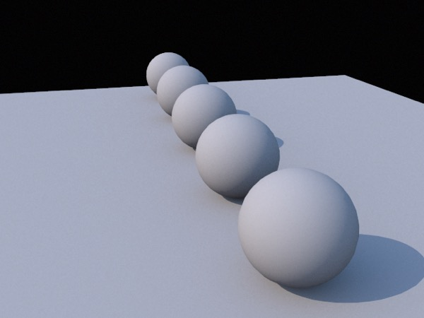
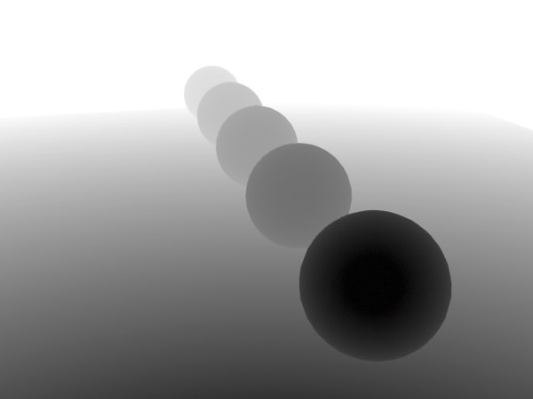
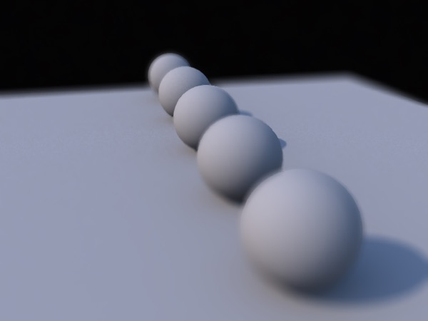
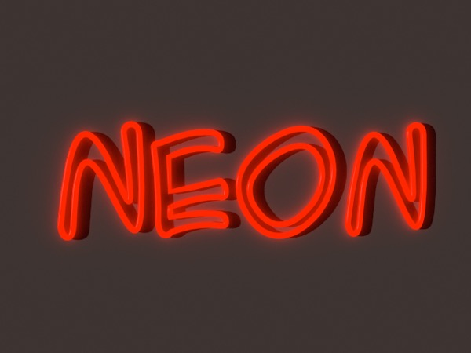
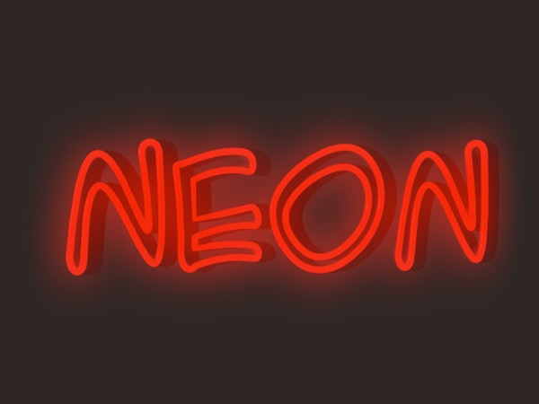
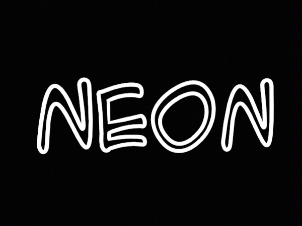
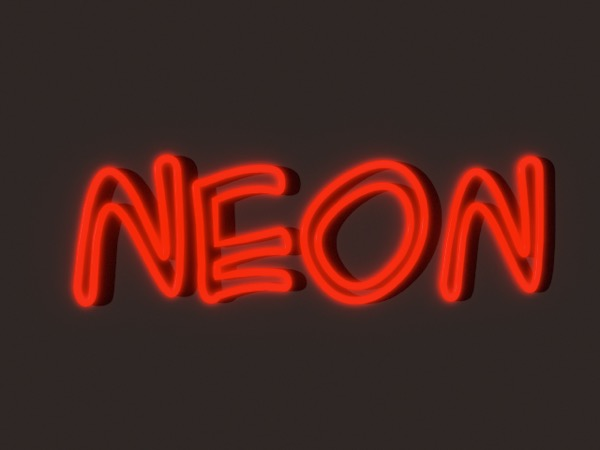

## Rendering Tricks

### Render-to-Layers

Some 3D programs allow you to render different components of an image to separate layers of a document that supports layered images (usually some variation of Photoshop’s PSD file format). E.g. you might want the light emitted by different sets of lights to be separated into their own layers, allowing you to adjust the relative brightness of different sets of lights in post production.

Cheetah 3D does not yet support this functionality, but it can fake it in some cases.

### Faking Render to Layers

Each of these techniques involves performing multiple renders of a scene with different settings to reproduce the flexibility of rendering to layers. Generally these procedures are too cumbersome to use casually, but can be very helpful for specific situations.

### Render depth layer

Suppose that you want to perform some kind of post-processing effect on a rendered image based on depth. You can create a “depth” render by using a combination of flat black (or white) textures and judiciously configured white (or black) fog.

*A scene rendered normally, then rendered a second time with every object assigned a solid black shader, and a fog tag assigned to the camera (set to “linear” and with density and start chosen to make the closest object black and the furthest white).*

*Now, I can use the second image as a (disabled) layer mask in Photoshop and perform a **Lens Blur** on the image, adjusting the amount of blur and the focus point as I see fit. Cheetah 3D supports depth of field renders, but this produces high quality results very quickly, and I can change the degree of blur in real time.*

**Note**: “Lens Blur” is a Photoshop filter designed specifically for simulating Bokeh (the blurring of out-of-focus elements in Photographs). You can achieve similar results using a combination of masking and Gaussian Blur in programs without this feature, but Lens Blur is a much better option (and easier to use, too).

### Render light sets to layers

Another simple example is to render your scene multiple times with different sets of lights turned on. E.g. you could render a city with street lights, with sun light, and with different sets of window lights — then you could animate the city going from day to night simply by blending the different renders.

**Glows**

Glows are usually a result of one of four phenomena:

- The illumination by a bright object of nearby surfaces.

- The illumination by a bright object of small particles in the air around it.

- Glare — the overloading of sensory apparatus (e.g. your retina, a camera’s film or sensor) leading to the bright object “bleeding over” of the bright object’s appearance.

- Internal Reflections — bright objects can emit so much light that internal reflections within the lens of a camera contaminate the rest of the image.

Of these, Cheetah 3D handles the first with aplomb using the Radiosity tag while glare can be simulated using post-processing effects (e.g. “bloom” filters). 

*The initial image with the Core Image **Stylize \> Bloom** filter from Acorn applied to it to simulate glare.*

The second item is the most problematic, since it requires volumetrics or post-processing fakery.

*The key to post-processing fakery is to be able to isolate elements. **Top**: I’ve attached a solid white shader to the sign, and a solid black shader to the background and rendered this image. I can now use this as a selection mask in Photoshop to drive a fake volumetric glow. **Bottom**: I’ve used this as a selection mask and then picked up that portion of the initial image, turned it into a new layer, blurred it, and changed its blend mode to Lighten.*

