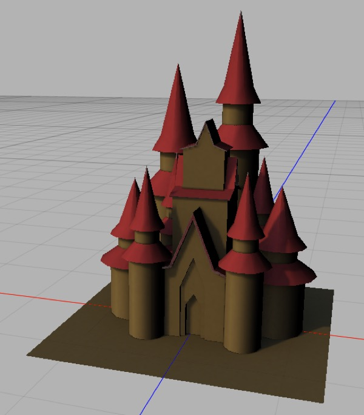

## Baking Materials

Originally, baking was used to precalculate the lighting of settings for 3D action games (*Quake* pioneered this technique). Back in the late-90s, calculating shadows on-the-fly was simply impractical for inexpensive computer hardware, so id software decided to “bake” lightmaps for their scenes. This allowed a game engine to render settings with elaborate lighting almost as quickly as a “flat” 3D scene.

For objects that aren’t transparent or reflective — “most objects” — you can precalculate the color of each point on a surface and “bake” it into a new texture that will allow the object to be rendered more quickly (especially for realtime applications). You can either bake everything into a new texture, or simply bake the precalculated lighting (and hence shadows) into a separate texture that, combined with the original textures, will allow the model to be rendered more quickly.

**Note**: this is a useful oversimplification. In reality anything other than solid metal is somewhat transparent, and all objects are somewhat reflective. But 3D rendering is all about oversimplification.

In addition to baking lighting, baking is also useful for turning procedural materials (which can be prohibitively expensive to calculate in “real time”) into image textures. This also allows you to use procedural materials for realtime applications.

### Tutorial: Baking in Five Minutes

**Note**: baking works on one *editable* mesh at a time, but the mesh is rendered in situ using the current camera’s settings, so other objects will cast shadows onto the mesh you’re baking and if you have a radiosity tag on the camera, radiosity will be baked.

1. Start with a textured **editable** mesh you want to bake.

2. Select the mesh.

3. Click on the **Bake** toolbar icon (looks like an oven) which will add a **Bake Material** tag (looks like an upside-down flower pot — I think it’s supposed to be a clay oven) to the mesh.

4. In the Baking tag’s properties panel, click the OK button next to **Baking UV Coordinates**. (This will automatically unwrap your UV mesh to UV set 2.)

5. Now (with the mesh still selected) click the Bake toolbar icon again (the toolbar item it adds a Bake Material tag to a mesh if it doesn’t have one, and bakes the mesh if it does).

*Baked materials generally look weird. This is the baked texture for the castle shown previously.*

1. You should see a really funky image rendered. This is a new texture for your model, but it will only work with the newly baked UV2 UV map.

To see the baked texture in action:

1. Save it to a file. (I usually call it “modelname baked.png”.)

2. Create a new material for your mesh, and drag it onto your mesh.

*By default, your mesh will be using UV set 1 (a.k.a. UV1) and thus when you assign an image-based material to it that uses UV set 2 it will look horrible!*

1. Add an image texture for the new material’s diffuse channel (ideally we’d use a Solid shader here, but Solid shaders do not preview correctly) and load the rendered image into it. Your mesh will probably look like crap right now!

*Once you set the mesh to use UV2 it should look amazing, from any angle! This is how the model looks in the Cheetah 3D viewport.*

1. Click on the mesh’s icon (either in the property panel or the Object Browser) so you can see its properties, and change its UV Set to 2. It should look amazing now (try orbiting around it). For an even better result, you can turn off all the lights in your scene, and add a single ambient light.

**Baking Procedural Materials**

***Top**: the same castle, but now it’s been textured with procedural materials, including procedural cobbles on the ground, procedural terracotta on the walls, and procedural shingles on the roofs. **Middle**: the same castle after baking a 2048x2048 texture and previewing it. **Bottom**: zoomed in showing how detailed the final texture is.*

**Baking a Tiling Textures from Procedural Textures**

You can use the preceding technique to create a tiling image from a procedural texture using a torus. A torus has the wonderful property of having a perfectly tiling UV map. This allows a torus to create a perfect tiling pattern from any solid procedural texture.

There is a downside to this — in order to prevent distortion of the resulting material you need to make the Radius Ring significantly larger than Radius tube, but this means the baked material will tile perfectly well but will be vertically stretched.

This is the Voronoi texture baked onto a torus with Radius Ring 1.0 and Radius Tube 0.5. It gets kind of bunched up in the middle relative to the top and bottom (which map to the inner surface of the torus).

This is the Voronoi texture baked onto a torus with Radius Ring 1.0 and Radius Tube 0.25, and then scaled vertically by 50%. There’s little apparent distortion and it still tiles well. It’s just not a square texture.

**The Bake Material Tag**

The Bake Material tag lets you control exactly how baking works, it automates UV unwrapping, and it determines what gets baked when you bake a mesh’s materials. 

**Properties**

These settings affect the quality of the finished image.

**Bake to** allows you to “bake to” UV1 or UV2. This affects which UV set gets overwritten when you click the OK button next to Baking UV coords, and determines which UV set is used for baking. 

**Texture Size** is obvious. 

**Pixel Border** essentially expands out the edges of the baked image for each UV Group to reduce the visibility of errors in the UV map.

**Background** determines the background color of the baked image.

**Channels**

This is a set of toggles that determines what ends up contributing to the baked image. The likely use cases are

- Bake everything (which is the default)

- Bake just the lighting (i.e. everything except Color) — i.e. bake a light map (this allows you to use the original image-based materials with precalculated lighting, which often allows you to use a low resolution lightmap in combination with high quality materials to get good results.

- Bake *just* the color (to convert procedural materials into image-based materials)

