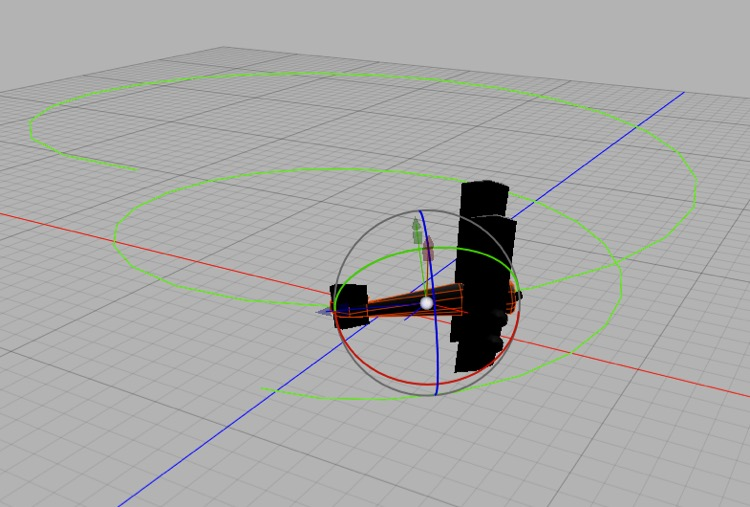

## Path Animation

*Making a model move along a path couldn’t be simpler. Add a Spline Tracking tag to the object and then assign the path to it. You can add a second rail path for greater control.*

