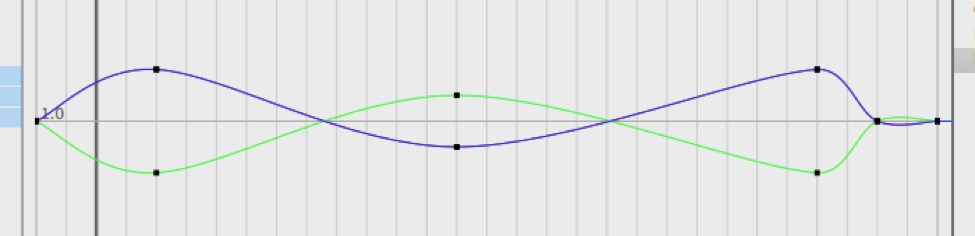
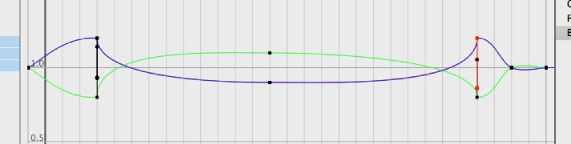

## Tutorial: Animation Basics

### A ball jumps from Point A to Point B

When I have taught animation classes the first task I set my students is this. Move a simple shape (usually a cube or a sphere) from point A to point B. Then, see if you can make it interesting.

So let’s try that.

1. First, create a new scene.

2. Next, create a ball and a plane.

3. Drag the ball up and off to the side — say to -2,0.5,0. (Stretch out the plane a bit to accommodate it. A scale of 5,5,5 should be good.)

4. Now make sure the Animation Timeline Controller is visible (click on the Timeline toolbar icon if necessary — if somehow your toolbar icon is missing, you may need to customize your toolbar).

5. Select the ball, and click the record icon. (By default of the row of small icons below the playback controls should have the three leftmost icons — position, scale, and rotation — active. This means clicking record will key position, scale, and rotation.

6. Now, drag the time in the timeline over to 1.0 seconds (frame 30) and then drag the ball to somewhere around 2,0.5,0 (move it using the red arrow or type in the new coordinates). Click record again.

7. Press Play.

You’ll see a looping animation where the ball moves from its initial position to the second keyed position and then sits there for a while, and then starts over.

Drag the right end of the dark grey “timeline view” widget so that it covers frames 1 to 30. This will restrict the visible part of the timeline to the first second, and allow you to concentrate on that one second of animation. It also affects playback, so you don’t need to watch the ball just sitting there at the end of each cycle.

So we’ve made an animation, but it’s not very interesting.

To make our animation more interesting, the first thing we should do is set a better pivot point. 

1. Go into **Pivot Mode** and drag the pivot point down to the plane (you can use snap to raster to make the position exact if you like, but it’s not important).

2. We can drag keyframes around the timeline to change timing. So select the ball and its two key frames should be visible on the timeline as blue marks. Drag them four frames toward the middle.

3. Now let’s turn our simple, smooth motion into a jump. Go to the middle of the timeline (0.5 seconds) and then drag the ball up into the air and rotate it slightly on its x axis (pitch). You can rotate it forward or backward (your choice — I pick backward). Click record.

4. A jump is intrinsically more interesting that just sliding, right?

5. Now let’s add **anticipation** and **overshoot** to the animation (that’s what those four frames are for).

6. Anticipate the jump by going to 0.0 seconds, select the keyframe from frame 4, and paste. Click record.

7. Go to the second keyframe (frame 4) and set the sphere’s scale to 1.2,0.8,1.2 (so it’s squashed) and tilt it back slightly. Click record.

If you hit play at this point you’ll see your ball tensing up before the jump.

1. Go to the midpoint keyframe and change the scale to 0.9,1.1,0.9 (stretched in mid jump) and click record.

2. Go to the final frame (1.0 seconds) and then copy and paste the final keyframe.

3. Go to the preceding keyframe, set the scale to 1.2,0.8,1.2 and tilt it forward slightly. Record.

4. Now go forward two frames — in between the last two keyframes — drag the ball slightly forward and click record.

If you hit play, the ball tenses for the jump stretches out as it flies through the air, squashes on impact and slides slightly forward before recovering its balance.

What we’d really like the squash to do is go from squashed in before jumping to its slightly stretched “flying through the air” state very quickly, and then stay that way until just before impact.

1. So let’s go to the frame two frames after take off (frame 6) set the scale to 0.9,1.1,0.9 and then **right-click** on record and select **Record Scale**.

2. Let’s do the same thing at the frame *immediately* before impact.

What we’re really doing here is fine-tuning the interpolation of the values between key frames. We could achieve similar results using the f-curve editor and in some cases this is a better way to do it.

*Here’s the f-curve editor showing the way the size values interpolated between keyframes. **Top**: before the last tweak. **Middle**: after the last tweak. **Bottom**: using f-curves instead.*

