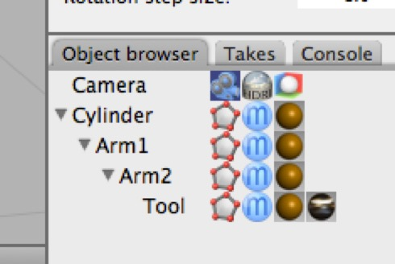
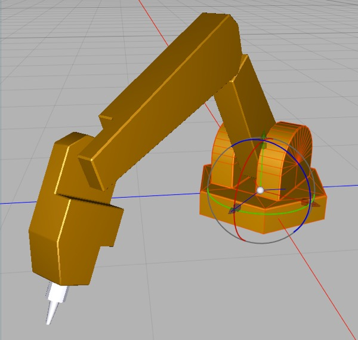

## Forward Kinematics: Robot Arm I

Imagine we’ve built a robot arm out of a hierarchy of parts. The hierarchy might look like what you see above left, while the robot arm might look like the model above right (when posed).

If this model is properly set up then each object will have its pivot set to its center of rotation. In this case we would assume that the base rotates around its Y-axis and each of the other pieces rotates around its X-axis.

You can pose the arm simply by rotating individual pieces around their specific axis of rotation. But if we’re trying to get our robot arm to point its tool at a specific spot, it quickly gets fiddly. Rotating Arm1 changes the entire hierarchy, so getting the tool to line up involves finessing each piece multiple times, and the resulting animation can look jerky — which *may* be OK for a robot.

Even for something as simple as this robot arm, forward kinematics is tedious.

