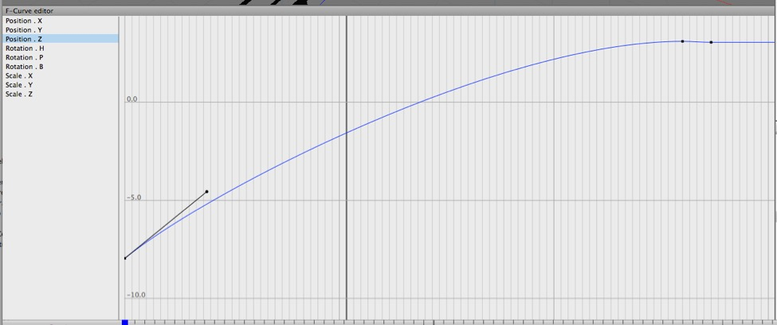
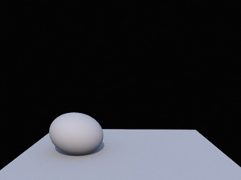
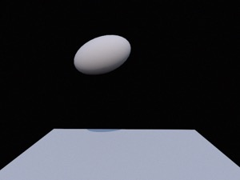
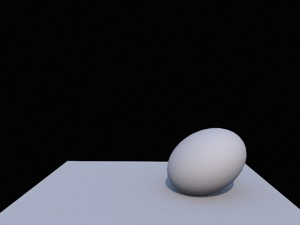

## Animation Concepts

### Keyframes and Interpolation

Interpolation means to “find a point between fixed points”. In animation terms, it means determining a value at a point in time between two key values. How values are interpolated is as important as the key values themselves.

Let’s consider our train animation again. We want to animate a train *arriving* at a station. It starts short of the station, it ends at the platform. Is this all we need to know?

If we were to naively interpolate between the two values (this is usually called linear interpolation) we might say that if the train starts at position 0 and time 0, and ends at position 10 and time 10, then at time 1 we’d interpolate its position to be time 1, at time 5 it would be at position 5, and so on.

This would produce a *terrible* animation. The train would move to the platform at a constant speed and then immediately stop. Trains don’t do this.

In fact, a *real* train arriving at a station will be slowing down the entire time — until it stops, when it will lurch backwards slightly. (We’ve all stood on trains and buses as they’ve come to a stop.)

*Cheetah 3D provides tools for visualizing and controlling the interpolation of keyed values. Here we’re looking at the way the train’s z position changes over time in Cheetah 3D’s F-Curve editor. I’ve added an extra keyframe before the final keyframe with a tiny bit of overshoot (so the train lurches backwards). I’ve tweaked the curve so that the train decelerates as it approaches the station.*

### Ease-in, Ease-out, Point-to-Point

Easing into or out of an animation means smoothly accelerating or decelerating rather than starting or ending abruptly.

Easing maps very well onto the core principle of point-to-point from *Disney Animation: The Illusion of Life*, the idea being that in animating a movement, most of the frames should be around the extreme poses (keyframes) and the transition should be rapid.

By default, Cheetah 3D will smoothly interpolate all motions (i.e. it will ease changes in animated properties smoothly over time). 

Sometimes this is what you want, often it isn’t.

### Anticipation and Overshoot

One of the principles of animation outlined in *Disney Animation: The Illusion of Life* — the idea is that any character who is about to perform an action will prepare for it by moving slightly in the opposite direction, and will always slightly overshoot on completion. (Think of a pitcher winding up to throw a ball and then following through after releasing the ball.) 

Again, returning to our train, the bit where it lurches back slightly after coming to a stop is a case of overshoot. The basic principle is that not only do objects not suddenly start moving, but they also tend to anticipate motion (usually be moving slightly in the opposite direction before starting) and overshoot (move past their intended destination and then regain balance).

### Squash and Stretch

*Simple animation of a ball “jumping” from point A to point B. **Left**: anticipating the jump the ball is squashed. **Middle**: as it flies through the air it stretches along its axis of motion. **Right**: as it impacts its destination it squashes again.*

One of the core principles of animation outlined in *Disney Animation: The Illusion of Life* — objects prepare for action and react to impact by being squashed, and stretch along the line of motion.

