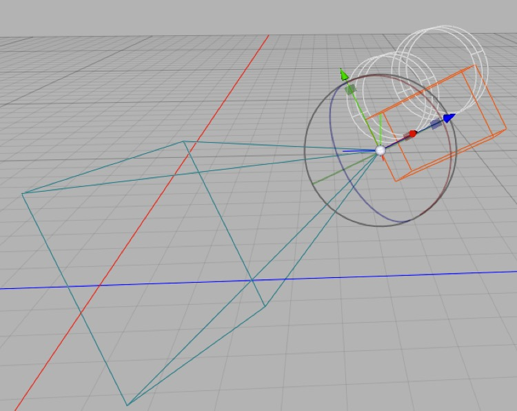
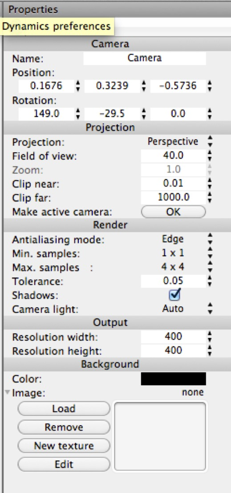

## The Camera Object

*When selected, a camera appears in the 3D view as a wireframe movie camera with a pyramid coming out of it indicating its field of view.*

*The camera object has many properties, and they’re all important.*

The first thing to notice about a camera object is that like meshes, it has **position** and **rotation** properties, but unlike meshes (and like other non-mesh objects, such as lights) it does not have scale properties.

Usually the most convenient way to place and orient a camera is by making it the active camera and then modifying your point of view while looking “through it” (i.e. setting your 3D view to “Camera” and altering the view directly.