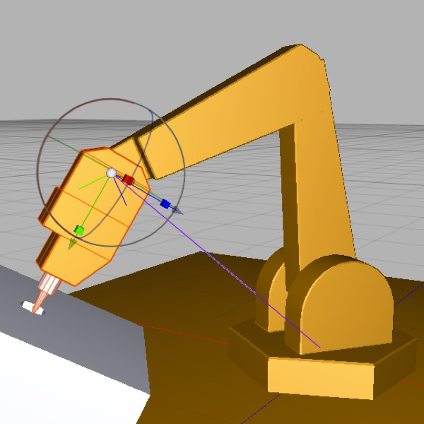
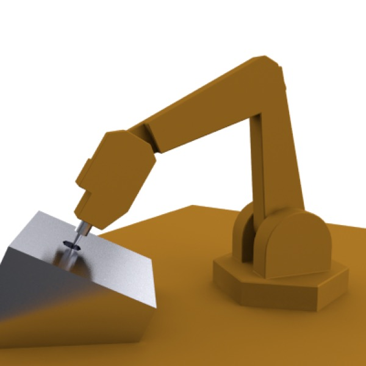

## Inverse Kinematics: Robot Arm II

So, we see from our experiment with forward kinematics that getting something as simple as the robot arm to point its tool at a specific spot is an exercise in frustration. The trick is to tell the computer what we want and have it figure out all the crazy math for us.

This is _inverse_ kinematics.

Again, we’ll take our robot arm, and we’ll simply add an **IK Handle** tag to the Tool, and set its Length to 3 (so the purple line reaches the base of the arm). 

(Save your file at this point — experimenting with IK can really mess up your hierarchy.)

If you drag the tool where you want it to go, the IK system will attempt to figure out how to rotate all the joints in the arm to achieve your desired goal, but it doesn’t know how the robot arm is supposed to bend so it fails miserably.

You might want to reload your saved file at this point.

What we’ll do is tell it what we want. We simply add an **IK Constraint** tag to each part of the arm and tell it to restrict rotation in two of the three axes. For the base we’ll have it constrain everything *except* Heading, and for the other three parts we’ll constrain everything *except* Pitch.

If you try the same thing again, you’ll see that it still doesn’t work properly. This is because the IK system ignores constraints unless you’re using the 3D Solver. D’oh! So (and you might need to reload again) set the IK Handle to use the 3D solver.

Now you’ll see that the Robot Arm works perfectly. 

_**Top**: the robot arm rigged for IK with a 3D solver and constraints (the purple line indicates the base of the hierarchy that it will solve for). **Bottom**: looks good!_

You try to place the business end of the arm where you want and it does the best it can, snapping the tool to the nearest possible position and orientation if necessary. Beautiful.

**Note**: for characters, setting up basic IK is simpler than what we’ve just done. The default 2D IK solver is specifically designed to make setting up character animations easier. As long as your joints are slightly bent in the direction they will usually bend in, the IK system will use that information automatically and, most of the time, “just work”. As we shall see.

Also note that the IK system doesn’t care whether you apply it to “joints” or any other object — so you can use the IK system, as we have done here, to manipulate an arbitrary hierarchy of objects. Skeleton tags do, however, care whether you use joints (you can’t just drag an arbitrary hierarchy of junk into a Skeleton tag).

