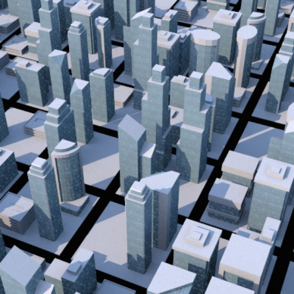
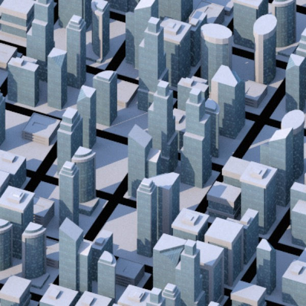
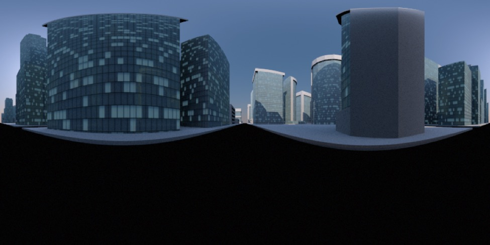
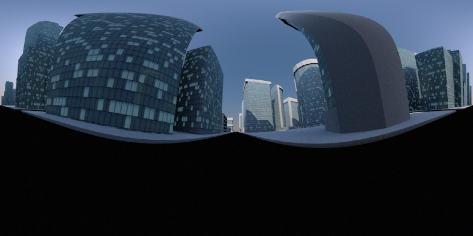
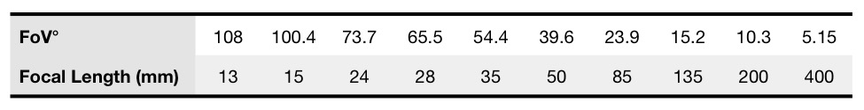
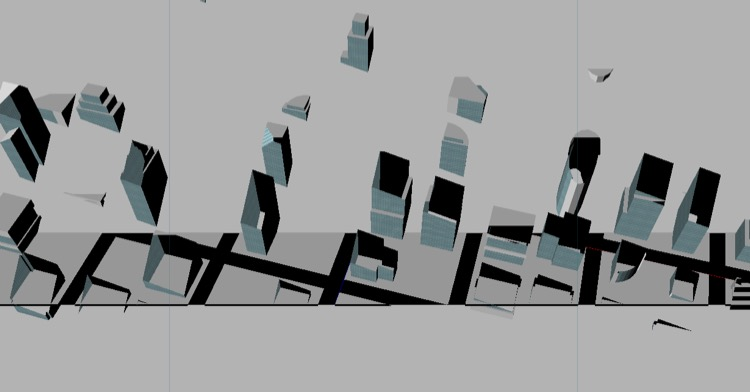
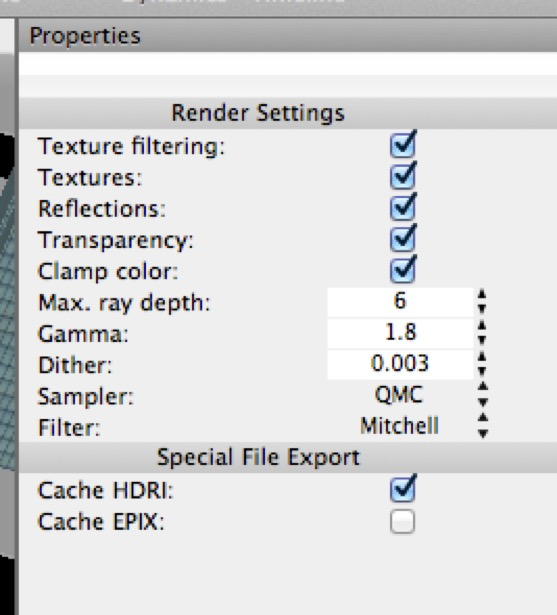

## Projection Settings

These settings all relate to how the camera looks out into the scene.

### Projection

By default, cameras render a perspective projection. There are two other options: orthographic (no perspective) and panorama.

**Top**: cityscape rendered through a camera with perspective. **Bottom**: cityscape rendered through an orthographic camera.* **Orthographic** rendering is useful for engineering and architecture applications, and for rendering components for isometric “faux 3D” games. (And, new in Cheetah 3D v6, orthographic projection is properly previewed in the 3D view.)

*Panorama rendered with a level camera — the ground plane is horizontal and runs through the center of the image.*

*This panorama was set up exactly as the previous one except that the camera was pitched up 10°.*

**Panorama** rendering produces 360° panoramas suitable for use as HDRI reflection maps, or simply to produce really cool looking 360° views. The panorama that will be rendered from a camera is determined by its position and orientation — it will be the panorama you would get by pivoting on the camera’s y-axis.

### Field of View

For perspective cameras, field of view determines the kind of “lens” your camera uses. Normally when you “zoom in” or “zoom out” using the camera controls you’re moving the active camera forward and backward (i.e. along its own z-axis). If you want to zoom in and out the way a camera lens does, you need to change the field of view — a wide field of view (e.g. 100°) would be equivalent to a very wide angle lens (approximately a 15mm lens on 35mm camera or 24x36mm “full frame” DSLR) while 5° is roughly the equivalent of a 400mm lens.

The following values are from Wikipedia’s article on Angle of View. Note that I am using their horizontal field of view values because Cheetah 3D’s field of view value determines the angle forming the square from which the final image is cropped.

### Zoom

For orthographic cameras, zoom determines the how large the scene is rendered in the camera view (since field of view is meaningless in an orthographic view).

### Clip Near, Clip Far

*Here I’ve set the Clip Near and Clip Far values of the active camera to be close to the distance the middle of the scene is from the camera, leading to a very strange result as these values “slice through” objects in the scene.*

These values determine the closest and furthest objects that will be visible in the camera in the edit view (it has no effect on rendering). The main use of these values is to improve screen refresh in very large and complex scenes by hiding stuff that’s “far away”.

### Make Active Camera

This button explicitly makes the camera active (unless this camera or the active camera are **locked**). There’s a quicker way to make a camera active, which is to double-click it in the  **Object Browser**.

### Render Settings

These settings all affect the quality (and speed) of rendering with the camera.

#### Anti-Aliasing Mode, Min Samples, Max Samples, Tolerance

Anti-aliasing is a graphics trick whereby images are made to look smoother by interpolating the colors of pixels that lie on edge detail in an image. Rendering is a tradeoff between speed and quality — and one of the things all renderers do is try to avoid doing as much work as possible.

**Min Samples** determines the minimum level of detail — i.e. number of rays — Cheetah 3D will render (1x1 means it will fire off one ray for each pixel, 4x4 means it will divide a pixel into a 4x4 grid and fire one ray off through each of them — you’ll see that Cheetah 3D is willing to go down as far as only firing one ray for every 4x4 set of pixels).

**Max Samples** determines the maximum level of detail —i.e. number of rays — Cheetah 3D will render for a given pixel.

**Anti-Aliasing Mode** and **Tolerance** dictate Cheetah 3D’s criteria for deciding whether to go beyond the minimum and fire off more rays to render a given pixel. **Edge** means that Cheetah 3D will fire off more rays if the pixel (or grid of pixels, or subpixel) it has just rendered has an edge running through it. **Color** means that it will fire off more rays if the pixel just rendered is different in color from a neighboring pixel relative to a specified **Threshold**.

In theory, using the Color antialiasing mode will be slower and produce better output than using the Edge method because it will pick up fine detail in materials which the edge method will ignore. In practice, both methods seem to use **threshold** as a criterion to render more detail, and there seems to be little difference in the results.

**Shadows** allows you to toggle shadows on or off for the entire scene (overriding the settings of individual lights and render tags).

**Camera Light** acts like a “flash”. By default it’s set to auto, which means if there’s no light in a scene it will be active (it acts like a directional light pointing out of the camera) otherwise it automatically turns off. You almost *never* want the camera light, but its auto setting means you hardly ever notice it. 

You may have issues with the camera light when rendering scenes entirely lit by emissive objects, in which case switch it off.

#### Output

Output settings determine the dimensions of images rendered using the camera.

#### Background

Background settings determine the background color or image. By default, Cheetah 3D renders a black background. Probably the best background option is 100% transparent since this allows you to composite your rendered images if so desired.

#### Renderer Preferences

Render Preferences (**Render \> Render Preferences**) are settings that apply to any camera in a scene (they are local to the current scene though — they are scene settings and not Cheetah 3D preferences).

It’s odd that you can globally turn off shadows via camera settings but reflections and textures via render preferences. Oh well.

The most commonly needed settings here are **Max. ray depth** (which determines how many transmissions and reflections a ray will be allowed to calculate before giving up) and **Cache HDRI** and **Cache EPIX** which allow you to save HDR versions of renders and may improve the rendering of animations when using Radiosity, respectively.

Increase Max. ray depth for scenes with many transparent and reflective objects, or if you see mysterious black patches appear when rendering transparent or reflective objects.