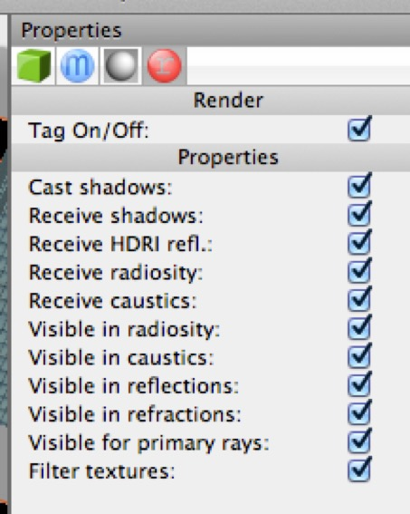

## The Render Tag

*By default, an object will cast shadows, receive shadows, and so on. The render tag allows you to remove an object from certain aspects of Cheetah 3D’s rendering pipeline.*

The render tag gives you fine control over how Cheetah 3D’s renderer will handle specific objects. Just as you can turn off all shadows using a camera’s settings, or all shadows cast by a light using a light’s settings, you can stop a specific object from casting shadows via a render tag.

Want to render a vampire looking in a mirror? You can prevent an object from appearing in reflections using a render tag.

Probably the most important settings are **Cast shadows** (e.g. if you want an object to not cast any shadows at all, this is the property to uncheck), **Receive shadows**, **Receive radiosity** (glass often causes problems in radiosity renderings of interiors, adding a render tag to glass panes and setting them to not receive or be **Visible in radiosity** often helps remove artifacts) and **Visible for primary rays** (if unchecked the object still casts shadows and appears in reflections and refractions, but otherwise it disappears — great for building environments around objects being rendered as icons, for example).

### The HDRI Tag

The HDRI tag attaches a reflection and/or lighting map to a camera. 

By default an HDRI tag will act as a **reflection map** and **background** (unless you have a very high resolution background, an HDRI tag will usually produce an ugly background, so you might want to uncheck the **Background** property).

If you add a **Radiosity tag** (whether in Ambient Occlusion or Radiosity mode) to a camera with an HDRI tag it will also act as an image-based light source.

### The Radiosity Tag

The Radiosity Tag has two modes — ambient occlusion and radiosity. These two modes do very different things. Of the two, ambient occlusion is by far the quicker and radiosity tends to produce better results. 

You cannot use both ambient occlusion and radiosity in a single render (if you assign two Radiosity tags to a camera, only the last one is used).

### Ambient Occlusion

Ambient Occlusion applies a simple idea to a scene’s lighting — assume that light is coming from “all around” it follows that parts of a scene that are in corners or nooks and crannies will receive less of this light. The way Cheetah 3D does ambient occlusion, with default settings a scene will become brighter overall when you add ambient occlusion, but “nooks and crannies” will not be brightened as much as other areas.

It’s worth noting that ambient occlusion is a monochromatic phenomenon. It affects the brightness of the scene, but not the color.

### Radiosity

Radiosity tries to simulate the effect of diffusely reflected light. Adding radiosity to a scene will cause surfaces to receive light reflected from other nearby surfaces. In particular this tends to cause colors from one surface to “bleed” onto adjacent surfaces (this is quite realistic).

*Simple scene rendered with a single distant light. Note how the brightness of the faces of the two boxes are uniform.*

*This shows the affect of adding Ambient Occlusion. Note in particular that the nearest faces of each box get slightly darker towards the bottom.*

*Finally, here’s radiosity in action (I’ve dialed the intensity up to 3.0 to exaggerate the effect). See how the box’s colors bleed into the neutral plane below them. Here the bottoms of the faces are brighter because they’re receiving diffuse reflected light from the plane.*

