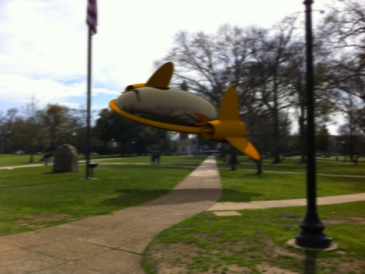
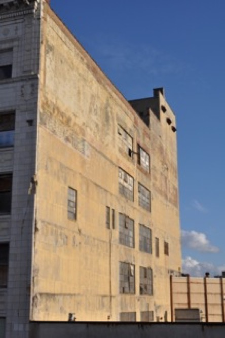
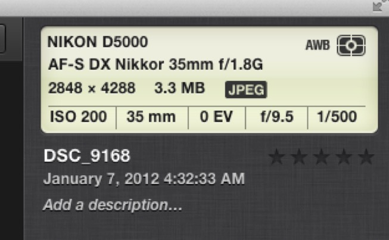
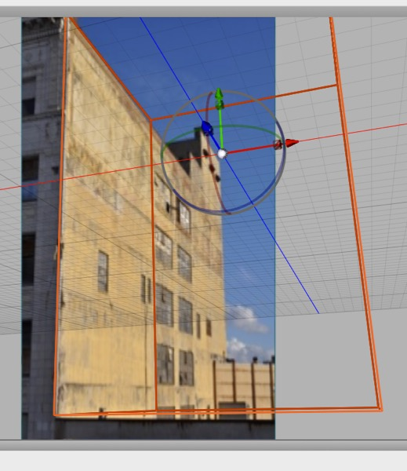
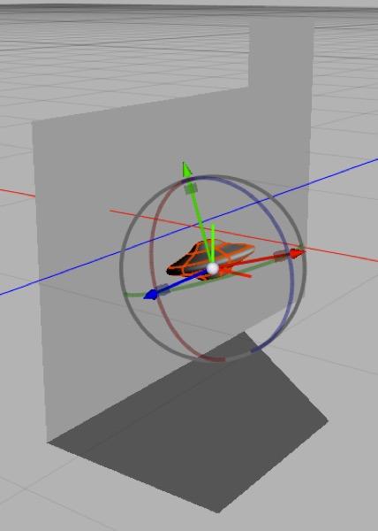
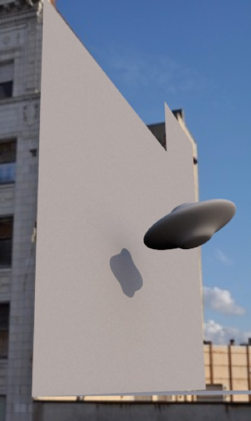
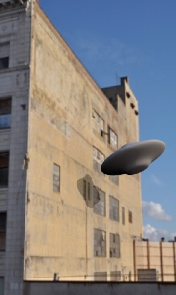

## Dealing with Reality

**Aircar on the Quad**. This photograph was taken with an iPhone and the aircar added using Cheetah 3D and a combination of Acorn and Photograph. 

- Remember that it’s imperfections that sell — the photo isn’t very sharp, so the added elements were blurred to match it. 

- The reflections in on the aircar were from an HDRI mocked up from the single Photo. 

- Lighting was with a skylight (I set it to the correct longitude, latitude, date and time). 

- The shadow was a simple shadowmat blurred and distorted a bit. It’s not perfect, but the whole process took less than an hour.

There are several basic problems when you want to add a rendered element to a photograph. Note that the same techniques apply to adding animated elements to still photographs and locked off camera shots.

- Matching the camera field of view and angle

- Matching the depth of field

- Shadows

- Reflections

- Lighting

- Caustics

- Masking out Foreground Elements

**Matching a Still or Static Camera Shot**

Let’s suppose you want to render a building on the site where it’s intended to be constructed.

Ideally what you will do is either take a photograph of the site, and carefully note all your camera settings (and, ideally, some information about landmarks or reference points in the area, such as their relative positions and sizes) — or be given a photograph along with that information. If you have the time and means, you might even insert reference points (or survey existing ones) yourself.

Then, you create a scene in Cheetah 3D with placeholder objects for the landmarks placed and sized correctly relative to one another, and then you’ll set up a camera with field of view matching that of the camera used to take the photograph. (There’s a conversion table for common lens focal lengths to Cheetah 3D field of view in the section on the Camera Object in the chapter on Rendering.)

In practice, all you really tend to need is a single rectangle of known dimensions (ideally a vertical or horizontal rectangle) and the focal length of the lens. Create a matching rectangle in your scene and line it up by trial and error.

Assuming you have a digital photograph, you can probably get the focal length and other camera settings (time of day) from the photograph’s EXIF metadata.

You then load the photograph into your camera object as the Background Image and adjust the camera facing and position using the orbit, zoom, and pan controls until your reference point objects line up with their corresponding images in the photograph.

Now lock your camera down and build out the scene.

Here’s a photograph of a building I had lying around. 

*Here’s some of the EXIF metadata for this image in iPhoto. The time of day is wrong (probably a timezone issue).*

So all I really know about it is that it was taken with a 35mm lens using a Nikon D5000 (an FX camera with a crop factor of 1.5). This makes it roughly a 50mm lens (on a 35mm film camera) — a 39.6° field of view for the larger dimension in Cheetah 3D terms. Judging from the light, it was taken in the mid-to-late afternoon — so I’ll set my Sky Light to 15:00.

Above, I’ve created a scene with a box, set the camera’s render width to 300 and its height to 500 (to match the aspect ratio of the photograph) and then set the field of view to 39.6 (close to Cheetah 3D’s default of 40.0) and played with the view controls until I was able to match the side of the cube with the top corner of the building and then I pulled out the bottom of the cube to line up with the point where I’ve got a horizontal line on the same facade and messed around a bit longer to get that lined up.

***Top**: I build out a bit more of the facade, add a flying saucer, roughly match the lighting with a skylight set to the right time of day (simply rotating the skylight until it looks roughly correct). **Middle**: a quick test render. **Bottom**: I put the default Shadowmat material on the facade and render again.*

**Converting 35mm equivalent apertures to C3D depth of field settings.**

Matching **Depth of Field** tag settings is not as straightforward as matching field of view. I’d recommend simply doing some test renders and eyeballing it. (Perhaps a kind reader will tell me the magic formula, and I will update a later edition of this book!)

Usually, depth of field won’t be a major issue since either (a) the photograph will be largely in focus, which is usually the case for photographs taken specifically for this kind of purpose, or (b) you’re only compositing isolated elements, and can simply blur them to match the depth of field during the compositing process.

**Matching Motion Footage**

One of the common problems in special effects work is producing cg images in a way that matches a moving camera shot. This is much harder than matching a fixed camera shot, which is why (for example) *Star Trek: Next Generation* used so many static camera shots.

E.g. in Jurassic Park 2 there’s a sequence where characters are fleeing from dinosaurs in a jeep; this was achieved by shooting the scene more-or-less conventionally with actors and a jeep on location, then calculating the motion of the camera from the way objects in the shots with known, fixed positions moved in the shots, then rendering the dinosaurs using a virtual camera which moved in the way the original camera was calculated to have moved during filming, and finally compositing the rendered imagery with the film (and removing the various sticks and reflectors used to help calculate the motion from the film at the same time).

PFHOE Pro is a remarkably good, inexpensive tool for calculating camera motion from high quality video footage on a desktop computer and then exporting it to a wide variety of formats, including FBX, which Cheetah 3D can easily import. So, yes, you can replicate this kind of shot with a few hundred dollars worth of software on a Mac laptop with a lot of work.

There are other kinds of motion tracking, notably the capture of body and facial motion so that the performances of actors and stunt people can drive the motion of cg characters. Typically, such motion is available or can be converted to BVH or FBX format, with FBX being convenient for Cheetah 3D.

There are libraries of motion content (some captured, some animated) which can be customized and bought off the shelf from vendors such as Mixamo (mixamo.com) and then used to animate characters in Cheetah 3D. Again, the key is getting the content in FBX format.

**Shadows**

If the rendered element is going to cast shadows into the scene, you may need to build out a Shadow Catcher (an object, usually a plane, with a Shadow Catcher material assigned to it).

An even better approach, if you have the time, is to render the shadows separately by rendering the object against a shadow catcher with shadows on and off, difference the two renders, and use the result as a mask to paint in a shadow. (A tutorial on this technique is provided elsewhere under **Foolproof Shadow Catchers**.)

**Reflections**

There are two distinct cases where reflection becomes an issue.

- Reflections of the scene onto the object

- Reflections of the object onto the scene

Of course there’s the worst case scenario of, say, inserting a mirror into a scene containing mirrors, which is just going to drive you nuts — good luck with that.

Reflecting the scene onto the object entails obtaining or faking an HDRI of the scene. The worst case scenario is you just have the Photo itself. The best case is you’re the Special Effects Director and you were present at the shooting and got to do some advance work — i.e. photograph light probes (usually large steel ball bearings) or panoramas, or you took a bunch of photos you can *stitch* into a panorama.

Stitching photos into Panoramas is something Photoshop makes easy these days (although to get a true 4π Steradian panorama you need to use an exotic lens). Light probes work very well. (Remember the liquid metal *Terminator*? Light probes.) You can also buy dedicated Panorama cameras and lenses that, together with specialized software, will allow you to create a full panorama with on shutter press.

**Aside**: never encountered Steradians before? They’re the way solid angles are measured, and they essentially measure the area on the unit sphere (whose total area is 4π) that a spherical projection covers. A good HDRI should cover the entire sphere and thus cover 4π steradians. Typically, 360° panoramas do not cover all of the sky above and the ground below the panorama.

Let’s assume that you’re on a budget. Take a few photographs in a circle and munge them together to form a fake panorama. Only have one photo? Make three or four copies and place them side to side and hack them into a panorama. Add some fake sky and dirt above — don’t need to make them too perfect.

Now you’re ready to render fake reflections of the scene.

Reflecting the object onto objects in the scene is comparatively easy (unless the objects are hideously complex, since you may need to build them). You simply create “reflection catchers” in much the same way as you would create shadow catchers, and then composite them into the scene as is appropriate.

Again, the **Foolproof Shadow Catchers** technique may be helpful here.

**Lighting & Color Grading**

I mention lighting after reflections because, at this point, you may already have a good HDRI, in which case matching the lighting in the Photograph may simply be a matter of using image-based lighting.

More likely, especially if the photograph has well-defined shadows, you’ll want to use a Sky Light (for an outdoor scene) or some carefully placed lights to produce shadows to match those in the scene (mismatched shadows often make these kinds of photo manipulation look bad).

Moreover, you’ll want to match the overall white balance and gamma of the scene. If the lighting has a yellow cast you’ll want to match it with the inserted element. Similarly, you’ll want to match the contrast and tone levels of the scene. (Again, it’s imperfections that sell. If the photograph has exposure problems, you want to match them — not insert a perfectly exposed, neutral white balanced rendered element into an underexposed moody scene.)

If you don’t have an excellent HDR image to use for lighting, you’re better off rendering with neutral lighting and using your compositing tool (e.g. Photoshop) to adjust the image interactively.

**Caustics**

Caustics are a big enough pain to deal with in pure cg scenes, but the same technique described under **Foolproof Shadow Catchers** can be used to capture caustics from an object. So — for example — you can render a glass of whiskey, capture its caustics, and then composite it onto a photograph of a table.

**Masking Out Foreground Elements**

It’s possible that some elements of in the Photograph will be in front of the rendered elements, in which case they will need to be masked out and you may even need to deal with things like faking shadows and reflections of those objects on rendered elements. This requires Photoshop wizardry that’s beyond the scope of this book.

**Avoid foreground elements where possible** (especially in stills — it’s a lot easier to get away with rough masking for animations).

**Adding Rendered Animation to Video Footage**

There are two typical approaches to adding cg elements to video. 

**Locked Off Camera Shots**

Adding rendered animation to a locked camera shot is essentially the same as adding a rendered image to a still photograph. (That’s the beauty of it!)

The simplest, which used to be the only practical option for low budget production, is to use “locked off” camera shots — in other words, mount the camera on a tripod, lock it down, and the shoot the video with a fixed camera angle. It’s relatively easy to add cg effects by matching the camera angle (“by eye” is often good enough) and then using simple compositing techniques to put the elements together.

**Motion Matching**

The more complex approach, which used to be limited to big budget movies, but is not available even to amateur enthusiasts working on their own, is to use a program like PFHoe (pfhoe.com) to analyze your video footage and generate a motion file from it (in essence, this represents the camera movement relative to the scene, calculated from identifying objects in the scene and figuring out how they moved). PFHoe Pro can export these motion files as FBX, ready for import into Cheetah 3D.

**Historical Aside**

Before motion matching (or “Match Move”) technology existed, there was an *even more expensive* approach called “motion control” where you could use a computer to control the camera movement, which meant you had a precise knowledge of how the camera had behaved. This technique was developed to allow complex flythroughs of elaborate modeled sets (e.g. the point-of-view approach shots as Luke flies towards the Death Star in the first Star Wars movie) and later the mixing cg and model shots in movies like *The Empire Strikes Back*.

