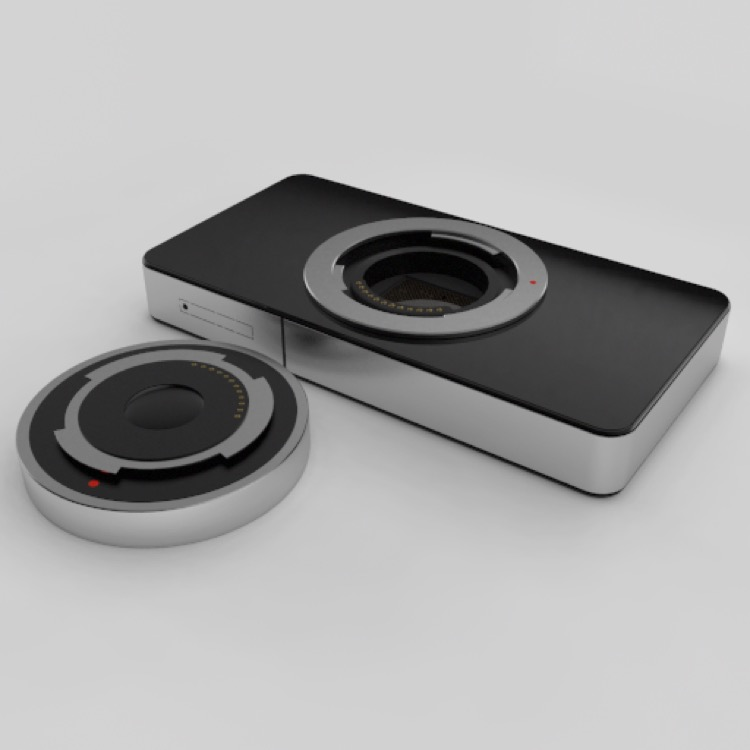

## Simple Render Setups

### Showing Off Geometry

If you just want to show off a model (or even if you just want to render it for purposes of fine-tuning it) the simplest option is to render it using a matte shader. You’ll want reasonably neutral lighting (harsh shadows will hide your model’s geometry) — here I’m using standard “three point” lighting (which should be plain from the shadows) using three point “area” lights.

*At **top**, the test scene showing the three-sided room set, three point lights, the model, and the camera. At **bottom**, the resulting rendered image.*

#### Wireframe Shaders

Another popular option is to use a wireframe shader to show off its underlying geometry. A quick way to set up a wireframe shader is to use a wireframe texture node as an input to the emission channel of the material shader.

*A simple wireframe shader. Note that I’ve dialed up the Wireframe texture node’s Line width property for emphasis, but generally you’ll want to make it quite a bit lower (0.003 seems to work well for objects a few units across).*

*Here’s the elephant rendered with a shader that uses the wireframe texture to send a dark cyan color to the emission channel. On **top**, the wireframe shader is set to Edge mode, on the **bottom** it’s set to Iso mode (which only generates lines for the edges of a subdivided surface’s control cage.*

### Product Shots

Product shots typically involve showing off a product with as little distracting detail as possible. Generally, you want the setup for a product shot to provide good lighting and produce attractive reflections.

If you’re in a hurry and want excellent results, probably the simplest and quickest option is to buy a professional HDRI. These usually work well and look great, but they can be very expensive.

We’re going to build our own product shot setup, and render a couple of test products using it, then we’re going to render a reusable HDRI from our setup so that we can go into business selling HDRIs to our colleagues! Or not.

Let’s start with a bad example.

*This is a fake “iPhone 5” render I did for fun, based on the idea that Apple would release an iPhone with a Micro Four-Thirds sensor and lens mount. (I still think this is a kickass idea, although maybe a Nikon CX mount would be better.) The goal of this render was to look like a photo an amateur might have taken under crappy lighting conditions (I used the Entrance Hall Panorama HDR that comes with Cheetah 3D). No-one would do a real product shot with this kind of lighting (or on a textured surface).*

Creating a nice “set” for product shots simply involves building a small room with neutrally colored walls (not all one shade of grey, and no pure blacks or whites — you need some variety) and lighting it with several large area lights with their geometry property switched on (even better, you can build you own glowing material and build out your own “lightboxes”.

*Here’s my product shot set. The room has walls that are varying shades of grey (alternating light and dark). The recesses have a very strong emission, and there are area lights in them. The lights are very strong too, and I render shots with Radiosity and HDR caching switched on. This produces renders with tons of light and plenty of scope for finessing the exposure.*

You can either render objects in the set or render an HDR panorama by placing a camera in the middle of the set. Here’s the HDR panorama rendered from this setup.

*To render this HDR, I hid the table (a plane) and placed a camera in the middle of the room with all coordinates and rotation set to zero, then rendered a 1024x512 panorama.*

Now you can create a new scene containing only the camera, the “table”, and whatever you want to make a product shot of, add an HDRI tag and a Radiosity tag to the camera and render shots like these in a couple of minutes.

**Note on fine-tuning Radiosity tag settings**: when rendering this image I had problems with blotchy shadows under the camera lens. It turned out that the critical value to alter here is Rmin, which I set to 0.1. This appears to determine how deep into “nooks and crannies” the Radiosity algorithm goes.

### Natural Environments

Cheetah 3D’s Sky Light does a good first approximation lighting setup for outdoor scenes. A Sky Light simulates all-around light from the sky along with intense directional light from the sun. Often, a Sky Light will be all that you need. 

The Sky Light does have two significant limitations:

- It won’t produce a *particularly* good backdrop (indeed you’ll want to make sure your scene blocks out any view below the horizon, since the Sky Light geometry simply shows black below the horizon and cannot be customized).

- It won’t produce reflections unless it *also* draws the background (unlike HDRIs).

You can work around the second issue by rendering a panorama using the Sky Light (or any other method you like) and then using that to generate the reflections in concert with using the Sky Light for lighting or using Image-Based Lighting. 

Unfortunately, even if you capture a panorama of the skylight as an HDR the lighting produced by the panorama when loaded into an HDRI tag will not be very similar to the lighting from a Sky Light tag.

Thus, if you want to go beyond the Sky Light you’re going to need to do quite a bit of work.

### Interiors

Lighting interiors well is very tricky because interiors are largely lit by internal reflections (effects simulated by the **Radiosity tag**) and not direct lighting. Since radiosity is handled *stochastically*, it can produce noisy results and it can time-consuming to refine your render settings to eliminate artifacts and even more time-consuming to do final renders at high resolution.

**Natural Light**

*The simplest approach to natural light is to use a skylight (in this case with intensity set to 5.0) along with radiosity. The color of the lighting reflects the latitude, longitude, and time of day — in this case latish afternoon. (The “sky” color visible through the window is simply the camera’s background color setting. You can also use an image background.)*

*One downside of using a sky light is that they’re a bit slow, especially when combined with radiosity. Here, I’ve used an intensity 2.0 distant light shining from roughly the same angle.*

*Here, I’ve increased the intensity of the radiosity tag to 3.0 to increase the degree to which reflected light illuminates the room. This reveals another common issue with lighting interiors — blotchy artifacts from radiosity. At this point, I had already increased samples from 400 to 1000, reduced the Error from 0.15 to 0.1, and toggle Detail detection on. Reducing error further had no visible effect, so the other obvious option was to increase samples dramatically.*

*Increasing samples to 10,000 dramatically improved the blotches, but also increased rendering time by a factor of 10. The lesson here is increasing samples works, but wait until you’ve finished adjusting other parameters because render times will be very long.*

**Artificial Light**

*Visualizations of different lights generated from their IES files.*

Doing artificial lighting well presents a whole new set of problems. The Illuminating Engineering Society (IES) has created a file specification for representing the way in which different electrical lights distribute light. Some 3D programs — unfortunately not including Cheetah 3D yet — can use IES files directly to simulate lights.

The key is building out lights carefully, using emissive materials for shades and covers.

### Faking IES Lights

You can get similar results to IES lights (see image on right) by using a transparent material (transparency map shown at left) wrapped around a point light.

