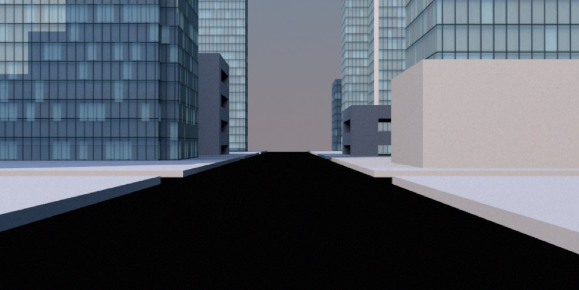
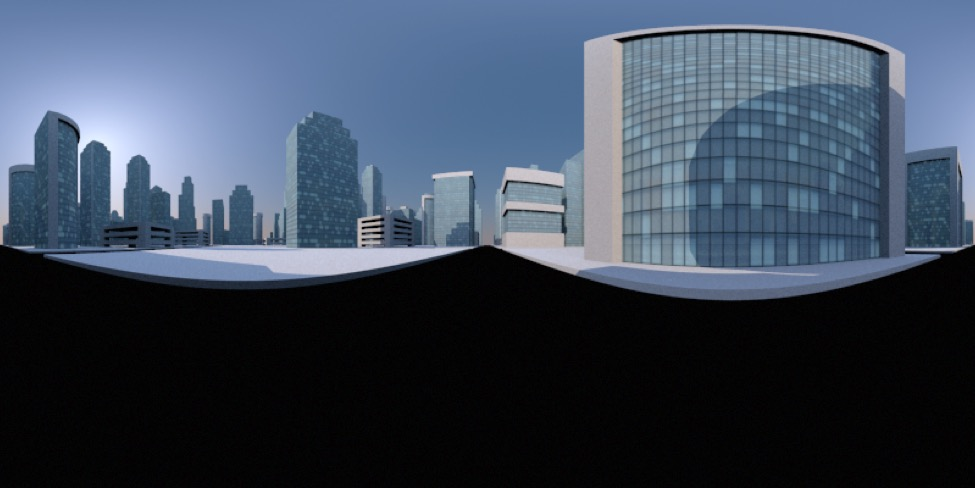

## Rendering Panoramas

*Render of a cityscape using camera with projection set to perspective (the default setting).*

*Same scene rendered with the camera set to panorama projection.*

Cheetah 3D allows you to quickly render 360° panoramas (perfect for use as reflection maps) simply by setting a camera’s projection property to panorama. The panorama will be rendered based on the camera’s orientation so, typically, you’ll want the camera’s rotation pitch and bank to be zero (i.e. the first rotation value — heading — can be anything, but for a horizontal panorama you want the other two values to be zero).

The panorama will be stretched to fit whatever sized output image the camera is set to produce. Typically you’ll want a panorama’s width to be at least double its height.

