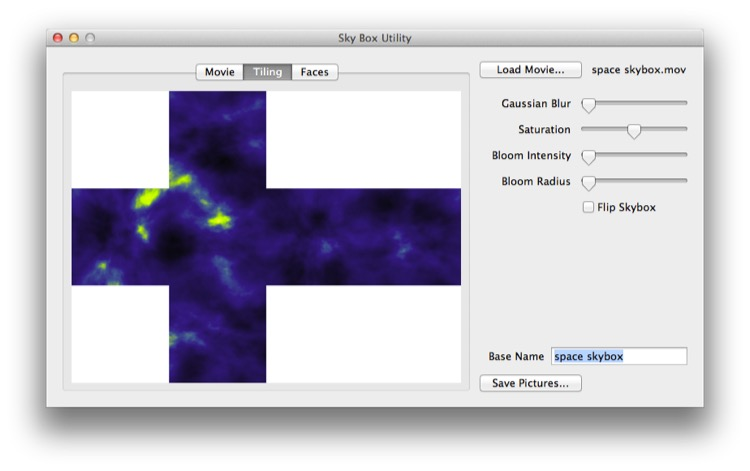

## Rendering a Sky Box

To render a skybox from a scene you simply need to:

1. Set the camera’s output resolution to produce a square image (e.g. 512x512)

2. Set the camera’s field of view to 90°.

3. Place the camera at the origin (0,0,0).

4. Create a six frame animation where the camera’s rotation settings are: (0,0,0), (-90,0,0), (180,0,0), (90,0,0), (0,90,0), and (0,-90,0).

Now simply render the entire sequence to create a skybox from whatever scene the camera is placed in. 

**Skybox Utility**

Skybox Utility will take an animation rendered using the preceding process and turn it into a skybox, ready for import into Unity 3D. You can obtain a copy of this free program from **http://loewald.com/waterboy**.

**Note** that a similar technique can be used to create faux HDR boxes.

