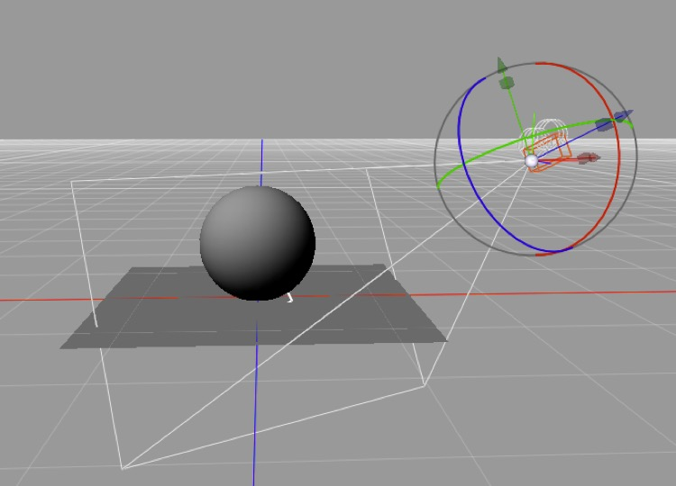

## How Raytracing Works

You *don’t* need to know this stuff.  You can skip this *entire section*.

But…

It’s very useful to have a solid grasp of how raytracing works when trying to render things in 3D. For that matter, most of the principles of raytracing apply to real-time 3D rendering, so it’s useful to understand this stuff even if all you’re interested in is real-time 3D (e.g. game development).

### Ray tracing is what it sounds like

You trace a ray from the camera’s position in your virtual 3D space to each point you’d like to render on your viewport and keep going until you bump into some object in your scene.

If you don’t bump into anything then you render the background (which could be a bitmap, transparency, or almost anything — e.g. a gradient or an algorithmic rendering of the sky).

Assuming you do bump into something you need to decide what color that thing you bumped into is, and this is where things get interesting. The thing you bump into will, fundamentally, be some point on a triangle. (If you hit a polygon, the renderer treats that polygon as a bunch of triangles and picks the one you hit and where you hit it.)

The triangle you hit will have an assigned **material** (or shader, depending on your nomenclature) and the position you hit on the triangle will be translated into the material’s coordinate system. (Materials have a coordinate system? Why yes they do — that’s the UVW space you keep seeing references to.) We won’t go into materials in detail here, but the point is that the material will turn out to have, among other things, a diffuse color, a specular color, a hardness, a reflectiveness, and a transparency value at that specific point on that specific triangle. Oh, and the triangle will have a normal, and the point on the triangle you hit will either inherit that normal or have an interpolated value between that triangle’s normal and some adjacent triangle’s normal.

So, having gotten these properties for this point on the triangle we hit we need to calculate how well it’s lit (based on its normal, and tracing back from that point to every light source in the scene unless you hit some other object in the scene before you get to the light — which is how shadows are calculated). The closer the angle between normal of the point and the direction to a given light source, the more brightly that light source will illuminate that point. (If the light source is more than 90° away from the normal, the light source is behind the triangle and can be ignored.) 

Light sources usually “fall off” with distance (real lights *always* do, but in 3D programs we often cheat to achieve specific effects or approximate something more cheaply — e.g. “distant” light sources, like the sun, can be treated as though they do not fall off with distance for most purposes).

Specularity (shininess) is also used to determine if we should render a hard reflection (in effect a “fake” reflection of a light source) at the point. Here we simply look at whether light from the source will be reflected exactly or nearly exactly back along our ray, and if so we add the specular color to our point’s color.

Reflection is handled by raytracing along the reflected angle (repeating the whole process again — “recursing”). The degree of reflectivity (i.e. the reflective component’s “color”) scales the color we get by performing this recursive step.

Transparency is handled by continuing to trace along the same path (bent by refraction if applicable) — again recursively performing the same steps again, and this time multiplying the result by the transparent color at this point.

Once you’ve done all the recursing you have to do (either because you hit a completely non-reflective, non-transparent triangle or because you reach the recursion limit set in your Render Preferences) you’re done with that point.

How many “points” do we need to render this way? Generally one for every pixel in the image, plus more along the edges of things to antialias “jaggies”. Each pixel in an image tends to be the result of rendering one or more points “inside” that pixel and averaging the results.

### Stochastic Sampling Tricks

Various special effects are achieved by using stochastic sampling methods at various recursive steps and/or by precalculating lighting using various algorithms.

(Stochastic means using random samples to try to understand an effect which cannot be perfectly understood. In this case we’re trying to approximate the behavior of countless photons by tracing tens or hundreds of simulated light rays.)

E.g. the way you decide if a point is in shadow is by calculating the ray from that point to a light source and seeing if it hits something before it gets to the light. An area light is treated as a random collection of dimmer lights within an area, so instead of tracing back to one light source you might trace back to 10 light sources and average the result. This is how you get “soft” shadows.

Similarly blurred reflections are achieved by calculating multiple reflections slightly deviating from the “correct” angle and averaging the result. Blurred transparency does the same thing for transparency. Depth of field is calculated by picking points offset from the camera position to start each ray (and because you start at a random positon, rather than splitting later in the process, depth of field is much more expensive than the other effects).

