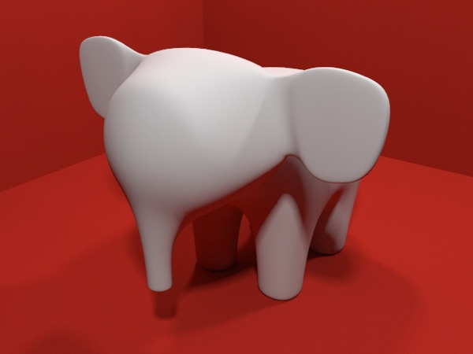
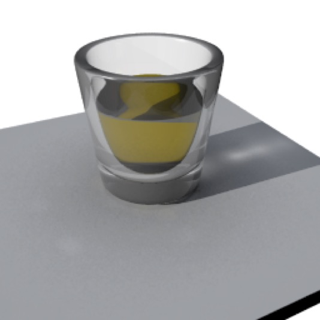
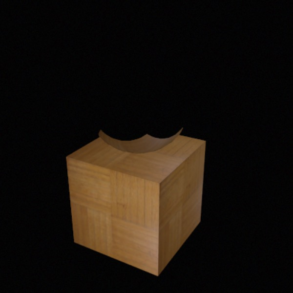
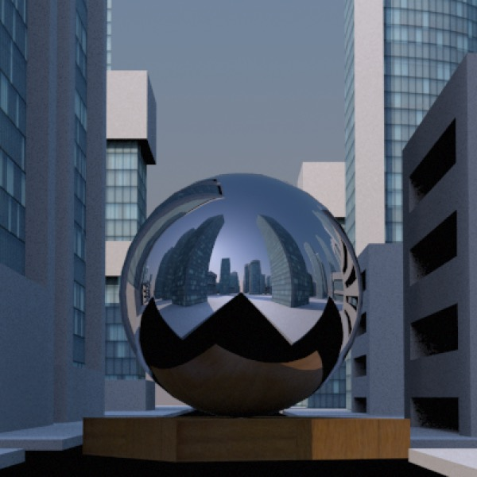
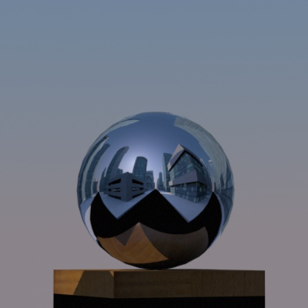
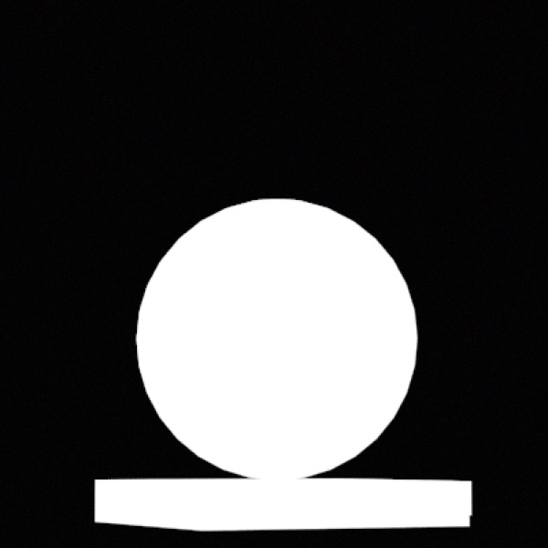

## Environments

Apart from light sources (such as the sun) **every object owes its appearance to light emitted or reflected by the things around it**. At first approximation this means light emitted from light sources, but when you take reflective and refractive objects into account you need to look at light being reflected off other objects in a scene. Even “dull” objects are greatly affected by reflected light.

**Radiosity** simulates the effects of light reflected off dull surfaces. In the image above, the elephant is light grey but reflected light, especially where the elephant is in shadow, colors the elephant.

**Caustics** simulate the effects of light reflected off or refracted through objects. While the caustics in the shadow of the glass don’t dominate the scene, the shadows would look completely fake were they not being used.

**I made a metal object and it’s black — Metal and Reflections**

_**Top**: a steel ball rendered in Cheetah 3D. **Middle**: the same ball placed above a parquet cube. **Bottom**: exactly the same steel ball and parquet cube placed in the middle of a cityscape._

Probably the first environmental issue that hits beginners in 3D is metal (or other reflective objects, such as mirrors) coming out looking very boring. If there’s nothing to reflect, reflective objects will look like nothing.

There are two ways to address this — one is easy and the other is hard.

The easy way is to use an HDRI to produce reflections. Cheetah 3D comes with two decent HDRIs to get you started, and more are available online. You can also create your own.

The hard way is to build an interesting world around your objects. This doesn’t need to be a complete or realistic world (think about the facades Hollywood uses to make “towns” — the important thing is what you see and what you might see reflected). Putting a cube under the steel ball is a tiny step towards building an interesting world around our steel ball, while placing the steel ball in a cityscape is almost overkill.

### I want my metal object to look like metal, but I don’t want a backdrop

What if I want my steel ball to look fabulous — the way it does in the cityscape render — but I don’t want to have the city in the background? The simple answer is to use an HDRI tag (and load an appropriate background image) instead of a complex scene, and to toggle off the Background setting of the HDRI tag.

If you want to use your own scene’s reflection you can render a panorama from inside the scene and then load it into an HDRI tag and render your object in an empty scene, but there are two caveats.

- First, you’ll want to set the Rotate background property of your HDRI tag to 180° if you want the panorama to match the scene setup.

- Second, a panorama will never be as tack sharp in reflections as the actual scene.

So, there are two more options:

- You can use render tags to finely control what appears and doesn’t appear in the final scene.

- You can use solid white and black shaders to produce an image mask.

***Top**: I’ve painstakingly applied render tags to everything in the scene and checked off “visible for primary rays”. This worked quite well except that the Sky light ignored it so it still appears in the background. (Note that the bottom of the cube is in shadows cast by objects that haven’t been rendered.) **Bottom**: I’ve pulled the standard trick of applying a solid white shader to the object I want, and solid black to everything else. This can be used to create a selection mask in any decent image editor and pull exactly what I want out of the scene. (Note that in this case it will pull out the lit part of the cube and trim the bit below ground, which is probably what I want.)*

