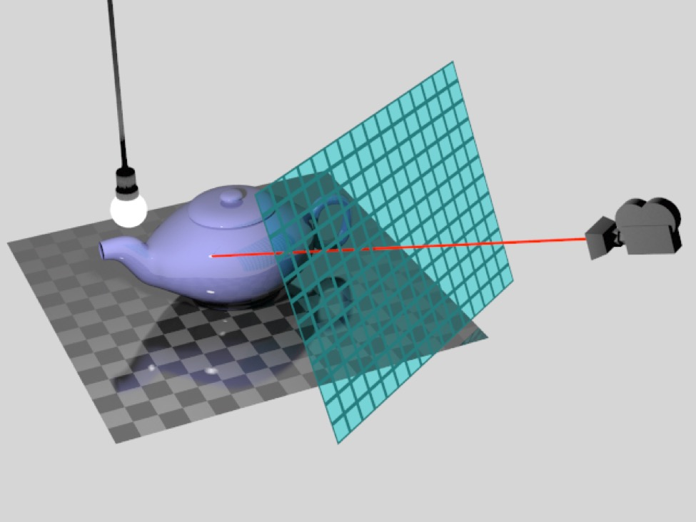
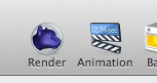

# Rendering

Rendering is the process of creating high quality images from 3D scenes. Cheetah 3D’s rendering algorithm is called “ray tracing” and it’s probably the most widely used rendering algorithm for non-realtime rendering. (Cheetah 3D’s 3D views are rendered using realtime techniques, which are much faster than raytracing but much lower in quality.)

In order to render an image in Cheetah 3D you must already have:

1. created a scene

2. placed a camera such that it is pointing at whatever it is you want to render (you can both move and rotate cameras, and change their field of view to control the composition of a render),

3. ideally you should have lit the scene, placed materials on the models, and so on, but these aren’t compulsory

*Cheetah 3D has two toolbar buttons for rendering. The Render button renders a still image of the scene as it currently is, while the Animation button renders an animation of the current selection of frames in the current take.*

To render a scene, simply click one of Cheetah 3D’s two render buttons, depending on whether you want to render a still image or an animated scene.

The **Render Manager** window will immediately appear, showing you the progress of your rendering (along with past renders, possibly including past renders still be processed).

Cheetah 3D divides rendering jobs into square “buckets” to efficiently divide a rendering task among all the CPUs in your computer. (Some Macs have Intel CPUs that support hyperthreading, which makes each CPU look like two CPUs to the operating system, and Cheetah 3D too — on those Macs you’ll see twice as many rendering buckets as you have CPUs.)

**Note**: when rendering an animation, Cheetah 3D will “lock up” the file used to render the image. If you want to keep working on an animation while it’s being rendered you should save a copy of the file and render the copy. This issue does not occur when rendering single frames.