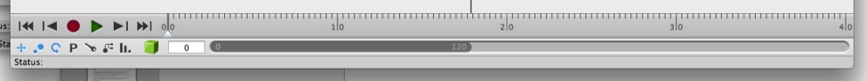
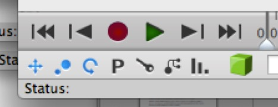
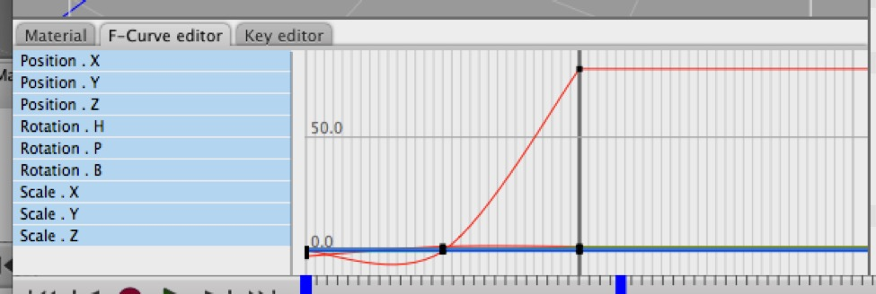

## Animation Overview

*This is the Timeline interface, which appears at the bottom of Cheetah 3D’s document window. If it’s not there you can toggle it on using the toolbar item (it looks like a stopwatch) *

The first thing you need to know about animation in Cheetah 3D is how to toggle the **Timeline** interface component. (See above.) Note that switching to the Animation Layout does not make the timeline appear, nor is the state of the timeline component stored as part of a layout.

### Keyframes

The basic principle of animation in Cheetah 3D is keyframes. In essence, Cheetah 3D animates objects by interpolating object properties between keyframe values over time. By default, any property of an object is “for all time”, and when you change it you’re changing it for all time. This all changes for a given property when that property is keyframed.

Note that keyframes only affect some properties and not others (unless you keyframe everything). It’s quite possible (and indeed likely) for most of an object’s properties to be set “for all time” and a few to be keyframed. E.g. character animation typically involves rotating and sometimes translating bones, but often that’s all. So, for example, the scale of those bones is set “for all time”.

In order to keyframe an object’s properties at a given point in time you:

- Move the timeline to the correct point.

1. Set the property to the value you want to keyframe (e.g. position the object where you want it)

2. Then click the record button in the Timeline control.

- Note that by default, clicking the record button keyframes the currently selected object’s translation information (position, rotation, and scale). To keyframe other properties, right-click the record button to specify the exact thing you want to keyframe. Almost any property (including those in tags) can be keyframed and thus animated.

### How Keyframes Work

Once a property is keyframed its value at any given point on the timeline can be calculated:

1. if there is a keyframe for that value at that exact point in time, that’s the value.

2. If there is no keyframe value for that exact point in time, but there is a keyframed value before and another after, then the value is calculated by *interpolating* between the two values.

3. If there are only values to one side (before or after) then the value is *extrapolated* from the nearest two values.

4. If there is only one keyframe value in total, then that’s the value used for all times.

*The F-Curve editor both shows how values are being interpolated and allows you to directly manipulate this interpolation. Cheetah 3D’s default “smooth” interpolation can have unanticipated effects. Note how the red line (which is x axis rotation) is being pushed in the reverse direction by the change that takes place between the second and third keyframes.*

The interpolation (and extrapolation) of values from keyframes is calculated by using bezier curves, and you can edit these curves (thus adjusting the interpolation directly) using the **F-Curve** pane.

### Character Animation & Joints

If you don’t know anything about Character Animation, it’s not possible to cover the necessary ground in a small amount of space. Assuming you have a rough idea of how 3D character animation works, here’s a quick rundown of how it works in Cheetah 3D.

To rig a character mesh for animation or posing, create a hierarchy of “joints” (a.k.a. “bones”) using the Joint tool (found in the menu bar **Tools \> Character \> Joint**), forming a simplified “skeleton” or “armature” for the character mesh.

Position the bones inside the character mesh, add a **Skeleton tag** to the mesh, drag the **root bone** of your mesh into the Skeleton tag’s listbox, then click **Bind Mesh**. Now if you move or rotate the bones, the mesh should now be deformed by it. Inverse kinematics is implemented by adding **constraint tags** to the bones and controller objects.

**Note**: adding bones to a skeleton tag's list box can be a wee bit fiddly. To do it reliably you need to select the tag, then *in one motion* click and drag the root bone into the listbox. If you don’t do it in one motion the Skeleton tag becomes deselected and you can’t drag anything to it. (Select the skeleton tag again and start over.)

If all this didn’t make any sense at all, you’ll probably need to look at the more detailed tutorials in the **Animation** section.

### Animating Tags

In addition to animating the properties of objects, you can animate the properties of their tags. For example, you can key the “Visible in Renderer” property of an object’s mode tag. Simply select the tag, and then right-click the record button in the Animation Timeline to select the property to key.

### Animating Materials

You can animate materials in a number of different ways. The obvious mechanism is the most direct — you can select a material and key its properties by right-clicking the record button in the Animation Timeline. (When you select a material you will be able to key its shader’s properties. If you select a different node in the material’s node editor, you can key that node’s inputs.)

Note that animating materials this way affects everything with the assigned material in the same way, but there are some tricks you can pull via the **State** and **Instance** nodes. (See **You Are All Individuals**, below.)

You can also animate the properties of the material tag (as per **Animating Tags**, above), e.g. animating the UV settings to “move” the material across the surface of the object.

#### You Are All Individuals! Animating Materials Using Nodes

Let’s suppose you want to create a forest full of glowing mushrooms, but you want the mushrooms to all pulse to the beat of their own drums (rather than in sync). If the mushrooms are individual objects, you can use their position to drive a highly unstable function (e.g. a noise texture) and then use the value from that texture to offset the animation.

If you’re dealing with particle instances, you can use an Instance node and simply use its random channel to offset the animation.

