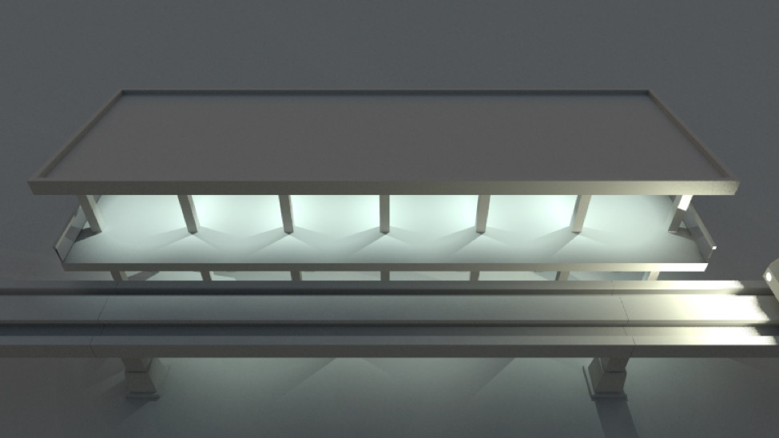
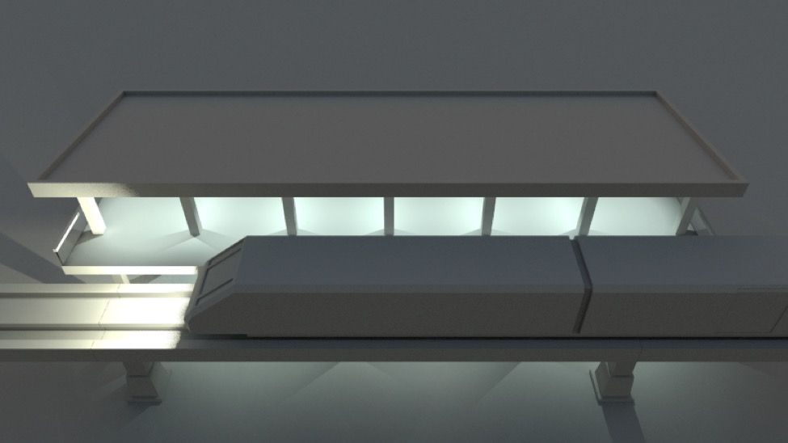
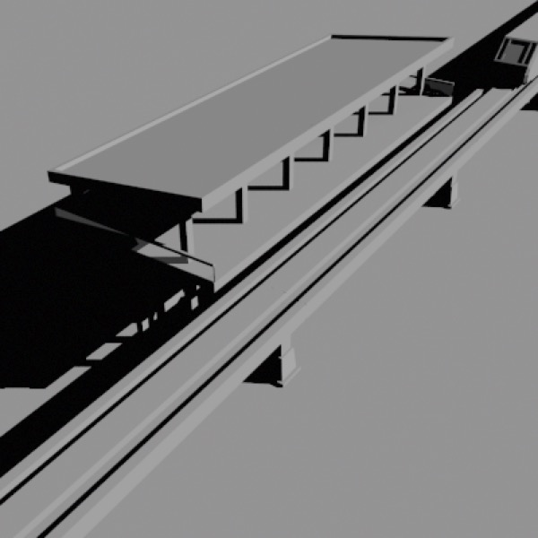
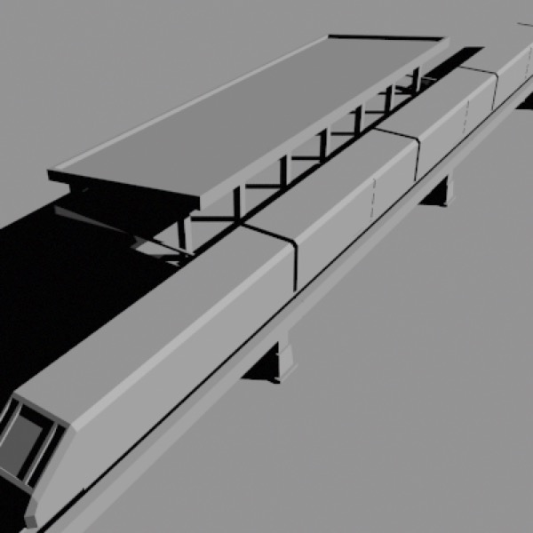
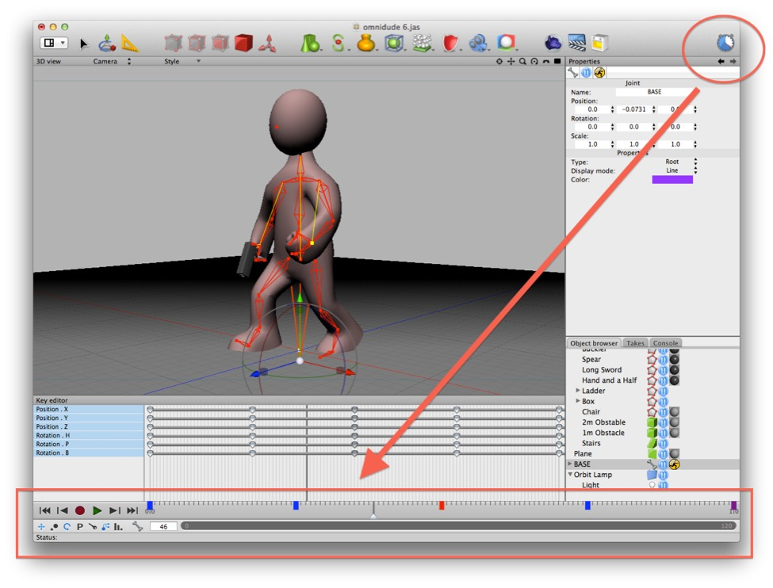
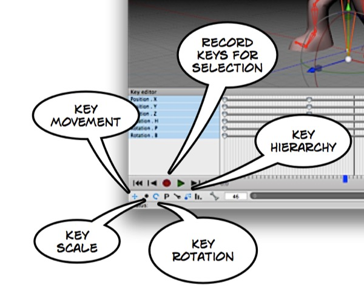

# Animation

To animate objects in 3D you start by saving “key” values for various object properties at various points in time. The 3D animation program then calculates intermediate values for those properties on other frames by interpolating between (or extrapolating from) the key values.

Let me repeat that in more concrete terms:

- A 3D animator animates a scene by creating a series of **key frames**. 

- Each key frame relates a specific point on a timeline to specific properties of various objects in the scene that need to be recorded to recreate that key frame. E.g. “at time = 0.5 the ball’s y coordinate is 2 and its Z rotation is 45°”.

- Cheetah 3D produces an animation by building successive versions of the scene at different points on the timeline (how many frames are produced per second can be set by the animator). When rendering a keyframe, the properties stored as part of that keyframe are used. When rendering any other frame, properties are interpolated between (or extrapolated from) values in keyframes. (At any given point in time, *most* properties will probably not have keyframe values. Even at keyframes, usually only some properties will be keyframed.)

- 

If that’s *still* not clear let’s discuss a simple example.

_**First Key Frame**: a train (top-right) is approaching a station._

_**Final Key Frame**: the train has come to rest at the platform._

_**One of many intermediate (non-key) frames**: depending on which frame it is, the train’s position is calculated by interpolating between its start and finish positions._

Suppose we want to animate a train arriving at a station. At the end of the animation the train will be at the platform. At the beginning of the animation the train will be somewhere short of the platform. We can create two keyframes, one for the start and one for the end, and then the animation will be produced by interpolating between those positions, so that over the duration of the animation the train moves closer and closer to the platform.

### The Animation Timeline Controller Doohickey

*The **Timeline** toolbar item toggles the Animation Timeline Controller.*

*The controls at the bottom right are used to control playback, record keys, and determine which keys are recorded. I’ve highlighted a few important items here. The settings you see are my preferred options for character animation.*

In order to animate a scene, you need to be able to move to different points in time, arrange the scene, and record keyframes (or store key values for certain properties of certain objects at that point in time). The animation timeline controller allows you to jump to different points in time by adjusting the slider, focus on specific portions of the timeline (by resizing the dark grey bar), record key values (using the record button), and play back the animation in real time (using the play button).

