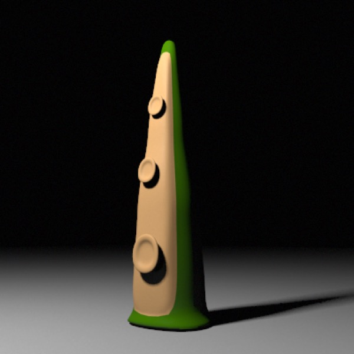
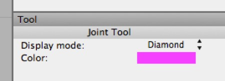
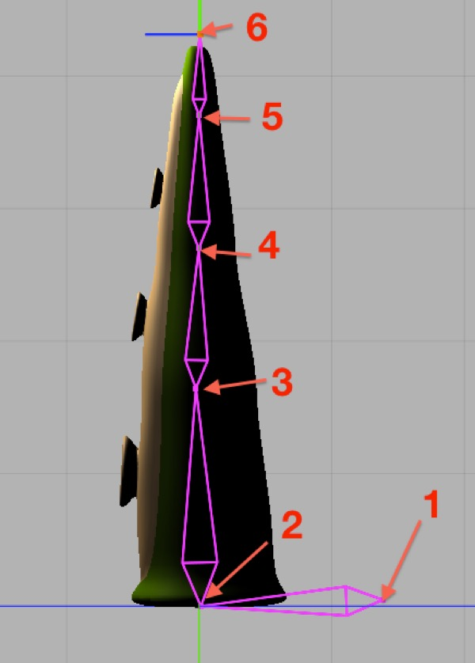
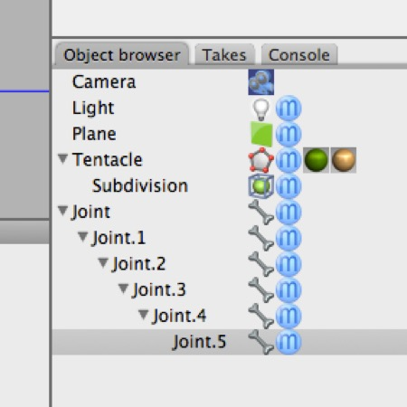
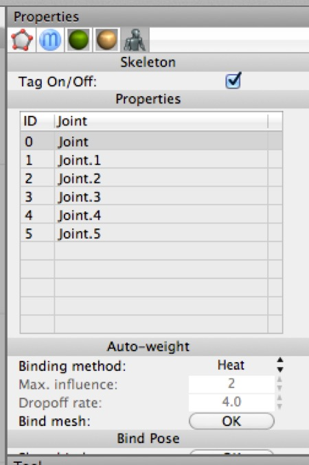
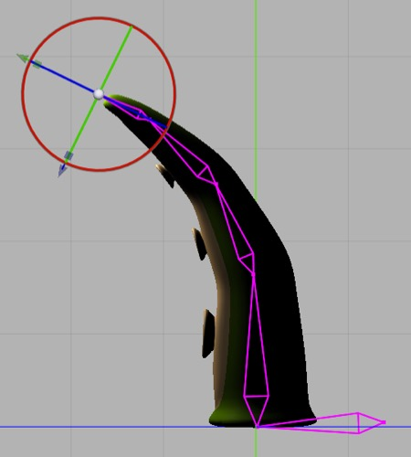

## Character Animation Tutorials

### Rigging a simple flexible object

To rig a mesh you start be creating a hierarchy of joints. You can’t get much simpler than a tentacle, so that’s what we’ll create.

1. Switch to the Left view and select the Joint Tool (Tools \> Character \> Joint). Set the joint tool’s color to whatever you like and switch to diamond display mode. We want to click in the places in the order shown below: 

2. With the Joint Tool active, clicking those points in order will create a hierarchy of joints that looks like this in the object browser: 

If you were rigging a more complex figure, e.g. a human being, you can either select a joint before creating different limbs to make sure a given joint is in the right place in the hierarchy, or simply move joints around in the Object Browser to correct problems in the hierarchy.

If you select the various joints in the hierarchy you should see that their axes are all lined up with the global axis, and that in particular the red x-axis is lined up so that it’s the axis we’re going to want to mainly rotate that joint around. This is convenient — you generally want to ensure this for any joint hierarchy before you bind it to your mesh. For a more complex rig, you’ll probably need to rotate some joints along their y axes to line up the x axes properly.

You can try rotating some joints at this point (undo afterwards!). The joints rotate as you’d expect, and each rotates its children, but aside from that they don’t do anything yet.

Having created our joints, we need to attach them to our mesh. 

1. Select the mesh (named “Tentacle” in this case), add a Skeleton tag to it, and then with the Skeleton tag still selected click the root Joint (named Joint) and drag it to the list box in the Skeleton tag’s properties. If you mess up the Skeleton tag will get deselected and you’ll need to select it and start over. (This is the case whenever you need to drag an object into a tag property.)

You should end up with the entire hierarchy of joints in the Skeleton tag’s list box, like this:

1. Click the button to “Bind mesh”. This will use the “heat binding” algorithm to bind your joint hierarchy (“skeleton”) to the mesh.

2. Now one-by-one select joints 2, 3, and 4 and rotate each slightly on its x-axis to curl the tentacle inward. You should get something like this:

The reason we do this is to give the IK system a hint as to our preferred rotation for each joint. This will make the IK setup incredibly simple. 

1. Add an IK Handle tag to joint 4 and set its length to 3. 

2. Now try moving joint 4 around. Magic!

You’ve rigged a tentacle, and you can keyframe it, store poses, and so forth exactly as you’d expect. You’ve also learned all the fundamental tools required to rig most characters. This section will focus on animating a character suitable for a game rather than long form animation. From what I’ve seen in the forum, more Cheetah 3D users are interested in game development than long form animation, and in any event Cheetah 3D currently lacks an interface for managing the complexity of long form animations.

**Note**: “Long form” is relative. In this case, I mean animations longer than a second or two, and more complex than a single character performing a single action.

These tutorials are easier to complete if you install and use tg\_jp’s **Mirror Copy.js** and my **Pose Utilities.js** scripts. Both are available for free and links can be found in the section on Scripting or on the Cheetah 3D forum. Instructions on installing scripts can be found in the section on Scripting or in the Cheetah 3D help.

