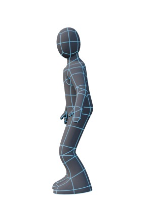
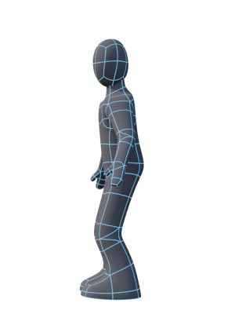
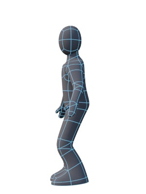

## Mini-Tutorial: Idle

*Keyframes 0, 12, and 24. Keyframe 36 is similar to 12 but with the character looking in the other direction. Keyframe 48 is the same as 0.*

The idle, or breath, animation is what the character does when they’re not doing anything. What the character does when idle does a lot to define their personality — Sonic the Hedgehog would turn to the camera and tap his foot in impatience if you left him idle for more than a few seconds. In a typical game situation, a character should look reasonably alert.

I’d suggest making a “breath” take with a duration of 2.0s and starting with the base pose, then moving the back joint down a little, then moving the ankles back up to bring the feet onto the ground — tweak the pose by spreading the feet out slightly. Relax the arms, and bend the back forward slightly, and the neck backward slightly. Record this keyframe and then copy it to the middle and final frame of the take.

I’d suggest changing the back and neck pose slightly in the middle frame, then on frames 12 and 36 have the character look to either side.

Experiment.

