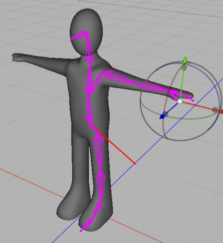

## Tutorial: Simple Character Rig

Rigging a humanoid figure involves the same techniques used to rig the tentacle. The major difference is that you’ll need to create a more complex hierarchy, and there’s symmetry involved (you generally want the left leg to be rigged like a mirror image of the right leg, and so forth) and Cheetah 3D’s symmetry tools don’t work on bones.

1. 

Start in the Left view. Use the Joint tool to click out the hierarchy per the above diagram. The first bone is our root (it’s on the ground and away from the mesh for convenience).

2. Rename the joints (from top to bottom) “root”, “back”, “chest”, “neck”, “head”, and “face”. 

3. 

Click the “back” joint in the Object Browser and the Joint tool and click out the hierarchy above. Name these new joints “left-thigh”, “left-knee”, “left-ankle”, “left foot”, and “left toe”.

1. 

Switch to front view and move the new joints sideways so they are centered in the figure’s left leg.

1. 

Now click on the chest bone in the Object Browser, select the Joint tool, and click out the left arm hierarchy (you can figure out the order).

2. Then go to the Top view and center the joints in figure’s the left arm. (You might want to somewhat reposition the joints too — e.g. the wrist is a bit out of position in my screenshot.)

3. Click on the left wrist in the Object Browser, select the Joint tool, and click out two bones for the thumb, name them left thumb, and left thumb tip, then go into the front and fix the centering.

You might like to orbit your model in Camera or Perspective view and do a quick check on your skeleton’s positioning. It should be good.

1. Now go through your joint hierarchy looking at the axes of each bone in your hierarchy. What you’ll find is the leg is fine but the arm is a mess. You want the green arrow for each axis pointing down the bone, and the red axis should be the axis of rotation. Switch to pivot mode and fix all the axes in the arm hierarchy.

You can test your skeleton now (even though half of the limbs are missing) by adding a skeleton tag to the mesh, binding it, and rotating some bones. When you’re finished testing, use the Skeleton tag’s “Show bind pose” function to reset the joint hierarchy, then delete the skeleton tag.

1. 

Now we need to mirror the left arm and leg hierarchies. We could just do everything over again (possibly typing in the positions of joints to make it exact). Or we can install tg\_jp’s excellect **Mirror Copy.js** script, and select the left shoulder and click Copy (under Object Copy) and repeat for the left thigh. There’s one thing left to do, and that’s fix the axes of the right arm (you don’t need to be exact).

**Note**: you can also do this quite efficiently using my Pose Utilities.js script, but tg\_jp’s Mirror Copy is quicker and simpler. With Pose Utilities, you duplicate the two limbs, and flip and rename them.

1. Now we skin the mesh — add a [new] skeleton tag to the mesh and drag the root bone into its list box. Click Bind.

1. 

Before we add IK handles, we need to rotate the joints slightly to give it hints as to how you want the IK solver to work. Rotate each joint slightly in its usual direction — so the thigh rotates forward, the knee backwards. Each rotation should be around the joint’s x-axis thanks to the tweaking earlier. When you’re done, your mesh should look like the image above. You can save time here by just doing the left side then using my **Pose Utilities.js**, select the root bone, and then copy left-to-right. The figure should look something like the above image when you’re done.

2. Now add an IK handle to each ankle and each wrist. Their default settings will be fine (even length!). 

Play around by dragging the wrists and ankles around. By and large, the legs will work a bit better than the arms, but the arm IK is still quite useful. In general, you will pose figures using a combination of forward and inverse kinematics. You can always go back to the skeleton tag and reset to the bind pose.

