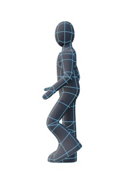
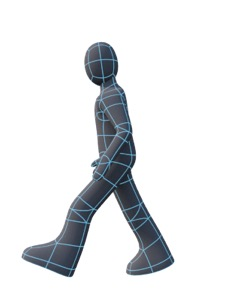
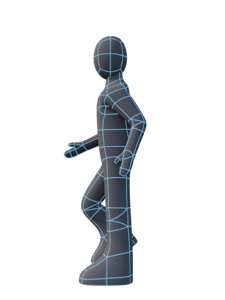
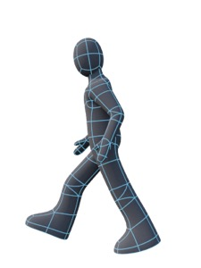
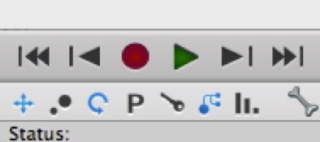

## Tutorial: Walk Cycle

*The simplest walk cycle comprises four keyframes, two of which are mirrors of the others.*

The first thing a game developer generally needs a character to do is walk around. A walk cycle is a looping animation that makes a character walk (usually on the spot). Other commonly needed cycles are the breath cycle (so characters who aren’t doing anything don’t stand rigidly still), run cycle, and sneak cycle.

To animate a walk cycle the absolute simplest approach is to create two poses — “passing” (where one foot is firmly planted, and the other is raised and passing it) and the “landing” (where one leg is in front and its foot has just hit the ground and the other behind), and then flip these two poses and space them out on the timeline, e.g. left foot passing right foot, left food landing, right foot passing left foot, right foot grounded.

A slightly more sophisticated option is to use passing, landing (as the front foot lands), and pushing off (as the rear foot comes off the ground), and flip those poses.

Either approach works fine and can be fine-tuned as much as you like once you’re happy with the basic walk cycle.

A typical relaxed walk cycle should last about one second. Characters in games are seldom relaxed, so we’ll try 0.8 seconds. **You’ll need access to the Takes pane**. It’s available in the default Animation layout, but I simply add it as a tab to the Object Browser in the Modeling layout so I can get at it any time. (To change a pane or add a tab to it, right-click on its name. Have fun!)

Oh, and **make sure the Animation Control Panel is active**.

1. Right-click in the Takes pane and create a new Take. Name it “walk cycle” and set its duration to 0.8 (seconds).

*The animation controls with position, rotation, and hierarchy toggled on and the other recording options (notably scale) toggled off.*

2. In the first frame, switch the view to Left and try to match the first pose — with right foot firmly planted on the ground and right leg straight, left leg bent and passing — above. Make sure hierarchy is toggled on under the record button (ideally, toggle off scale as well). Click the root bone and then click the **Record** button. 

A blue marker will appear on the timeline representing the current set of keyed values (including children of the selected node because hierarchy is toggled on).

1. Click on the blue marker. Copy it. Drag the time indicator to the middle frame (frame 12) and paste. Drag the time indicator to the last frame and paste.

2. Go to frame 6 and try to replicate the pose in the second pose — striding with left foot forward and left leg slightly bent, right leg back and straight with heel leaving the ground. When you’re happy, click on the root bone and then click **Record**.

3. Copy the blue marker for frame 6, move to frame 18 and paste it.

If you run the animation now, it will look pretty weird (for reasons that should be obvious). We need to flip the poses in frames 12 and 18. You can either do this manually, trying to match the third and fourth poses above, or you can cheat and use my **Pose Utilities.js** script.

Using Pose Utilities to “flip” a keyframe requires you to:

1. Go to the key frame you want to flip.

2. Click on the root bone, select Pose Utilities from **Tool \> Script \> Tool Script \> Pose Utilities**. Select the left/right naming convention you’re using (which should be set correctly by default if you’re using the latest version from my website) and click **Swap Left and Right**.

3. **Click on the root bone *again*** and then click **Record**.

You need to flip (not to be confused with Pose Utilities’ “Flip” function, which does something very different) frames 12 and 18 and then you should be done.

**Note**: "Swap Left and Right" is the single most useful function in Pose Utilities — it mirrors the right side onto the left and vice versa. It currently ignores non left/right bones, but maybe it should mirror them too. Or perhaps that should be a separate function.

