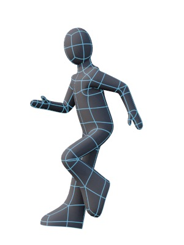
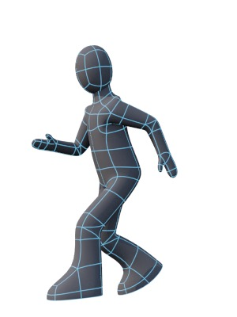
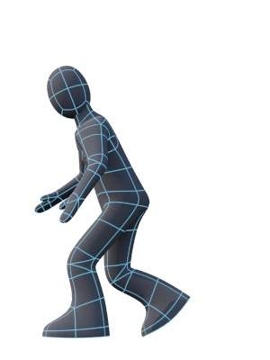

## Mini-Tutorial: Jumping

Most characters in computer games don’t jump — they only land. This is because when a real person jumps they need to prepare for it, usually for at least two strides. Since the computer can’t foretell that you want to jump 1.2s in the future, it can’t start playing a nice jump animation in time for you to take off at the edge of that yawning precipice, so most computer games cheat, and simply launch the character into the air without any kind of preparation.

It follows that your character doesn’t need a “jump” animation, but they need a “flailing around while in the air” cycle and a “landing” animation. Both of these can be created by cannibalizing your Run cycle.

### Flailing

The “flailing around while airborne” animation can be adapted from the “passing” frame from the run cycle. 

1. Create a new “flailing cycle” take and make it 0.8s long.

2. Go to the Run cycle and copy the passing keyframe (frame 4 if you followed my advice to the letter) by clicking the root bone, then clicking the blue keyframe indicator, and then copying it.

3. Now go to your new take, go to frame 0, and paste the key frame there. Now move the arms into more of a windmill position (out from the body) and make rotate the thighs out a bit. Click the root bone and record. Now copy and paste this new keyframe into frames 12 and 24, then flip frame 12.

You’re done bar the tweaking.

### Landing

Once again, you’ve got a landing sequence already — frames 7 and 9 of the run cycle.

1. Create a new “landing” take and make it 0.4s long.

2. Copy frame 7 of the run cycle take to frame 0 of the landing take. Copy frame 9 of the run cycle to frame 2 of the landing take.

3. Move the bent ankle on the bent leg down and tweak the foot so it’s just touching down. Click the root bone and then Record.

4. Now go to frame 4, move the backbone slightly forward and down, bend the back forward, bend the legs to keep the feet grounded, and tweak the feet. Click the root bone and then Record.

5. Finally, copy the first keyframe from your “breath” take to the last frame of the landing take.

TODO — Derigging, Editing, and Re-Rigging an Animated Figure

TODO Weight-Painting

