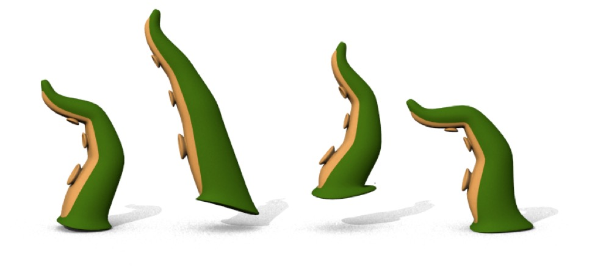

# Character Animation

So far, 3D animation has consisted of picking a point in time, selecting objects, changing their properties, and then storing key frames. This works for a lot of animations, but it’s a very difficult way to animate characters.

Character animation generally comprises two major jobs: rigging and animation. These jobs will often be performed by different people in an animation studio — so the person doing the rigging needs to treat the person who'll do the animation as his/her *customer*. Doing a good job of rigging makes the task of animation easier. A really well put-together rig makes the animator's job easier, and often exposes "features" of the figure to the animator.

Filip c's "blockman" rig makes use of splines to allow easy selection of IK targets and makes it obvious to the animator how each target is intended to be used. Filip has generously [made this rig available for free on the forums](http://www.cheetah3d.com/forum/showthread.php?p=70934#post70934).

We're not going to get that advanced here, but it's worth at least discussing.

