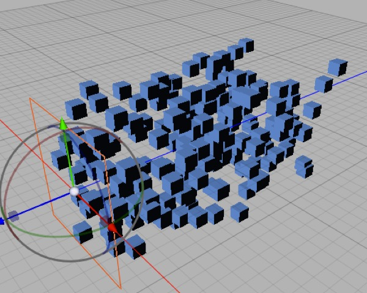

## Getting the most out of Cheetah 3D’s Particle System

Cheetah 3D’s particle system is very powerful, but what you can do with it directly is sometimes limited by the renderer. 

Because Cheetah 3D doesn’t support volumetrics and is a ray tracer, there’s no really good way to render classic volumetric particle effects, such as clouds of billowing smoke, nicely. 

Because the motion of particles is frequently crucial, Cheetah 3D’s lack of vector motion blur imposes further limitations (particles tend to be rendered “frozen” in space, rather than “smeared”, which is often not the look you are after).

And finally, because Cheetah 3D doesn’t internally support post-processing render passes, you can’t make particles glow.

At this point you might like to review the sections in the Materials chapter on faking volumetrics.

### Workarounds

The lack of motion blur is unfortunate, but the other two issues can be worked around by performing separate render passes and using a compositing program such as Photoshop (for still images) or Premiere / After Effects / Final Cut Pro / Motion for animated sequences.

### Basic Setup: Particle Emitter

Setting up a particle system requires a minimum of two steps.

1. Select **Particle Emitter** from the Particle item in the Toolbar.

2. **Add a child** such as a box or a ball to the emitter.

***Top**: a default Particle Emitter with a default Ball particle, a little way down the timeline. **Bottom**: you’ll probably want to make your particle object smaller or your particle emitter bigger. If you scale down your particle, you’ll see all the particles change size immediately. Neat, huh? This is the magic of instances.*

Press **Play** (on the Animation Timeline Controller) to see your shiny new Particle Emitter in action.

### Making the Particles Different

There are four fundamental ways to have particles that aren’t all identical.

*This Particle Emitter has been set to grow its particles over time (by setting its Size Growth value to a number greater than 1.0). To add randomness, variation is also quite large and the particle lifetime has been reduced so that the growth occurs more quickly.*

**You can set properties in the Particle Emitter** to make the particles change certain properties over time (e.g. you can make them grow or shrink over time).

*This particle emitter has two child objects, a red box and a green plane. About half of the particles are of each type.*

**You can put any number of child objects into your Particle Emitter** and it will create instances of them at random.

*This particle emitter has one child, a green plane, but it has a particle tag assigned to it that randomly varies its heading by up to 180°.*

**Note** that for most objects the rotation order is HPV, i.e. YXZ, but for the Particle tag (and some other newer tags) it is XYZ. This is part of an ongoing effort on Martin Wengemeyer’s part to make Cheetah 3D more consistent with other 3D applications (which have the same order for rotations and coordinates).

**You can assign a Particle Tag to the child object** and set degrees of variation in different properties (position, rotation, scale).

**You can create materials** that use the Instance node to use properties of the individual instances to drive shader properties. (There’s even a random property that can be used to add random variations to materials assigned to instances.)

### Making Particles do Something

The real fun with particles starts when you use **Force Effectors** and **Dynamics** with them. (Using Dynamics with Particle Systems is discussed in depth in the chapter on Dynamics.)

In order to set up a nice test bed to play with Force Effectors, we’ll create a Particle System — everything is set to defaults — and give it a single child which is a box with size set to 0.1,0.1,0.1. With this setup you’ll essentially have a stream of particles flying in the negative Z direction.

*This simple setup in action. A stream of small boxes is flying in the negative z direction.*

Now from the Effectors toolbar item select the **Wind** effector, and set its position to 0,0,–2 and change its Geometry from Unlimited (where it affects every particle in the Scene) to Sphere. It now “blows” inside a unit sphere.

Now hit rewind and play again. (Be careful that your Wind effector didn’t end up a child of the Particle Emitter — that doesn’t work well.)

*Windblown particles.*

The best way to understand effectors is imply to play with them. Try out different effectors and combinations of effectors to see what you can do with them.

### Particle Dynamics

Particles on their own will do some things that are problematic — e.g. they will pass through one another. Some effectors allow you to simulate things like solid surfaces which will deflect particles, but you can’t get sophisticated dynamic behavior without using the Dynamics system.

### Basic Setup: Particle Mesh

***Top**: a single pillar mesh and a weird mesh consisting only of points (no polygons). **Bottom**: a particle mesh with the pillar as child and the point mesh assigned to it.*

The Particle Mesh, Particle Spline, and Particle Array objects aren’t about generating fountains of sparks or smoke, but about creating instances of objects. (They can be used to create the raw materials for Dynamics effects, but we won’t talk about that here.)

Imagine you’re building a model of the Parthenon. Rather than model each pillar individually, or model one pillar then duplicate it to create all the pillars — and then discover you’ve made a mistake and need to start over, you can use a Particle Mesh, a Pillar Object, and a mesh comprising one point for each pillar you need to create all your pillars as *instances*. 

Using a Particle Mesh (or Particle Array or Particle Spline) lets you have the simplicity of creating one pillar and copying it all over the place with the ease of editing of having one pillar you can fix or refine later.

This topic is also discussed under **Managing Complexity** (in the chapter on **Mastering Cheetah 3D’s Interface**).

