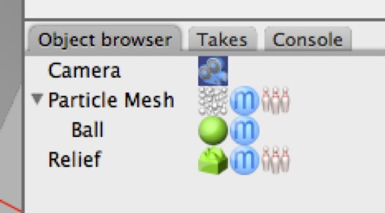

## Using a Particle System as a Source of Objects

If you need to create many objects quickly, use a collapsed particle system.

For example:

1. Create a Plane and set it to have 10x10 segments. Move it up to 0,1,0.

2. Create a **Particle Mesh**. Assign the plane as its mesh. Drag a ball into it and set its radius to 0.03. You should now have 100 small balls.

3. Now create a **Relief** object. Its default settings should be fine.

*You should now have 100 small balls floating above a relief object.*

1. Now collapse the **Particle Mesh** (double-click on it) and delete the plane (you don’t need it any more).

2. Add a **Rigid Body** tag to the (former) particle mesh. (Note — assign it to the particle former Particle Mesh, not the particle itself.)

3. Add a **Rigid Body** tag to the **Relief** object, set its Type to static and its Shape to concave (since it has dents in it, convex will screw it up).

*Here’s the setup. The object labelled “Particle Mesh” was a Particle Mesh but has been collapsed. The Plane that it used has been deleted. The Particle Mesh has a Rigid Body tag assigned to it, everything is default. The Relief object has a Rigid Body set to be static and concave.*

1. Press Play. It kind of works — but some of the balls fall through the terrain.

2. Click on the **Dynamics** toolbar item, and in the Dynamics property panel, change Accuracy to 8x. This should stop the balls falling through the terrain.

3. Press Play again.

### Using Effectors to Influence Dynamics

Force Effectors from the Particle System can act on dynamic objects (they have a property which determines whether or not they are affected by forces — its default setting is on.)

1. You can use another Particle Mesh setup to have some fun with Force Effectors.

2. Create a plane with 10x10 sections, and set its position to 0,0.04,0.

3. Create a Particle Mesh, assign the plane to it.

4. Add a small Ball (radius 0.03) to the Particle Mesh. You should now have 100 small balls.

5. Collapse the Particle Mesh by double-clicking it, and then add a Rigid Body tag. Set the Rigid Body’s margin to 0.0 (vs. the 0.02 default).

6. Create another Plane, set its size to 2x2, add a Rigid Body tag to it, and set its Type to static.

When you press Play, nothing much will happen. But now you can have some fun with Force Effectors. Just drop one or more of them into the scene and press Play to see what happens.

